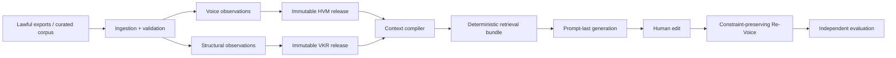

# CEO Voice Platform

An evidence-backed system for modeling an executive's writing micro-patterns, applying independent
content structure, and producing traceable LinkedIn and X drafts. It is designed to answer a harder
question than “can an LLM imitate these examples?”: **which measured voice decisions are supported,
authorized, relevant to this request, and preserved through human editing?**

The platform combines a typed Python 3.13 engine with an editorial Next.js 15 product interface,
immutable HVM (voice) and VKR (structure) releases,
deterministic context and retrieval, governed model boundaries, constraint-preserving Re-Voice, and
independent evaluation. It does not reduce a person to a prose prompt and does not let prompt code
reach into an entire profile.

> Scientific and governance boundary: Tier-1 analyzers measure descriptive structure; they do not
> establish authorship or automatically authorize generation in a real person's voice. The local
> Ali Ghodsi and Matei Zaharia development profiles use operator-transcribed public posts and require
> provenance, rights, calibration, and independent fidelity review before production use.

## Problem

Conventional voice generation collapses a person into a handful of examples and a prose prompt.
That loses micro-patterns, mixes style with engagement structure, hides weak evidence, and makes a
draft impossible to audit after a human edits it.

## Motivation

This project treats executive voice as governed knowledge, not prompt decoration. It keeps voice,
structure, evidence, platform policy, intent, and user constraints separate until prompt rendering,
then evaluates the result independently.

## Architecture



Voice, structure, evidence, user intent, platform rules, and negative constraints remain separately
typed until the final prompt render. Every selected item retains a reason, confidence, priority,
release reference, and evidence lineage. Only Generation and Re-Voice may call a model.

| Subsystem | Responsibility |
|---|---|
| Data pipeline | Bounded acquisition, raw retention, style-preserving cleaning, normalization, validation, incremental checkpoints |
| HVM + analysis | Evidence-addressed feature observations, confidence, residuals, interactions, constraints, release governance |
| Voice Profile Builder | Restartable corpus analysis, health checks, immutable publication, inspection and retrieval projection |
| VKR | Independent structural patterns and observational engagement statistics without copying reusable wording |
| Context + retrieval | Request-specific, platform-aware, confidence-gated compilation and compact deterministic evidence selection |
| Generation | Prompt-last provider isolation, token budgeting, retry policy, post-processing, platform validation, full report |
| Re-Voice | Diff analysis, protected regions, conservative restoration, constraint validation, change report |
| Evaluation | Voice, structure, compliance, factual/edit preservation, readability, optional judge, benchmark and regression reports |

The detailed dependency rules and failure boundaries are in
[Architecture Overview](docs/ARCHITECTURE.md). The audited assignment coverage is in
[Release Gap Analysis](docs/RELEASE_GAP_ANALYSIS.md). A reviewer-ready narrative and recording plan
is in the [Product Walkthrough](docs/DEMO_RUNBOOK.md).

## Quickstart

Prerequisites: CPython 3.13, Node.js 20+, Git, and `make` on macOS/Linux.

### Run an existing checkout

From the repository root, update the project, install both runtimes, create local configuration,
and verify the complete backend and frontend:

```bash
git pull origin main
make setup
make frontend-setup
cp .env.example .env
make doctor
make check-all
```

After the checks pass, start the API and frontend in two separate terminals:

```bash
# Terminal 1
make api
```

```bash
# Terminal 2
make frontend-dev
```

Open `http://127.0.0.1:3000` for the product and `http://127.0.0.1:8000/api/docs` for the
interactive API documentation. Keep both terminal processes running while testing.

### Fresh clone

```bash
git clone https://github.com/aksh08022006/ceo-voice-platform.git
cd ceo-voice-platform
make setup
make frontend-setup
cp .env.example .env
make doctor
make check-all
```

`make check-all` runs the Python and frontend quality gates: Ruff, Black, strict mypy, pytest with
branch coverage, ESLint, TypeScript, and a production Next.js build. It needs no model credential,
database, or network service after the locked Python and Node dependencies are installed.

### Launch the product

Run these in separate terminals after completing the quickstart:

```bash
make api
make frontend-dev
```

Open `http://127.0.0.1:3000`. The browser can select an available profile, generate, edit, Re-Voice,
evaluate, and inspect every report. Without a published catalog or model credential, deterministic
fixtures keep orchestration testable. With the development catalog and an explicitly enabled
provider, the same workflow serves the operator-transcribed Ali and Matei corpora. Provider choice
does not upgrade corpus authority. API documentation is available at
`http://127.0.0.1:8000/api/docs`.

### One-command offline demonstration

```bash
make demo
```

This executes the full fixture workflow—profile, VKR, compilation, retrieval, prompt rendering,
generation, human edit, Re-Voice, and evaluation—and writes inspectable JSON/Markdown artifacts
below `data/demo/latest/`. The provider response and explicit profile approval are deterministic
test fixtures. This proves orchestration and regression behavior; it is not a real-person quality
benchmark.

Typical artifact set:

```text
voice-profile.json          virality-profile.json
generation-context.json     retrieval-bundle.json
rendered-prompt.json        generated-draft.json
generation-report.json      revoiced-draft.json
evaluation-report.json      evaluation-report.md
integration-outcome.json
```

## Pipeline and features

```bash
ceo-voice --help
ceo-voice doctor
```

Build or resume an immutable HVM profile:

```bash
ceo-voice build \
  --manifest /approved/corpus-manifest.json \
  --workspace ./data/runtime \
  --output ./data/runtime/published-profile.json \
  --pretty
```

Onboard a reviewed leader corpus into both knowledge systems:

```bash
ceo-voice onboard \
  --manifest /approved/onboarding-manifest.json \
  --workspace ./data/runtime
```

The onboarding command publishes HVM and VKR releases and writes
`data/runtime/onboarding/report.json`. Exit `0` means generation-authorized; exit `3` means the
releases were built successfully but remain descriptive and require review. Adding a leader changes
data, not code. See [Operations](docs/OPERATIONS.md) for the manifest workflow and exit codes.

### Public-data acquisition

If an external collector is producing X or LinkedIn data, follow the exact JSONL contract in
[Public-content dataset handoff](docs/DATASET_HANDOFF.md) and validate it before corpus review:

```bash
ceo-voice validate-dataset --input data/runtime/incoming/public-content.jsonl
```

Before content acquisition, create a URL-only source catalog and run the governed readiness gate:

```bash
ceo-voice audit-corpus \
  --manifest configs/source-catalogs/ali-ghodsi.discovery.json \
  --policy configs/acquisition/production-policy.json \
  --pretty
```

The committed Ali Ghodsi and Matei Zaharia discovery catalogs are deliberately not ready: they
record official identity anchors and access boundaries without pretending that profile pages are a
reviewed voice corpus. See [Governed Corpus Acquisition](docs/CORPUS_ACQUISITION.md).

`LocalExportConnector` accepts bounded JSON or JSONL files produced through official exports,
licensed datasets, or operator-curated transcripts. It supports cursor resumption,
`modified_after`, source versions, structured metadata, and path confinement. A synthetic schema
example is at [local-export.jsonl](data/examples/local-export.jsonl). Before persistence,
`CatalogAuthorizedConnector` matches every record to its reviewed catalog entry and preserves a
content-free authorization receipt. The matching synthetic catalog is at
[source-catalog.json](data/examples/source-catalog.json).

The repository intentionally does not include credentialless X/LinkedIn scraping. Network source
adapters must use official APIs or authorized feeds behind the existing connector contract.
The exact current inclusion/exclusion decision for X, LinkedIn, YouTube, Databricks, SEC EDGAR, and
operator-provided exports is maintained in [Public Data and API Register](docs/PUBLIC_DATA_SOURCES.md).

Convert a reviewed source catalog plus confined JSON/JSONL exports into the exact build manifest
consumed by the profile engine:

```bash
ceo-voice prepare-corpus \
  --manifest /approved/corpus-preparation.json \
  --export-root /approved/exports \
  --output ./data/runtime/profile-build-manifest.json \
  --pretty
```

The adjacent `.preparation.json` report records every admitted, rejected, unchanged, and failed
document without copying source content into logs. The command does not grant generation authority;
it preserves the catalog authorization receipt so later review remains auditable.

### Serve reviewed published profiles

Production serving requires both a validated deployment catalog and an explicitly configured model
provider. It fails closed if either is missing:

```bash
CEO_VOICE_API__PUBLISHED_PROFILE_CATALOG=./data/published/catalog.json \
CEO_VOICE_MODEL__ENABLED=true \
CEO_VOICE_MODEL__PROVIDER=openai \
CEO_VOICE_MODEL__GENERATION_MODEL=<approved-model-id> \
CEO_VOICE_MODEL__API_KEY=<injected-by-secret-manager> \
make api
```

The catalog contains relative paths to self-validating `PublishedProfileBundle` files. Startup
rejects path traversal, duplicate leaders, tenant or lineage mismatches, unpinned corpora, and
cross-release assembly. In published mode, the API lists only those bundles and every generation
uses their exact HVM, VKR, corpus snapshots, feature registry, and analysis artifacts.

### Build the reviewed Ali and Matei corpora

The ignored screenshot batches can be converted into development-only HVM/VKR serving bundles:

```bash
make profiles
```

Use `make ali-profile` or `make matei-profile` to rebuild only one leader. The targets upsert both
leaders into `data/runtime/ali/published/catalog.json`. Point the local API at that catalog without
touching provider secrets by creating the ignored `.env.local` file:

```bash
CEO_VOICE_API__PUBLISHED_PROFILE_CATALOG=data/runtime/ali/published/catalog.json
```

Restart `make api`, then open the Generate page. The API exposes Ali Ghodsi and Matei Zaharia,
reports mode `development`, and uses the configured model provider for generation. Each bundle
admits complete authored text, retains authored repost commentary with explicit provenance,
excludes quoted third-party previews, and does not invent missing URLs or publication timestamps.
Development bundles are rejected when the application environment is `production`; they make no
verified identity-fidelity or reuse-authority claim.

## Demo fixtures

The Generate page intentionally accepts exactly three product inputs: idea/angle, CEO identity,
and platform. Content form, structural influence, output bounds, and other technical controls are
resolved internally. Synthetic Ali Ghodsi, Matei Zaharia, and Jensen Huang walkthrough fixtures
remain available to automated regression tests, but are not exposed as additional Generate inputs.

For a 3–5 minute submission recording, follow [Demo Runbook](docs/DEMO_RUNBOOK.md).

## Benchmarks and evaluation

The evaluation engine scores each dimension independently and retains raw metric provenance;
mandatory deterministic failures cannot be averaged away by an LLM judge. Benchmark and regression
contracts support fixed suites, thresholds, cohort labels, and report comparison.

- [Benchmark catalog](data/benchmarks/evaluation-suite.json)
- [Machine-readable fixture report](data/benchmarks/fixture-report.json)
- [Human-readable fixture report](data/benchmarks/fixture-report.md)
- [Evaluation design](docs/evaluation-framework.md)

Ali Ghodsi, Matei Zaharia, and Jensen Huang are present only as benchmark routing labels. The
bundled cases reuse synthetic content and make no fidelity claim. A valid real-person study needs a
lawfully reviewed corpus, held-out samples, human ratings, agreement statistics, baselines, and
confidence intervals.

## Containers

Build and run the cloud-neutral, non-root CLI image:

```bash
docker compose build
docker compose run --rm cli doctor
docker compose run --rm cli build \
  --manifest /app/exports/corpus-manifest.json \
  --workspace /app/workspace
```

The image is read-only at runtime, drops Linux capabilities, uses a non-root user, exposes only
explicit data volumes, and includes a configuration health check. Production defaults require JSON
logs and disabled debug mode. See [Operations](docs/OPERATIONS.md).

## Repository map

```text
backend/src/ceo_voice/
  acquisition/ ingestion/    analysis/     voice/         profiles/      virality/
  context/     retrieval/    generation/   revoice/       evaluation/
  config/      core/         models/       schemas/       utils/
frontend/      Next.js App Router product interface and owned UI primitives
configs/       environment-safe non-secret examples
data/          synthetic schemas, benchmark manifests, ignored runtime data
docs/          architecture, subsystem, operations, and engineering guides
scripts/       narrow operational entry points; no product logic
tests/         unit, integration, regression, and contract evidence
```

## Development

```bash
make format       # apply Ruff fixes and Black
make lint         # Ruff and Black verification
make typecheck    # strict mypy
make test         # pytest with branch coverage
make check        # complete release gate
make frontend-check # ESLint, TypeScript, and production Next.js build
make check-all    # backend and frontend release gates
```

Read [Development Setup](docs/DEVELOPMENT.md), [Coding Guidelines](docs/CODING_GUIDELINES.md), and
[Contributing](CONTRIBUTING.md) before changing public contracts. The project favors narrow modules,
explicit composition roots, dependency injection at I/O boundaries, structured errors, content-free
logs, and backwards-compatible release schemas.

## Limitations and future work

- Bundled JSON/in-memory workspaces are reference adapters for evaluation and single-node use, not
  a claim of horizontally scalable storage.
- OpenAI, Anthropic, and Gemini adapters use a pooled asynchronous HTTP transport with bounded
  timeouts, retry classification, and provider-neutral reports. Credential rotation, organization
  policy, provider allowlists, cost controls, and fleet-wide rate-limit telemetry remain deployment
  responsibilities.
- Tier-1 features are deterministic structural measurements. Calibrated stylometry, cohort
  baselines, nuisance controls, and real-person human evaluation remain required.
- Virality statistics are descriptive associations, not causal claims or guaranteed tactics.
- The HTTP API stores showcase workflow sessions in process memory. A multi-instance deployment
  requires a durable session repository and tenant authentication before exposing the endpoints.
- Semantic retrieval, embeddings, and vector storage are deliberately absent; deterministic
  retrieval remains the auditable baseline.

See the [Release Checklist](docs/RELEASE_CHECKLIST.md) for the concrete path from this reference
release to an organization-operated production deployment.

## License, contribution, and acknowledgements

The package is currently marked `LicenseRef-Proprietary`. Do not redistribute it until the owner
adds an explicit license. Contributions follow [CONTRIBUTING.md](CONTRIBUTING.md) and require the
complete quality gate plus evidence for changed behavior.

The design draws on stylometry, hierarchical modeling, retrieval systems, reproducible ML
evaluation, and safety-by-construction practices. Named leaders are benchmark labels only and do
not imply participation, endorsement, or verified imitation quality.
