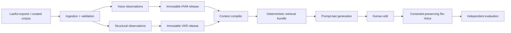

# CEO Voice Platform

An evidence-backed system for modeling an executive's writing micro-patterns, applying independent
content structure, and producing traceable LinkedIn and X drafts. It is designed to answer a harder
question than “can an LLM imitate these examples?”: **which measured voice decisions are supported,
authorized, relevant to this request, and preserved through human editing?**

The platform is a typed Python 3.13 package with immutable HVM (voice) and VKR (structure) releases,
deterministic context and retrieval, governed model boundaries, constraint-preserving Re-Voice, and
independent evaluation. It does not reduce a person to a prose prompt and does not let prompt code
reach into an entire profile.

> Scientific and governance boundary: the bundled Tier-1 analyzers measure descriptive structure.
> They do not establish authorship or automatically authorize generation in a real person's voice.
> Production generation fails closed until an organization supplies reviewed, calibrated evidence.

## Architecture



Voice, structure, evidence, user intent, platform rules, and negative constraints remain separately
typed until the final prompt render. Every selected item retains a reason, confidence, priority,
release reference, and evidence lineage. Only Generation and Re-Voice may call a model.

| Subsystem | Responsibility |
|---|---|
| Data pipeline | Bounded acquisition, raw retention, style-preserving cleaning, normalization, validation, incremental checkpoints |
| HVM + analysis | Evidence-addressed feature observations, confidence, residuals, interactions, constraints, release governance |
| Voice Profile Builder | Restartable corpus analysis, health checks, immutable publication, inspection and retrieval projection |
| VKR | Independent structural patterns and observational engagement statistics without copying reusable wording |
| Context + retrieval | Request-specific, platform-aware, confidence-gated compilation and compact deterministic evidence selection |
| Generation | Prompt-last provider isolation, token budgeting, retry policy, post-processing, platform validation, full report |
| Re-Voice | Diff analysis, protected regions, conservative restoration, constraint validation, change report |
| Evaluation | Voice, structure, compliance, factual/edit preservation, readability, optional judge, benchmark and regression reports |

The detailed dependency rules and failure boundaries are in
[Architecture Overview](docs/ARCHITECTURE.md). The audited assignment coverage is in
[Release Gap Analysis](docs/RELEASE_GAP_ANALYSIS.md).

## Quickstart

Prerequisites: CPython 3.13, Git, and `make` on macOS/Linux.

```bash
git clone <repository-url>
cd "VERY IMPORTANT TASK"
make setup
cp .env.example .env
make doctor
make check
```

`make check` runs Ruff, Black verification, strict mypy, and pytest with branch coverage. It needs
no model credential, database, Node.js runtime, or network service.

### One-command offline demonstration

```bash
make demo
```

This executes the full fixture workflow—profile, VKR, compilation, retrieval, prompt rendering,
generation, human edit, Re-Voice, and evaluation—and writes inspectable JSON/Markdown artifacts
below `data/demo/latest/`. The provider response and explicit profile approval are deterministic
test fixtures. This proves orchestration and regression behavior; it is not a real-person quality
benchmark.

Typical artifact set:

```text
voice-profile.json          virality-profile.json
generation-context.json     retrieval-bundle.json
rendered-prompt.json        generated-draft.json
generation-report.json      revoiced-draft.json
evaluation-report.json      evaluation-report.md
integration-outcome.json
```

## CLI

```bash
ceo-voice --help
ceo-voice doctor
```

Build or resume an immutable HVM profile:

```bash
ceo-voice build \
  --manifest /approved/corpus-manifest.json \
  --workspace ./data/runtime \
  --output ./data/runtime/published-profile.json \
  --pretty
```

Onboard a reviewed leader corpus into both knowledge systems:

```bash
ceo-voice onboard \
  --manifest /approved/onboarding-manifest.json \
  --workspace ./data/runtime
```

The onboarding command publishes HVM and VKR releases and writes
`data/runtime/onboarding/report.json`. Exit `0` means generation-authorized; exit `3` means the
releases were built successfully but remain descriptive and require review. Adding a leader changes
data, not code. See [Operations](docs/OPERATIONS.md) for the manifest workflow and exit codes.

### Public-data acquisition

`LocalExportConnector` accepts bounded JSON or JSONL files produced through official exports,
licensed datasets, or operator-curated transcripts. It supports cursor resumption,
`modified_after`, source versions, structured metadata, and path confinement. A synthetic schema
example is at [local-export.jsonl](data/examples/local-export.jsonl).

The repository intentionally does not include credentialless X/LinkedIn scraping. Network source
adapters must use official APIs or authorized feeds behind the existing connector contract.

## Benchmarks and evaluation

The evaluation engine scores each dimension independently and retains raw metric provenance;
mandatory deterministic failures cannot be averaged away by an LLM judge. Benchmark and regression
contracts support fixed suites, thresholds, cohort labels, and report comparison.

- [Benchmark catalog](data/benchmarks/evaluation-suite.json)
- [Machine-readable fixture report](data/benchmarks/fixture-report.json)
- [Human-readable fixture report](data/benchmarks/fixture-report.md)
- [Evaluation design](docs/evaluation-framework.md)

Ali Ghodsi, Matei Zaharia, and Jensen Huang are present only as benchmark routing labels. The
bundled cases reuse synthetic content and make no fidelity claim. A valid real-person study needs a
lawfully reviewed corpus, held-out samples, human ratings, agreement statistics, baselines, and
confidence intervals.

## Containers

Build and run the cloud-neutral, non-root CLI image:

```bash
docker compose build
docker compose run --rm cli doctor
docker compose run --rm cli build \
  --manifest /app/exports/corpus-manifest.json \
  --workspace /app/workspace
```

The image is read-only at runtime, drops Linux capabilities, uses a non-root user, exposes only
explicit data volumes, and includes a configuration health check. Production defaults require JSON
logs and disabled debug mode. See [Operations](docs/OPERATIONS.md).

## Repository map

```text
backend/src/ceo_voice/
  ingestion/   analysis/     voice/        profiles/      virality/
  context/     retrieval/    generation/   revoice/       evaluation/
  config/      core/         models/       schemas/       utils/
configs/       environment-safe non-secret examples
data/          synthetic schemas, benchmark manifests, ignored runtime data
docs/          architecture, subsystem, operations, and engineering guides
scripts/       narrow operational entry points; no product logic
tests/         unit, integration, regression, and contract evidence
```

## Development

```bash
make format       # apply Ruff fixes and Black
make lint         # Ruff and Black verification
make typecheck    # strict mypy
make test         # pytest with branch coverage
make check        # complete release gate
```

Read [Development Setup](docs/DEVELOPMENT.md), [Coding Guidelines](docs/CODING_GUIDELINES.md), and
[Contributing](CONTRIBUTING.md) before changing public contracts. The project favors narrow modules,
explicit composition roots, dependency injection at I/O boundaries, structured errors, content-free
logs, and backwards-compatible release schemas.

## Limitations and future work

- Bundled JSON/in-memory workspaces are reference adapters for evaluation and single-node use, not
  a claim of horizontally scalable storage.
- Provider adapters exist, but production HTTP transports, credential rotation, rate-limit
  telemetry, and organization-specific safety review belong to deployment adapters.
- Tier-1 features are deterministic structural measurements. Calibrated stylometry, cohort
  baselines, nuisance controls, and real-person human evaluation remain required.
- Virality statistics are descriptive associations, not causal claims or guaranteed tactics.
- There is no public HTTP API or frontend. The CLI is the supported release interface.
- Semantic retrieval, embeddings, and vector storage are deliberately absent; deterministic
  retrieval remains the auditable baseline.

See the [Release Checklist](docs/RELEASE_CHECKLIST.md) for the concrete path from this reference
release to an organization-operated production deployment.

## License, contribution, and acknowledgements

The package is currently marked `LicenseRef-Proprietary`. Do not redistribute it until the owner
adds an explicit license. Contributions follow [CONTRIBUTING.md](CONTRIBUTING.md) and require the
complete quality gate plus evidence for changed behavior.

The design draws on stylometry, hierarchical modeling, retrieval systems, reproducible ML
evaluation, and safety-by-construction practices. Named leaders are benchmark labels only and do
not imply participation, endorsement, or verified imitation quality.
