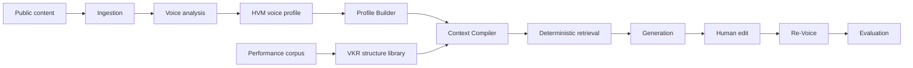

# Architecture overview

This document explains the current product architecture in plain language. The deeper research,
feature taxonomy, and original decision record remain in
[Engineering Blueprint](ENGINEERING_BLUEPRINT.md) and
[Voice Profile Representation](VOICE_PROFILE_REPRESENTATION.md).

## System at a glance

The HVM answers **how this leader communicates**. The VKR answers **which content structures may
work well on this platform**. They remain independent until one request is compiled. This prevents
popular formatting from being mistaken for personal voice.

## Why this is more than ordinary RAG

A conventional RAG system embeds old posts, retrieves similar examples, and places them in a
prompt. That is useful for topical similarity, but it cannot reliably distinguish vocabulary,
cadence, rhetoric, formatting, facts, and reusable structure.

This platform retrieves from structured knowledge instead:

- HVM features describe measured voice behavior with confidence and evidence.
- VKR features describe structure without claiming it belongs to the leader.
- The Context Compiler turns three product inputs into explicit targets and constraints.
- Retrieval selects the minimum relevant evidence and explains every selection.
- The Prompt Builder consumes only that compact Retrieval Bundle. It never reads an entire profile.

Optional BM25 or hybrid ranking adds topic relevance signals behind the retrieval interface.
Hybrid ranking uses BM25 and cosine similarity over supplied embedding snapshots, fused by rank.
The application can prepare these embeddings through an explicitly enabled OpenAI-compatible
adapter before retrieval. Embeddings cannot bypass feature, authority, platform, or context-budget
checks and are not evidence of improved voice fidelity by themselves.

## Complete workflow

| Stage | Receives | Produces | Main responsibility |
|---|---|---|---|
| Ingestion | Authorized public-content exports or transcripts | Raw artifacts and clean documents | Preserve source text, provenance, checksums, metadata, and incremental state |
| Voice analysis | Clean leader corpus | Evidence-backed observations | Measure lexical, structural, rhetorical, tonal, and platform patterns |
| HVM | Observations and evidence | Structured voice knowledge | Represent behavior, confidence, scope, exceptions, and lineage |
| Profile Builder | Curated corpus and analyzer registry | Published immutable HVM release | Orchestrate analysis, validate health, recover failures, and publish |
| VKR | Authorized structural examples and performance snapshots | Published immutable structure release | Model hooks, pacing, post shapes, and calls to action separately from voice |
| Context Compiler | CEO, platform, idea, policies, active HVM and VKR | Generation Context | Resolve exact release versions, voice targets, structure targets, intent, and constraints |
| Retrieval | Generation Context, retrieval-ready releases, and optional pinned ranking inputs | Retrieval Bundle | Rank already eligible spans; select compact, diverse, confidence-aware evidence with reasons and budgets |
| Generation | Generation Context and Retrieval Bundle | Draft and Generation Report | Build the prompt last, call one provider, validate, post-process, and report |
| Re-Voice | Original draft, human edit, and existing context | Re-Voiced Draft and change report | Strengthen voice only where meaning, facts, order, formatting, and intent remain safe |
| Evaluation | Draft, reports, context, and evidence | Dimension scores and disposition | Measure voice, structure, platform fit, readability, constraints, and evidence use independently |

## Product request and result

The Generate page intentionally exposes only the three assignment inputs:

1. CEO identity
2. Platform: X or LinkedIn
3. Idea and narrative angle

Internal controls are resolved by policy. The result contains the draft and an explainability report:
active releases, selected features, selected evidence, structural guidance, provider and model,
latency and token usage, validation findings, constraints, and execution timeline.

## Module boundaries

| Module | Owns | Must not own |
|---|---|---|
| `ingestion` | connectors, parsing, cleaning, normalization, validation, repositories, checkpoints | analysis or generation decisions |
| `analysis` | analyzer registry, observation construction, confidence dispatch | profile mutation or provider calls |
| `voice` | HVM contracts, validation, evidence, feature and release rules | storage SDKs, prompts, or virality |
| `profiles` | end-to-end corpus builds, incremental reuse, publication, inspection, health reports | a second voice representation |
| `virality` | independent structural observations, patterns, releases, and platform rules | personal voice claims |
| `context` | request-specific targets, constraints, authority, and release pinning | retrieval or prompt rendering |
| `retrieval` | deterministic selection, BM25/supplied-vector ranking, diversity, budgets, explanations | broad corpus discovery, embedding-provider I/O, or generation calls |
| `generation` | prompt rendering, provider adapters, retries, validation, reports | direct HVM/VKR access |
| `revoice` | edit diff, protected regions, conservative restoration, change report | changing intended meaning or structure |
| `evaluation` | independent dimensions, hard gates, reports, benchmarks | hiding failures in one blended score |
| `experiments` | declared split validation, blinded ballots, scoring supplied human comparisons | generation, invented ratings, automatic profile promotion |
| `api` | HTTP contracts, request correlation, dependency wiring, workflow sessions | domain logic |
| `frontend` | the reviewer and editor workflow | duplicate business rules or secret access |

Dependencies point inward toward typed contracts. Vendor SDK types stay inside adapters, and the
composition root is the only place that constructs concrete dependencies. Cross-feature imports
are rejected unless the owning contract explicitly allows them.

## Data and release model

Raw content, clean documents, observations, evidence, HVM releases, VKR releases, retrieval bundles,
and reports are separate artifacts. Each durable artifact has a stable identifier, checksum,
version, ownership context, and lineage where applicable.

Published knowledge releases are immutable. An update creates a successor release; rollback selects
an older release rather than editing history. Generation pins exact HVM and VKR release identifiers,
so a report remains reproducible even after new content is ingested.

## Failure behavior

The system fails before a provider call when it cannot support an accountable request. Examples
include an unknown leader, incompatible platform evidence, an unpublished release, insufficient
required evidence, conflicting constraints, unsupported features, or an exceeded context budget.

Provider retries are bounded and limited to classified transient failures. Output validation and
constraint failures use controlled repair attempts. Unexpected programming errors keep their stack
traces and are logged once at the process boundary with a request identifier.

## Scale and replacement points

The domain is designed for hundreds and later thousands of leaders: tenant and leader identifiers
exist at durable boundaries, immutable versions form cache keys, batch profile builds are
restartable, and storage/provider interfaces are injected. Reference JSON and in-memory adapters
support local evaluation; production deployments can replace them with object storage, relational
metadata, queues, caches, and distributed workers without changing the domain contracts.

Ranking is configurable as `baseline`, `bm25`, or `hybrid`. Baseline remains the default. The two
additional modes rerank only spans admitted by the existing release/context path. Hybrid inputs pin
tenant, model, revision, dimensions, evidence membership and content hashes, and the exact query
hash. The pure retrieval engine verifies these before cosine scoring; no vectors are fabricated.
The application preparation boundary owns provider transport, input bounds, and caching.

This is not full-corpus semantic discovery or factual search. Those would require a separately
governed corpus and candidate-generation contract. Deterministic policy continues to own mandatory
coverage, authority, platform compatibility, diversity, lineage, and final budgets. See
[ADR 001](adr/001-governed-retrieval-experiments.md).

## Comparing system variants

`ceo_voice.experiments` accepts supplied outputs from named arms on the same briefs. A manifest
rejects declared held-out source/group/content-hash overlap and training/context material dated
after the case cutoff; held-out sources must be strictly later than that cutoff. Preparation
randomizes comparison sides and separates reviewer ballots
from the analyst key. Scoring uses actual submitted ratings, reports missing coverage, and produces
case-weighted preferences with paired bootstrap intervals over held-out dependence groups.

This workflow measures comparative human evidence, separately from candidate conformance in
`evaluation`. It does not execute generation arms or prove that upstream corpora were isolated
outside the declared manifest. Model/prompt control, reference selection, representative sampling,
human-panel adequacy, and cost/latency measurement remain study responsibilities. See
[the experiment guide](experiments.md).

## Current trust boundary

The local Ali Ghodsi and Matei Zaharia development profiles are built from operator-transcribed
public posts. They demonstrate the complete workflow but have incomplete timestamps, URL
provenance, reuse authority, and independent identity-fidelity review. They must not be described as
production impersonation models or as proof that generated text was written or endorsed by either
person.

Likewise, VKR engagement relationships are observational. They can guide subtle structural choices;
they do not prove causality or guarantee virality. Human review remains part of the intended
workflow.
