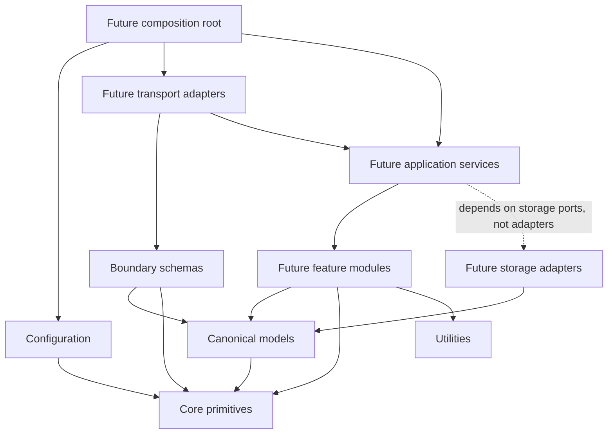

# Architecture Overview

## Current architectural increment

The foundation establishes stable boundaries before an AI or provider integration is selected.
It makes later feature decisions reversible: an embedding provider, database, LLM, web framework,
or workflow engine can be replaced without rewriting canonical contracts or cross-cutting policy.

The ingestion package is the first functional subsystem. It is intentionally provider-neutral:
real parsing, cleaning, normalization, validation, incremental decisions, persistence ports, and
orchestration exist, while network acquisition remains an adapter concern. The `voice` package is
the second domain increment: an immutable HVM knowledge graph, declarative feature registry,
compiler ports, structural validation, release governance, and retrieval contracts. It contains no
statistical estimator, persistence adapter, or retrieval implementation. The `analysis` package is
the third increment: it compiles clean documents into HVM-native observations through registered,
independent analyzers. It does not mutate profiles or perform stylometric inference. The `profiles`
package is the application workflow increment: it composes those stable subsystems into restartable
corpus builds, conservative Tier 1 compilation, release publication, inspection, health reporting,
and retrieval-projection materialization. It adds orchestration, not a second domain model. The
`virality` package is the first structure-intelligence increment. It independently converts
authorized outcome corpora into evidence-backed structural observations and reusable
platform-aware pattern releases; it has no dependency on `voice` or `profiles`. The `context`
package is the first generation-enabling increment: it validates and projects exact active HVM and
VKR releases into an immutable `GenerationContext` while preserving separate voice, structure,
constraint, intent, and evidence planes. It performs no retrieval, prompt rendering, or model call.

## Dependency direction

The arrows mean “may import.” Lower layers never import transport, orchestration, feature, or
storage implementations. The eventual composition root will be the only place that constructs
concrete adapters and injects them into application services.

Cross-feature imports are prohibited by default. If generation needs retrieval, it should depend
on a retrieval port owned by the application boundary, not instantiate a retriever or import a
database client directly.

## Module ownership

| Module | Purpose now | Future inputs and outputs | Allowed dependencies | Design rationale |
| --- | --- | --- | --- | --- |
| `api` | Reserves the transport boundary; contains no routes | Validated boundary schemas in, use-case responses out | schemas, services, core | HTTP is one adapter, not the application architecture |
| `config` | Loads and validates environment settings | Environment and `.env` values in, immutable typed settings out | core | Prevents feature modules from reading ad-hoc environment variables |
| `core` | Owns constants, logging, and expected failures | Primitive configuration in, reusable policies out | Python standard library | Keeps cross-cutting behavior dependency-light and stable |
| `models` | Defines canonical cross-module data contracts | Validated domain data in, immutable snapshots out | core constants, Pydantic | Contracts are not ORM entities and do not inherit persistence concerns |
| `schemas` | Defines use-case request and response messages | External values in, typed boundary messages out | models, Pydantic | Callers do not see prompts, provider parameters, or database structures |
| `services` | Reserves use-case orchestration | Future commands in, results out | ports, models, schemas, core | Orchestration belongs outside domain engines and transports |
| `ingestion` | Implements provider-neutral ETL, validation, incremental identity, and persistence ports | Connector `SourceItem` streams in, raw artifacts, clean documents, metadata, checkpoints, and run outcomes out | models, core, utilities | Provider adapters, transformation policy, and storage implementations evolve independently |
| `analysis` | Implements structural addressing, analyzer registration and scheduling, confidence dispatch, and HVM observation construction | Immutable `CleanDocument` plus governed identity and registry in, canonical `ObservationSet` out | ingestion contracts, HVM contracts/ports, core, utilities | Analyzers emit measurements only; one builder owns evidence, provenance, confidence, and HVM schema enforcement |
| `voice` | Implements the HVM representation kernel and governance | Versioned evidence and observations in, validated sealed releases and typed retrieval contracts out | models, core exceptions, deterministic utilities, injected analysis/storage ports | Voice is a traceable graph of typed behavior, context, evidence, uncertainty, and lineage rather than a prose summary |
| `profiles` | Executes the end-to-end Voice Profile Builder | Curated corpus manifest in, published immutable HVM, reports, and retrieval projection out | analysis, voice, ingestion contracts, core, utilities | One composition boundary owns workflow state, incremental reuse, publication, and recovery while the analysis and HVM kernels remain independently testable |
| `virality` | Implements deterministic structure intelligence and observational engagement patterns | Canonical social posts plus pinned performance snapshots in, validated immutable structural pattern releases out | ingestion contracts, shared models, core, utilities | Structural tactics remain evidence-backed, platform-aware, searchable, and completely independent from personal voice |
| `context` | Implements deterministic generation-context compilation | Active pinned HVM/VKR, identity, intent, policy, constraints, and supplied evidence in; sealed model-neutral `GenerationContext` out | voice and virality contracts, shared models/schemas, core, deterministic utilities | One fail-closed boundary owns authority, inheritance, compact selection, constraint conflicts, and traceability before any prompt or provider exists |
| `retrieval` | Reserves evidence selection | Typed intent and filters in, role-labeled context out | models, future storage ports | Voice, facts, structure, and platform evidence remain distinguishable |
| `generation` | Reserves draft orchestration | Pinned request and context in, candidates out | service ports, models, schemas | Provider calls and prompt assembly will remain replaceable collaborators |
| `evaluation` | Reserves offline and online quality measurement | Candidate plus references in, versioned metrics out | models | Evaluation is a first-class release gate, not a logging afterthought |
| `storage` | Reserves persistence ports and concrete adapters | Typed records in and out | models, core | Domain models do not import ORM or vector-database types |
| `prompts` | Reserves versioned prompt assets | Structured variables in, rendered artifacts out | future prompt contracts | Prompts are reviewed artifacts with versions, not strings inside services |
| `utils` | Owns small technical helpers | Primitive values in and out | standard library, core constants | Utilities remain domain-neutral and must not become a miscellaneous layer |

## Foundation components

### Configuration

`Settings` is composed of typed application, logging, and provider-neutral model sections. Values
come from environment variables or a local `.env` file. The environment prefix and nested
delimiter give every setting one unambiguous name.

Validation happens before consumers receive settings. Production rejects console logging and
debug mode. Model access is disabled by default and cannot be enabled without the minimum provider,
model, and credential fields. The model section chooses no vendor; it exists so future adapters
receive injected configuration instead of reading process state themselves.

`get_settings()` is cached for normal process use. Tests and controlled reload tooling can clear
that cache explicitly. Importing a module never loads configuration, which avoids import-time
side effects.

### Logging

The logging layer uses the Python standard library to avoid forcing an observability vendor on
every module. `configure_logging()` accepts validated primitives rather than importing `Settings`,
which prevents a configuration/logging cycle.

JSON records include UTC timestamp, severity, service, logger, module, message, request ID, safe
structured fields, and exception data. Development console logs retain the same request
correlation. A `ContextVar` makes request IDs safe across future asynchronous HTTP requests, queue
jobs, and workflows. Transport middleware will set this context later; no transport dependency is
present now.

### Exceptions

`ApplicationError` provides stable code, safe message, structured details, and retryability. Each
major future subsystem owns a named subclass. Transport adapters can map these errors without
knowing whether a failure came from a provider SDK, database driver, parser, or evaluator.

Unexpected programming errors are not converted into expected application failures inside lower
layers. They should retain stack traces, be logged once at a process boundary, and fail loudly.

### Shared contracts

Pydantic models provide runtime validation and static typing without introducing an ORM. Canonical
models are frozen and reject unknown fields. Boundary schemas remain constructible request and
response messages but also reject unknown input.

Important representation decisions:

- Every durable artifact carries tenant and leader identifiers where ownership matters.
- Documents and voice profiles are versioned; generation requests pin a profile version.
- Timestamps must be timezone-aware and are normalized to UTC.
- Checksums and evidence identifiers make provenance auditable.
- A voice feature records layer, scope, platform condition, value, confidence, and evidence.
- Retrieved items carry an explicit context role instead of becoming an undifferentiated text bag.
- Voice-significant text is validated for non-blank content but is not stripped or whitespace-
  collapsed.
- Evaluation metrics and evaluator versions are part of the output contract, enabling regression
  comparisons later.

These models are canonical application contracts, not database schemas. Persistence adapters will
map them to relational, object, or vector representations at the storage boundary.

### Utilities

Utilities are deliberately narrow:

- text helpers normalize line-ending encodings or remove null bytes without collapsing style;
- file reads are bounded and path containment can be enforced;
- JSON output is deterministic;
- time helpers reject naive timestamps;
- hashes support integrity and deduplication without loading large files into memory;
- retry helpers are bounded, exception-selective, synchronous or asynchronous, and accept an
  injected sleep function for deterministic tests.

Retries are not enabled implicitly. A future adapter must decide which operation is idempotent and
which exception is transient before selecting a retry policy.

## Voice, structure, facts, and performance remain separate

The central product risk is accidental entanglement. A system that stores examples in one vector
index and asks a model to imitate them cannot explain whether an output copied topic, structure,
facts, or voice.

The foundation therefore establishes four distinct concepts:

1. `VoiceFeature` represents an observed identity pattern with evidence and confidence.
2. `ContextRole.VOICE_EVIDENCE` carries exemplars selected to realize those patterns.
3. `ContextRole.STRUCTURAL_REFERENCE` and `PLATFORM_REFERENCE` carry shape conventions that are not
   asserted to be identity traits.
4. `ContextRole.FACTUAL_EVIDENCE` carries claims that may ground content but must not redefine voice.

Tier 1 deterministic measurements now create HVM observations through the analysis compiler;
statistical and learned feature implementations remain later milestones. This separation prevents
a conventional RAG interface from becoming the de facto architecture.

## Scalability implications

Tenant and CEO identifiers are mandatory at durable boundaries, allowing partitioning and policy
enforcement when the system grows from hundreds to thousands of leaders. Versioned artifacts make
cache keys and rollback explicit. Provider-neutral configuration and transport-neutral messages
allow workers, batch evaluators, and APIs to share the same use cases.

This phase does not claim that Pydantic objects or in-process settings solve distributed scale.
They define stable seams at which databases, queues, caches, workflows, and observability backends
can later be introduced without leaking their SDK types across the codebase.

## Failure modes guarded in this phase

| Failure mode | Foundation control |
| --- | --- |
| Secret committed or hardcoded | `.env` exclusion, example-only config, `SecretStr` |
| Production emits unstructured logs | environment validation requires JSON |
| Concurrent work loses correlation | context-local request identifiers |
| Naive timestamps create ordering bugs | aware-only UTC normalization |
| Schema drift silently enters modules | strict models and unknown-field rejection |
| Cleanup erases writing-style evidence | non-blank validation without text stripping |
| Voice profile cannot be audited | versions, evidence IDs, confidence, snapshot digest |
| Retrieval collapses unlike evidence | explicit context roles |
| Retry storms or non-idempotent replay | bounded opt-in policy with selected exceptions |
| Toolchain drift changes results | committed lock, formatter/linter/type/test CI gate |

## Extension rules

Before a later phase adds behavior:

1. Define or review the port and typed contract at the owning boundary.
2. Keep vendor SDK types inside concrete adapters.
3. Inject adapters through a composition root; do not construct them in domain code.
4. Add deterministic unit tests for decisions and contract tests for adapters.
5. Add evaluation fixtures when output quality can change without a type or unit-test failure.
6. Update this document if ownership or dependency direction changes.

Any exception to these rules requires an architecture decision record explaining the constraint,
alternatives, consequences, and reversal plan.
