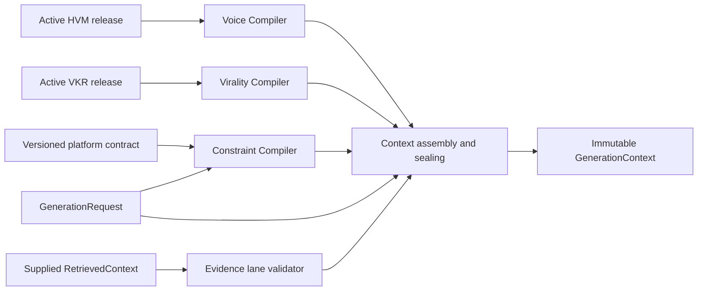

# Context Compilation Engine

## Purpose and boundary

The Context Compilation Engine is the deterministic policy boundary between governed knowledge
artifacts and future content generation. It accepts exact HVM and VKR releases, generation intent,
platform policy, optional typed caller rules, and already-retrieved evidence. It emits one sealed
`GenerationContext`.

This subsystem does not retrieve documents, render prompts, call a model, or generate content. A
future prompt builder or provider adapter may consume `GenerationContext`; it must not consume raw
HVM/VKR releases independently. That rule prevents provider-specific prompt code from silently
reimplementing confidence, authority, inheritance, or constraint policy.

The output keeps voice, structure, constraints, intent, and evidence as distinct fields. There is
no concatenated context string and no prompt text.

## Inputs and release pinning

`CompilationInput` requires:

- a `GenerationRequest` with exact voice lineage and version;
- the governed `VoiceIdentity` that connects the request leader to the HVM identity;
- an active `ManagedRelease` with a valid, content-matched validation report;
- the exact content-addressed `FeatureRegistry` pinned by that HVM release;
- an active, validated `ViralityProfile` from the same tenant;
- a compiler-supported platform and language;
- a caller-supplied UTC compilation time;
- optional typed `UserConstraint` values;
- optional `RetrievedContext` produced elsewhere.

The explicit identity input is intentional. An HVM release stores a writing-identity identifier,
not the external leader identifier from `GenerationRequest`; accepting both without validating the
governance link would permit cross-identity compilation. Tenant, identity, lineage, version,
registry hash, release state, and validation status are all checked before selection begins.

Missing profiles, inactive releases, stale or mismatched registries, ownership violations,
identity mismatches, unpinned versions, unsupported platforms, and invalid validation reports fail
with `ContextCompilationError` and a stable `details.reason`. These are expected application
failures, not warnings.

## Voice compilation

The Voice Compiler does not expose the entire HVM. A feature crosses the boundary only when all
of the following are true:

1. its exact registry definition grants `DownstreamPermission.GENERATE`;
2. the definition supports the requested platform and language;
3. its component has actionable or explicit-policy authority;
4. the component context matches platform, language, supported content form, and audience;
5. decomposed confidence meets the versioned compilation policy.

The default policy gates measurement reliability, authorship attribution, coverage, effective
support, distinctiveness, calibration, contradiction mass, and conditional transfer confidence.
It never converts a descriptive component into an actionable instruction. Consequently, current
Tier 1 profiles—which deliberately remain descriptive—will fail this boundary until a governed
analysis/review process grants generation authority. This is a safety property, not an integration
bug.

For each eligible feature, the compiler selects one core residual, resolves the most applicable
platform conditional as an inherited delta, and finally applies an active explicit preference if
one exists. Explicit preferences override statistical targets because they carry governed human
authority; they remain source-labeled and never masquerade as observed frequency. Compatible
scalar base and delta values are resolved numerically. Other typed values retain a structured
`base` plus `conditional_delta`, avoiding invalid arithmetic across distributions, graphs, or
incompatible units.

Features are ranked deterministically by decomposed confidence and stable feature identity, then
bounded by a configurable compactness limit. Interactions are admitted only when every marginal
feature was selected and the interaction independently passes context, authority, and confidence
gates. Every selected target retains component and evidence-unit identifiers. Every rejected
candidate records a stable ignored reason.

This is deeper than example retrieval: the downstream consumer receives resolved micro-pattern
targets, authority, inheritance source, uncertainty, and evidence lineage rather than a prose
style summary or a bag of previous posts.

## Virality compilation

The Virality Compiler reads the active VKR independently of HVM. It filters patterns by exact
platform, descriptive authority, minimum document support, minimum leader support, and comparable
performance fraction. It then selects a bounded number per `StructuralDimension` using a stable
ordering over comparability, support, leader breadth, observed association, and pattern identity.

The output contains structural labels and evidence addresses, never reusable wording and never a
personal voice claim. `causal_claims_permitted` is always false in this release. Observed
performance differences are retained as descriptive associations; the compiler does not claim
that adopting a pattern will cause engagement.

## Constraint compilation

Constraints are compiled into one nonduplicated list. Every item has an origin category, hard or
soft strength, typed operator, canonical key, JSON-compatible value, priority, rationale, source,
and optional evidence trace.

Current sources are:

- hard platform character limits from versioned platform contracts;
- hard, versioned safety policy against ungrounded factual claims and fabricated quotations;
- HVM negative-space rules, preserving hard/soft strength, basis, feature, value or frequency
  ceiling, and evidence;
- typed caller rules for user or formatting concerns;
- legacy `GenerationRequest.constraints`, preserved conservatively as opaque soft instructions.

Opaque strings are never parsed into hard policy. Numeric minima/maxima must carry numeric values.
The compiler rejects duplicate identifiers, incompatible exact values, a minimum above a maximum,
an exact value outside bounds, or an exact value that is simultaneously prohibited. Compatible
hard limits remain independently traceable; a future consumer can apply the most restrictive
bound without losing source attribution.

Platform contracts are injected data, not scattered constants. The default composition pins the
official 3,000-character LinkedIn UGC limit and 280-character X post limit with source references,
verification date, and policy version. LinkedIn remains a single-post contract. X supports a
request-pinned thread of two to five posts: every unit retains the 280-character limit and the exact
requested count is sealed into generation intent before validation and splitting.

## Retrieved evidence

`RetrievedContext` is a future input, not something this subsystem produces. The Evidence Compiler
only validates and partitions supplied items into the existing roles:

- voice evidence;
- factual evidence;
- structural reference;
- platform reference.

Ranks must be globally unique, document-role pairs cannot repeat, and factual documents must
belong to `GenerationRequest.source_document_ids` whenever that whitelist is nonempty. The
compiler does not rerank, embed, search, or infer why an item exists. Empty evidence is valid and
represented by explicit empty lanes, allowing profile/structure compilation to be tested before a
retriever exists.

## Determinism, immutability, and reports

All public contracts inherit the strict frozen `ContractModel`. Ordering uses explicit stable keys;
the compiler does not read current time, random state, environment variables, or provider
configuration. The caller supplies `compiled_at`. The canonical JSON payload is hashed with
SHA-256, and the context UUID is derived from that digest. Recompiling identical pinned inputs and
policy produces the identical object, hash, and identifier.

`CompilationReport` exposes:

- selected voice feature IDs and ignored HVM knowledge with reasons;
- selected structural pattern IDs and ignored VKR knowledge with reasons;
- hard/soft and per-category constraint counts;
- minimum and mean voice selection scores plus structural support summary;
- typed trace edges to HVM/VKR releases, components, patterns, evidence units, and an optional
  retrieval trace.

The report is inside the sealed payload, so audit behavior is versioned and content-addressed with
the decisions it explains.

## Scaling and extension points

Compilation is CPU-local over bounded release projections. It performs no network or database I/O,
so workers can run it horizontally by tenant and request. Exact release and registry hashes are
natural cache keys. Context objects can be persisted as immutable artifacts without coupling this
domain to a storage engine.

Supported extensions are deliberately narrow:

- add a platform by registering another reviewed `PlatformContract`;
- revise confidence or compactness thresholds by publishing a new `ContextCompilationPolicy`;
- add a constraint source by adapting it to `CompiledConstraint` before assembly;
- add intent-aware feature relevance through a deterministic, versioned selector injected into
  `VoiceCompiler`, not through prompt heuristics;
- add another evidence role in the shared enum and update lane validation explicitly;
- add a new HVM value type by defining governed inheritance semantics rather than falling back to
  string rendering.

Changes that alter selection, priority, constraints, or hashing require a compiler-version bump
and golden context regression fixtures.

## Known limitations and failure modes

- Feature relevance currently means authorization, platform/language/context applicability, and
  confidence. It does not semantically match arbitrary topics; doing that deterministically
  requires a governed intent-to-feature policy that does not yet exist.
- VKR v1 supports social-post structures and descriptive associations only.
- The default platform catalog covers LinkedIn and X single posts only.
- Supplied retrieved text is retained in `GenerationContext`; access control and retention must be
  enforced by the future retriever and persistence adapter.
- The compiler validates structural and governance contracts, not whether a future generated draft
  actually follows them. That belongs in generation-time validation and the evaluation pipeline.
- A configuration can weaken safety only by constructing a non-default `ConstraintCompiler`.
  Production composition must use the reviewed composition root and test its policy fingerprint.

## Test strategy

Unit and integration tests cover exact end-to-end determinism, immutable separation of voice and
structure, conditional inheritance, explicit-preference precedence, generation-permission denial,
confidence/support failure, profile and registry pinning, tenant/identity isolation, platform
mismatch, constraint conflicts, HVM negative-space compilation, evidence lanes, unpinned factual
evidence, traceability, and platform-policy validation. The repository-wide CI gate runs Ruff,
Black, strict mypy, and pytest with branch coverage of at least 95%.
