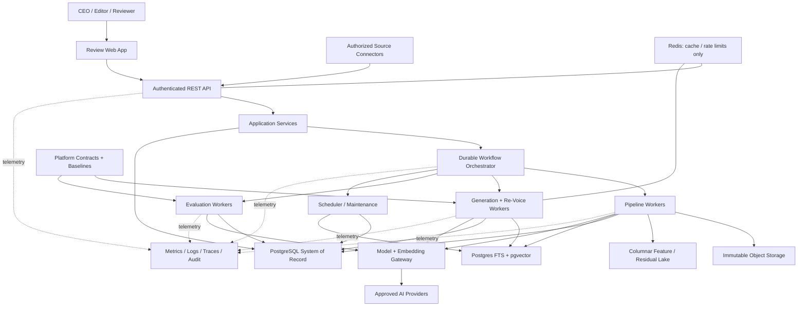
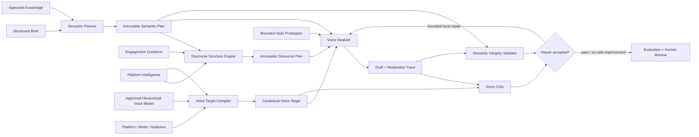
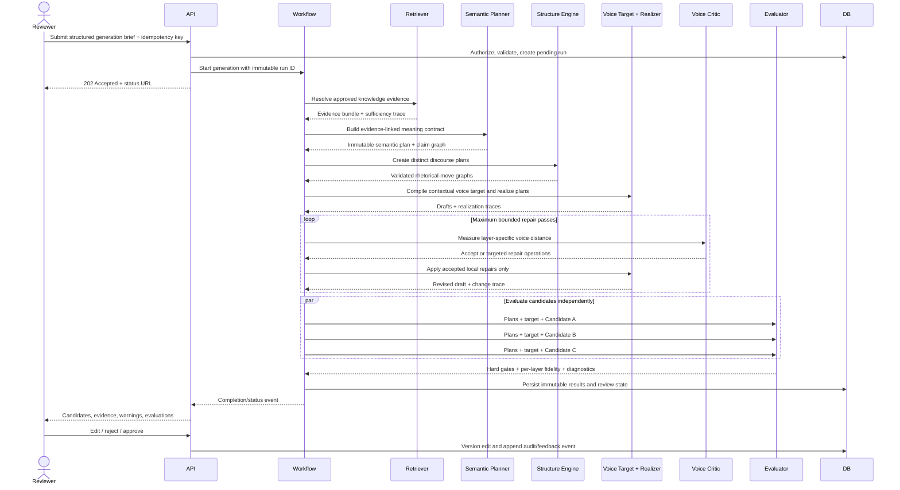
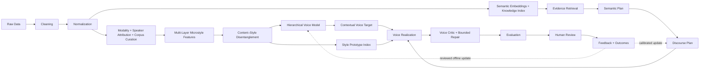

# Engineering Blueprint: Multi-Tenant CEO Social Voice Platform

**Status:** Phase 1 architecture proposal; no production features implemented

**Date:** 2026-07-13

**Audience:** Product, engineering, ML/AI, security, data, and operations
**Decision state:** Recommended baseline, subject to the validation gates in Section 1.10

## 0. Executive position

This product is a multi-tenant writing system that learns a CEO's **written communication process at multiple linguistic levels**, separates that process from subject matter and content structure, realizes new drafts under measurable voice constraints, and improves through controlled evaluation and feedback. Retrieval supplies facts and selected evidence; it is not the mechanism that creates voice fidelity.

The word “voice” is ambiguous. This blueprint assumes it means textual persona and style—not speech input, speech synthesis, or voice cloning. If audio is a requirement, it is a separate bounded context and materially changes consent, security, data processing, latency, and model choices.

### Recommended architecture in one page

- Start with a **modular monolith** using ports-and-adapters boundaries. Deploy the API, workflow workers, and scheduler as separate processes that import the same domain packages. This keeps operational complexity proportional to a system serving hundreds—not millions—of CEOs while preserving extraction paths to future services.
- Use a **durable asynchronous workflow** for ingestion, profiling, generation, and evaluation. Synchronous APIs validate and enqueue; workers execute model and data work with retries, idempotency, and recorded lineage.
- Use **PostgreSQL as the system of record**, object storage for immutable raw artifacts, and PostgreSQL full-text search plus pgvector for the first retrieval implementation. Add a dedicated vector engine only when measured scale or recall requires it.
- Represent voice as a **hierarchical statistical and symbolic model**, not a prose description or one embedding. It includes microstyle distributions, content-invariant stylistic residuals, contextual modes, negative constraints, exemplar prototypes, feature interactions, confidence, and corpus lineage.
- Split generation into four explicit transformations: **semantic planning** determines what must be said; **discourse planning** determines the information structure; **voice realization** renders that plan using CEO-specific micro-patterns; **voice criticism and repair** measures deviations and applies bounded local corrections without changing meaning.
- Keep **voice, semantic facts, structure, and engagement strategy as separate artifacts**. Knowledge supplies what may be claimed. The Structure Engine supplies a platform-appropriate discourse plan. The Voice Model conditions how the plan is realized. Engagement guidance may rank structural tactics. None may silently take ownership of another layer.
- Use exemplars as diagnostic prototypes and bounded local evidence—not as the voice representation itself. Retrieval is retained for facts and selective context, but a conventional “retrieve old posts and ask the LLM to imitate them” path is an explicit baseline, not the target architecture.
- Put all model calls behind an **LLM/embedding gateway**. Prompts, schemas, models, retrieval traces, and evaluator versions are immutable inputs to a reproducible generation run.
- Treat generation as **decision support**, not autonomous publishing. Human approval is mandatory in the initial production scope.
- Treat “virality” as an uncertain, platform-dependent ranking problem—not a promise. The system should estimate likely effectiveness and explain tactics, never claim it can guarantee reach.
- Make evaluation a product subsystem from day one. Use deterministic gates, grounded checks, calibrated model graders, near-copy detection, and human review. A single aggregate “quality score” is not sufficient.

### Architectural invariants

These rules should be enforced in design reviews and tests:

1. Every persisted business record has an `organization/tenant` owner; every query is tenant-scoped; database policy provides defense in depth.
2. Raw source data is immutable. Cleaning creates a new derived version and never overwrites provenance.
3. HVMs, Voice Targets, plans, prompts/compilers, model configurations, embeddings, engagement models, and evaluation rubrics are versioned.
4. A generation run can be reproduced from recorded inputs, subject to the nondeterminism of external models.
5. Factual claims must trace to the user brief or an approved knowledge source. Voice exemplars are not factual evidence.
6. Engagement tactics may affect structure, hook, framing, and call to action; they may not add facts or distort the CEO's position.
7. Semantic content, discourse structure, and surface voice are versioned intermediate artifacts. A later stage may not silently change an earlier stage's contract.
8. Voice fidelity is evaluated on held-out topics and content-matched counterfactuals; success on randomly split historical posts is insufficient because it permits topic leakage.
9. No single voice score controls generation. Feature-distance, authorship discrimination, human preference, edit behavior, semantic preservation, and anti-copying checks are jointly considered to avoid stylometric caricature.
10. Re-voicing must preserve semantic claims and explicit constraints. Material semantic changes require regeneration or user approval.
11. Retrieved source text is untrusted input. It cannot issue system instructions or override policy.
12. A generated draft must pass hard policy gates and human approval before publication.
13. Human feedback updates a candidate feedback record immediately, but updates HVMs, compilers, or models only through a versioned, reviewable process. No uncontrolled online learning.
14. The system models observable communication behavior under known contexts. It must not claim to infer the CEO's private thought process, personality, intent, or immutable identity from writing alone.

---

# Phase 1 — Requirements analysis

## 1.1 Project summary

Build a production-quality platform that can onboard hundreds and grow to thousands of CEOs and create high-quality social media drafts in each CEO's authentic written voice. It must ingest and govern source material, construct evidence-backed and versioned Hierarchical Voice Models, retrieve tenant-isolated factual evidence and bounded prototypes, separate semantics from discourse structure and surface realization, generate and re-voice drafts, evaluate quality and safety, support human review, and learn from explicit feedback without silently drifting.

The product is not merely a prompt wrapper. Its durable value is the combination of:

- governed, traceable CEO-specific data;
- a hierarchical, content-controlled representation of voice with explicit uncertainty;
- staged semantic planning, discourse planning, voice realization, and bounded repair;
- a repeatable ablation and human-evaluation program that can prove or reject architectural value;
- an approval and feedback loop;
- operational controls for reliability, privacy, cost, and multi-tenancy.

## 1.2 Functional requirements

### A. Tenant, identity, and access

- **FR-001:** Create organizations, users, roles, memberships, and CEO personas.
- **FR-002:** Support at least `admin`, `editor`, `reviewer`, and `viewer` roles; keep `publisher` separate if publishing is later introduced.
- **FR-003:** Isolate source data, embeddings, prompts assembled with private data, drafts, metrics, and audit events by tenant.
- **FR-004:** Record who created, modified, approved, exported, or deleted an artifact.
- **FR-005:** Configure per-CEO platforms, languages, prohibited topics, required disclosures, preferred claims, and review rules.

### B. Source ingestion and governance

- **FR-010:** Ingest authorized historical posts and supporting materials—including X, LinkedIn, podcasts, YouTube/video transcripts, interviews, earnings calls, blogs, and shareholder letters—through an initial file/upload interface followed by prioritized approved connectors.
- **FR-011:** Preserve original content, source URI or external ID, author, timestamps, platform, content type, language, ingestion time, consent/rights metadata, and a content hash.
- **FR-012:** Make ingestion idempotent and detect exact and near duplicates.
- **FR-013:** Allow sources or individual items to be included/excluded from voice learning, factual grounding, virality analysis, or evaluation datasets independently.
- **FR-014:** Support deletion and retention workflows that remove derived features and embeddings as well as source records.
- **FR-015:** Quarantine unsupported, corrupt, suspicious, or policy-disallowed input without blocking unrelated items.
- **FR-016:** Record source modality and transformation chain: authored-written, prepared-spoken, spontaneous-spoken, interviewer-mediated, team-edited, ghostwritten/unknown, transcript provider, diarization, ASR confidence, and editorial processing.
- **FR-017:** Preserve speaker turns and attribution confidence for podcasts, interviews, videos, and earnings calls; quoted interviewer or other-speaker text must not enter the CEO voice corpus.
- **FR-018:** Weight or exclude source modalities independently. Spoken transcripts may inform selected pragmatic or lexical tendencies only after modality controls; they cannot be treated as equivalent to authored platform writing.

### C. Cleaning, normalization, and content understanding

- **FR-020:** Clean boilerplate and platform artifacts while retaining an immutable raw version.
- **FR-021:** Normalize heterogeneous material into a canonical content-unit schema.
- **FR-022:** Preserve semantically meaningful formatting such as line breaks, lists, emoji, hashtags, quotations, and calls to action as structured features.
- **FR-023:** Detect language, content type, likely authorship confidence, duplicates, quoted material, and obvious PII/secrets.
- **FR-024:** Segment long-form sources into context-preserving units suitable for features and retrieval.
- **FR-025:** Calculate deterministic linguistic, structural, topical, and rhetorical features with extractor and schema versions.

### D. Embedding and indexing

- **FR-030:** Create embeddings for approved normalized units and record model, dimensions, input hash, and creation time.
- **FR-031:** Maintain independent indexes or namespaces for voice exemplars, approved knowledge, and engagement/virality evidence.
- **FR-032:** Re-embed through an explicit migration/backfill workflow; never mix incompatible embedding spaces in one search.
- **FR-033:** Support tenant, CEO, source type, platform, language, date, quality, and approval filters.

### E. Hierarchical Voice Model Engine

- **FR-040:** Build a versioned Hierarchical Voice Model from approved, sufficiently attributable material.
- **FR-041:** Represent orthographic, lexical, syntactic, rhythmic, discourse, pragmatic, and editorial micro-patterns as distributions and relationships—not only scalar averages or prose labels.
- **FR-042:** Estimate stable, content-invariant CEO style separately from topic, platform, campaign, content form, co-author, and time-dependent effects.
- **FR-043:** Support human review, edits, approval, comparison, activation, and rollback of HVMs.
- **FR-044:** Express low-data uncertainty instead of fabricating a precise voice model.
- **FR-045:** Detect drift when new approved writing differs materially from the active HVM.
- **FR-046:** Store a hierarchical voice model containing a population/cohort prior, CEO-level residual signature, conditional mode overrides, feature covariance/interactions, prototype exemplars, negative constraints, and confidence by feature family.
- **FR-047:** Support counterfactual and cross-topic tests that detect whether a purported voice signal is actually a company, product, named-entity, or subject-matter signal.
- **FR-048:** Select an inference-time voice target as feature ranges and priorities for the requested platform/mode rather than copying the historical corpus mean exactly.
- **FR-049:** Degrade personalization by explicit tier when data is sparse: approved explicit preferences, population prior, or neutral brand-safe style—never an overconfident synthetic fingerprint.

### F. Virality/engagement engine

- **FR-050:** Store post-performance observations with platform, timestamp, follower/audience baseline where available, impressions/reach, engagement components, post age, and collection method.
- **FR-051:** Normalize metrics for exposure, audience size, age, and platform where data permits; report missing/confounded data.
- **FR-052:** Extract reusable presentation tactics such as hook type, structure, specificity, tension, narrative, cadence, and call-to-action style.
- **FR-053:** Produce tactic recommendations and candidate-ranking signals with uncertainty and an explanation.
- **FR-054:** Keep engagement signals from overriding factuality, brand safety, voice fidelity, or user intent.
- **FR-055:** Version datasets, features, heuristics/models, calibration, and offline validation results.

### G. Knowledge and retrieval

- **FR-060:** Maintain approved factual knowledge separately from voice training material.
- **FR-061:** Convert a generation brief into a retrieval plan across voice, knowledge, and engagement lanes.
- **FR-062:** Use hybrid lexical/semantic retrieval, metadata filters, recency, diversity, and optional reranking.
- **FR-063:** Enforce a token budget and return provenance, scores, filter decisions, and exclusion reasons in a retrieval trace.
- **FR-064:** Return an explicit insufficient-evidence result when required claims are not supported.
- **FR-065:** Detect and neutralize prompt injection or instruction-like text in retrieved content.

### H. Prompt building and generation

- **FR-070:** Accept a structured brief containing CEO, platform, objective, audience, topic, source facts, desired length, constraints, and number of candidates.
- **FR-071:** Resolve and snapshot the approved HVM, compiled Voice Target, prompt/compiler versions, retrieval trace, plans, policy, model route, and parameters.
- **FR-072:** Build deterministic prompt sections within explicit context budgets and require structured model output.
- **FR-073:** Generate one or more meaningfully distinct candidates rather than superficial paraphrases.
- **FR-074:** Include a claim ledger or evidence mapping for evaluation; do not expose hidden model reasoning.
- **FR-075:** Support cancellation, timeout, retry, rate limiting, idempotency, partial failure, and safe provider fallback.
- **FR-076:** Keep provider-specific response objects outside domain models.
- **FR-077:** Produce an immutable, voice-neutral semantic plan containing claims, evidence, stance, audience intent, and locked meaning before surface generation.
- **FR-078:** Produce a separate discourse plan containing rhetorical moves, ordering, paragraph roles, hook/close strategy, and platform constraints without adding claims.
- **FR-079:** Realize the discourse plan under a versioned voice-target specification, then measure and repair specific feature deviations without reopening validated semantics.

### I. Re-Voice Engine

- **FR-080:** Rewrite a user-provided or system-generated draft toward an approved CEO HVM/Voice Target.
- **FR-081:** Support scoped controls such as “more concise,” “less promotional,” “stronger hook,” or “platform adaptation.”
- **FR-082:** Preserve named entities, numbers, links, quotations, required disclosures, and locked claims unless explicitly authorized to change them.
- **FR-083:** Evaluate semantic equivalence and identify material changes before presenting the result.
- **FR-084:** Retain parent-child lineage between the original and re-voiced versions.
- **FR-085:** Diagnose voice mismatch by feature family and apply the smallest scoped transformation capable of correcting it.
- **FR-086:** Prevent repair loops from maximizing stylometric features into unnatural caricature through bounded passes, naturalness constraints, and multi-objective acceptance.
- **FR-087:** Preserve the input's semantic and structural plans independently. “Voice only” is the default and freezes both plans; “structure only” and full platform adaptation are explicit operations that version and display the Discourse Plan diff.

### J. Evaluation, review, and feedback

- **FR-090:** Run deterministic validation for schema, length, required phrases/disclosures, forbidden patterns, links, and platform constraints.
- **FR-091:** Evaluate brief adherence, factual grounding, voice fidelity, clarity, platform fit, novelty, near-copy risk, brand/policy risk, and engagement quality.
- **FR-092:** Separate hard blocking gates from advisory scores and explanations.
- **FR-093:** Version evaluator prompts, models, rubrics, thresholds, and calibration datasets.
- **FR-094:** Provide side-by-side review, source/evidence inspection, editing, reject reasons, approval, and export.
- **FR-095:** Capture edit distance, semantic changes, explicit ratings, rejection reasons, selected candidate, and—when authorized—publication outcomes.
- **FR-096:** Turn representative accepted/rejected examples into regression evaluation cases through a reviewed process.
- **FR-097:** Evaluate voice on topic-held-out, time-held-out, content-matched cross-author, sparse-data, and adversarial-noise datasets; random post splits alone are prohibited.
- **FR-098:** Run component ablations against at least four baselines: generic voice summary, exemplar-only RAG, structured voice model without staged realization, and the full staged architecture.
- **FR-099:** Report fidelity by linguistic layer, CEO cohort, platform, mode, and data sufficiency; aggregate improvements may not conceal regressions for specific leaders or low-data cohorts.

### K. Operations and administration

- **FR-100:** Expose job status, stage progress, failures, retry history, model usage, latency, and estimated/actual cost.
- **FR-101:** Support quotas and concurrency limits by tenant and workload.
- **FR-102:** Support prompt/compiler/model/HVM rollout by environment, cohort, tenant, or experiment.
- **FR-103:** Provide kill switches for a provider, model, connector, prompt version, evaluator, or auto-transition.
- **FR-104:** Provide audit export and data-subject deletion workflows.

### L. Platform Intelligence

- **FR-110:** Maintain a versioned platform contract covering content forms, limits, formatting semantics, link/media behavior, policy constraints, and metrics definitions.
- **FR-111:** Represent platform behavior hierarchically as global leader core plus platform residual plus content-form/mode interaction, with feature-specific support and uncertainty.
- **FR-112:** Prevent platform conventions from being mislabeled as CEO voice by estimating platform baselines across leaders and comparing the CEO against that baseline.
- **FR-113:** Compile a platform realization target that constrains the Discourse Plan and Voice Target without altering the Semantic Plan.
- **FR-114:** Evaluate the same leader separately by platform and detect unsupported transfer when insufficient examples exist for a target platform.
- **FR-115:** Keep platform adapters independent from source connectors, HVM building, and model providers so platform changes do not require retraining unrelated components.
- **FR-116:** Version metric semantics and collection windows; “engagement” fields from different platforms may not be compared without an approved normalization model.

## 1.3 Non-functional requirements

The following are **proposed starting objectives**, not validated commitments. Product and operations owners must approve the numbers.

| Quality | Proposed objective | Architectural consequence |
|---|---|---|
| Availability | 99.9% monthly for API/control plane; queued jobs survive worker restarts | Managed database, durable workflows, multi-instance stateless API |
| API latency | p95 under 500 ms for reads and under 1 s to validate/enqueue generation, excluding file upload | No model calls on request thread; indexed queries |
| Generation latency | p95 under 45 s for a standard three-candidate request; progress visible after 2 s | Parallelizable candidate/eval stages, timeouts, streaming status |
| Ingestion latency | Newly uploaded batch searchable within 15 minutes at the agreed standard batch size | Async fan-out, backpressure, batch embeddings |
| Launch scale envelope | 500 organizations, 1,000 leader personas, 5 million normalized units, 50 concurrent generation jobs | Horizontal workers, tenant quotas, partition-aware storage |
| Design/expansion envelope | 5,000 organizations, 10,000 leader personas, 100 million normalized units, 500 concurrent generation jobs; validate before commitment | Columnar offline features, compact online HVMs, independent worker pools, index/OLTP separation triggers |
| Durability | No acknowledged business event lost; raw artifacts and approvals durable | Transactional outbox, object versioning, backups |
| Recovery | Proposed RPO 15 minutes and RTO 4 hours | PITR database, versioned object store, restore drills |
| Tenant isolation | Zero cross-tenant results in API, retrieval, logs, and exports | AuthZ at application and database layers; adversarial isolation tests |
| Security | Encryption in transit/at rest, least privilege, managed secrets, audited privileged access | OIDC, KMS, secret manager, service identities |
| Privacy | Configurable retention/deletion; no raw CEO content in telemetry by default | Data classification, redaction, deletion lineage |
| Explainability | Each candidate exposes sources, semantic/discourse plans, HVM/Voice Target versions, realization/repair trace, tactic explanation, and evaluator outcomes | Immutable generation/retrieval/evaluation records |
| Reproducibility | Every AI artifact records prompt, model route, parameters, context hashes, and versions | Append-only run metadata; prompt registry |
| Maintainability | Domain logic independent of web, database, queue, and model SDKs | Ports/adapters, dependency rules, contract tests |
| Cost control | Per-tenant and per-stage token/cost metering; configurable budget ceilings | Model router, batching, caches, quotas, alerts |
| Observability | Trace one request across API, workflow, model, retrieval, and evaluation | OpenTelemetry-compatible traces and correlation IDs |
| Accessibility | Review UI targets WCAG 2.2 AA | Keyboard workflows, contrast, semantic controls |
| Portability | One provider or database replacement does not alter domain contracts | Provider gateways and repository interfaces |

Quality SLOs also need product baselines. Before launch, set measurable minimums on a held-out, human-rated CEO dataset—for example, hard-gate pass rate, unsupported-claim rate, near-copy rate, blind voice preference, reviewer acceptance, and average edit effort. Do not invent targets until baseline human agreement is known.

## 1.4 Explicit constraints

- This phase must produce analysis and architecture only; no feature implementation.
- The launch design must support hundreds of CEOs, have an explicit path to thousands, and cannot encode CEO-specific logic in prompts or code.
- Modules must have single responsibilities and explicit contracts.
- External model, embedding, storage, and connector vendors must be replaceable behind adapters.
- Tenant isolation applies to all derived artifacts, not only raw records.
- Social and source data may be processed only with appropriate authorization and within platform/API terms.
- Model output is probabilistic; critical rules and publication approval cannot rely solely on an LLM.
- Training/fine-tuning is not assumed. Interpretable HVM targets and staged realization are the default until ablation evidence demonstrates a need.
- “Virality” cannot be guaranteed or evaluated from raw likes alone.
- Current workspace state is an empty Git repository; there are no legacy constraints or datasets to preserve.

## 1.5 Scope

### Initial production scope

- Multi-tenant organization and CEO persona management.
- Authorized ingestion through file upload and one prioritized source connector.
- English textual content for one prioritized social platform, with schemas designed for additional languages/platforms.
- Immutable raw storage, normalization, corpus curation, multi-layer features, disentanglement, purpose-specific indexes, and deletion lineage.
- Versioned, human-approved HVMs and contextual Voice Targets.
- Separate approved-knowledge, structural-pattern, and curated voice corpora/representations.
- Hybrid knowledge retrieval and style-specific prototype selection with provenance.
- Structured brief, immutable Semantic/Discourse Plans, staged voice realization, bounded criticism/repair, re-voicing, and human editing.
- Evaluation gates, review, approval, and export/copy.
- Feedback capture, offline evaluations, operational metrics, audit, and cost controls.
- Virality v1 as transparent heuristics/ranking informed by authorized performance data.

### Designed extension scope

- Additional social platforms and languages.
- Additional content/data connectors.
- Publication integration after policy and approval controls mature.
- Learned ranking and personalization based on sufficient, unbiased outcome data.
- Dedicated vector infrastructure if scale measurements justify it.

## 1.6 Out of scope for the initial production release

- Audio conversation, transcription, text-to-speech, biometric voice cloning, or phone calling.
- Autonomous posting or scheduling without an explicit human approval boundary.
- Images, video, carousels, or synthetic avatars.
- Scraping platforms in violation of their terms or ingesting private material without permission.
- Guaranteed virality, follower growth, or business outcomes.
- Automated political persuasion, deceptive impersonation, astroturfing, or undisclosed synthetic endorsements.
- Fully automated fact research from the open web without approved sources and citations.
- Online model fine-tuning or reinforcement learning directly from unreviewed user behavior.
- A general-purpose social media management, CRM, advertising, or listening suite.
- Mobile-native applications; a responsive web review surface is sufficient initially.
- Supporting every platform and language at launch.

## 1.7 Engineering challenges

1. **Style versus subject leakage.** Semantic models can confuse what a CEO discusses with how the CEO writes. Voice needs explicit style features and counterfactual evaluation, not only embeddings.
2. **Sparse or misattributed data.** Many executive accounts are ghostwritten, team-edited, or contain too few examples. The system needs authorship confidence, data thresholds, and human approval.
3. **Temporal and contextual voice.** A CEO may write differently for crises, hiring, product launches, or personal stories. One static persona paragraph is inadequate.
4. **Authenticity versus copying.** Retrieval improves fidelity but also increases plagiarism and memorization risk. Diversity, passage limits, and near-copy checks are required.
5. **Factual integrity.** Historical posts may contain stale claims. A style corpus must never silently serve as current factual truth.
6. **Causal ambiguity of engagement.** Reach depends on audience, timing, promotion, platform algorithms, and topic. Likes do not isolate the value of a hook or structure.
7. **Subjective evaluation.** Human raters may disagree on “sounds like me.” Rubrics, blind comparisons, calibration, and inter-rater agreement are required.
8. **Cross-tenant leakage.** A missing filter in vector search, cache keys, logs, or evaluation fixtures can expose highly sensitive executive content.
9. **Prompt injection from sources.** Documents and posts are untrusted data even when owned by the tenant.
10. **Long-running reliability.** Ingestion and generation span external APIs with variable latency, rate limits, and partial failures.
11. **Reproducibility under changing models.** Provider aliases can change behavior. Exact model IDs, prompt versions, and context snapshots must be recorded.
12. **Feedback bias.** Selected drafts and high-performing posts are not a random sample. Blindly learning from them reinforces survivorship and reviewer preference bias.
13. **Platform volatility.** APIs, metrics, limits, terms, and formatting conventions change.
14. **Cost/quality tradeoffs.** Profile extraction, multi-candidate generation, reranking, and model graders can multiply token cost.

## 1.8 Assumptions requiring validation

| Assumption | Current confidence | Why it matters | Validation method |
|---|---:|---|---|
| “Voice” means written style, not audio | Medium | Audio changes the entire architecture and risk model | Product decision in writing |
| Initial channels are LinkedIn and/or X | Low | Formats, data APIs, metrics, and evaluation differ | Prioritize one launch platform |
| English is the launch language | Low | Tokenization, features, embeddings, and human evaluation vary by language | Confirm customer/language matrix |
| Historical posts can legally be used for profiling | Medium | Rights, platform terms, and deletion obligations | Legal/data-governance review |
| The CEO or delegate can attest authorship | Low | Ghostwriting can corrupt the learned HVM | Add authorship-confidence workflow |
| Spoken/video sources have reliable speaker and transformation metadata | Low | Interviewer text, prepared scripts, ASR artifacts, and oral cadence can corrupt written voice | Audit diarization/transcript/editorial provenance and define admissible feature families |
| Performance metrics and audience baselines are available | Low | Virality modeling is weak without exposure/denominator data | Connector spike and sample audit |
| Human approval is acceptable before publishing | High | Safest initial control; affects workflow and latency | Confirm approval roles and SLA |
| A brief or approved source supplies all material facts | Medium | Determines whether web research is needed | Define knowledge-source policy |
| Hundreds of CEOs means low thousands of personas, not millions | Medium | Supports modular-monolith recommendation | Obtain 12/24-month capacity forecast |
| Per-CEO corpora are small enough for filtered exact vector search initially | Medium | Avoids premature dedicated vector infrastructure | Measure actual chunk counts and latency |
| Customers accept a managed model API | Low | Data residency, retention, and procurement may prohibit it | Security/procurement review |
| Fine-tuning is not required at launch | High | HVM targets and staged realization are more inspectable, reversible, and deletable | Complete the ablation matrix before any fine-tuning ADR |
| Enough content overlap exists to separate author from topic/platform | Low | Without matched variation, CEO residual style is statistically unidentifiable | Audit topic/form overlap and run leakage analysis on a sample corpus |
| A cross-CEO evaluation cohort can be legally assembled | Low | Disentanglement and cross-voice confusion cannot be validated in isolation per CEO | Approve a consented/de-identified benchmark program |
| Reviewers will provide structured feedback | Medium | Evaluation and improvement depend on reliable labels | Workflow prototype with reviewers |
| Publication metrics may be joined back to drafts | Low | Enables outcome analysis but creates attribution and privacy issues | Consent and connector validation |

## 1.9 Risks and mitigations

| Risk | Likelihood | Impact | Primary mitigation | Residual decision |
|---|---:|---:|---|---|
| Cross-tenant data leakage | Medium | Critical | Database RLS, tenant-scoped repositories, retrieval filters, cache namespacing, isolation tests | Independent security review before launch |
| CEO reputational harm from false or offensive content | Medium | Critical | Approved knowledge, hard gates, human approval, audit trail, kill switch | Define liability and incident process |
| Near-copy/plagiarism from historical posts | Medium | High | N-gram and semantic similarity gates, retrieval excerpt limits, novelty evaluation | Agree allowed reuse policy |
| HVM learns ghostwriter rather than intended CEO/brand voice | High | High | Authorship labels/confidence, corpus subsets, HVM review, source weighting | Product must define “target voice” |
| Topic/entity leakage is mislabeled as voice | High | High | Content-matched and cross-topic evaluation, residualization, entity masking, leaky-feature exclusion | Accept that some CEO traits will remain unidentifiable |
| Critic creates stylometric caricature | Medium | High | Feature ranges, interaction/naturalness checks, bounded repairs, caricature adversarial set, human blind review | Define acceptable fidelity versus natural variation |
| Cohort prior encodes cultural or demographic bias | Medium | High | Cohorts based on language/platform/form rather than sensitive identity, fairness slices, reviewer controls | Governance approval of cohort features |
| Staged generation increases latency/cost without quality gain | Medium | Medium | Mandatory ablations, cached/reused plans, route smaller stages, stop at simplest winning arm | Set practical minimum uplift and cost/latency guardrails |
| Virality engine rewards sensational or off-brand tactics | Medium | High | Multi-objective ranking with brand/voice constraints; explain tactics | Establish ethical engagement policy |
| Unsupported/stale claims | High | High | Separate knowledge store, effective dates, claim ledger, evidence-required generation | Define approved freshness windows |
| Prompt injection or poisoned source | Medium | High | Treat retrieval as data, sanitize, delimit, minimize tool authority, adversarial tests | Define handling of user-authored instructions |
| Provider outage/rate limit | Medium | Medium | Durable retries, circuit breakers, quotas, provider routing, graceful degradation | Procurement for secondary provider |
| Model behavior changes | High | High | Pin model versions, canary, golden eval gate, rollback | Decide acceptable alias policy |
| Evaluation grader bias/correlation | High | Medium | Human calibration, deterministic checks, multiple judges or provider diversity | Budget ongoing labeling |
| Data deletion misses embeddings/backups | Medium | High | Data lineage, deletion tombstones, backfill-aware erasure, retention schedule | Legal review of backup deletion window |
| Cost grows faster than usage | Medium | High | Stage-level metering, budgets, batch/caching, small-model routing | Set unit economics before launch |
| Workflow complexity becomes operational burden | Medium | Medium | Managed durable workflow or simple queue behind an interface; runbooks | Reassess after load testing |
| Insufficient performance data for learned virality | High | Medium | Start with transparent heuristics; never present false precision | Delay ML until dataset gate is met |
| Feedback loop causes voice drift | Medium | High | Offline reviewed HVM versions, holdout eval, rollback | Define who can activate HVMs |
| Platform API/terms change | High | Medium | Connector adapters, source contracts, feature flags | Maintain platform ownership and reviews |

## 1.10 Questions to answer before implementation

### P0 — architecture/product gates

1. Does “voice agent” mean textual social voice only, or is any audio interaction required?
2. Which single platform is the first launch target, and what is its exact output contract (post, thread, long-form article, comments)?
3. Who are the actors—CEO, chief of staff, agency writer, compliance reviewer—and what can each approve or publish?
4. Is human approval mandatory for every draft? Is direct publishing in any launch scope?
5. What data is available per CEO, how is the intended target voice/authorship established, and which sources are legally authorized for HVM building?
6. Are CEO/customer materials confidential, regulated, region-restricted, or subject to zero-data-retention requirements?
7. What factual sources are approved? May the system browse the web, and if so, which domains and citation policy apply?
8. Which languages and regional variants are required at launch?
9. What is the 12- and 24-month capacity envelope: tenants, personas, source items, daily generations, concurrency, and retention?
10. What objective product metrics define a good draft: acceptance, edit distance, voice preference, time saved, factuality, publication outcome, or a weighted set?
11. What are the latency, availability, RPO/RTO, and per-generation cost budgets?
12. Which model/cloud providers are approved by security and procurement?

### P1 — data and quality gates

13. How should mixed authorship, team-edited accounts, prepared speeches, spontaneous speech, interviews, and transcripts be labeled, weighted, and restricted by feature family?
14. Can one CEO have multiple approved modes—personal, company, crisis, technical, recruiting—and platform-specific variants?
15. What content is prohibited, requires a disclaimer, or requires specialist review?
16. How much historical wording may be reused before it is considered copying?
17. Which engagement metrics are available, with what denominator, delay, and reliability?
18. How are paid promotion, follower growth, topic, posting time, media type, and algorithm changes represented?
19. Who owns HVM activation, feature/disentanglement review, evaluator calibration, and compiler/model release decisions?
20. What is the retention/deletion policy for raw sources, generated drafts, prompt traces, and provider logs?
21. Can rejected drafts and reviewer edits be used for future evaluation/HVM updates by default, or only with explicit consent?
22. Is the frontend a requirement for the first engineer milestone or will API plus internal review tooling suffice?

### P2 — rollout and operations

23. What existing identity provider, observability stack, cloud, CI/CD, and data warehouse should be reused?
24. Is a secondary LLM provider required for resilience or only for evaluation independence?
25. What environments and promotion process are required?
26. Who responds to data leakage, harmful output, provider outage, and model regression incidents?
27. What audit evidence must be exportable to customers?
28. Are A/B tests on published content ethically and contractually permitted?

Implementation should not begin beyond a walking skeleton until the twelve P0 questions have named owners, decisions, and dates. Unknowns may be handled by reversible defaults only when explicitly recorded in an ADR.

---

# Phase 2 — System decomposition

## 2.0 Primary intelligence domains

The attachment's seven-domain split is adopted as the top-level ownership model. “Independent” means separate contracts, versions, evaluation, and failure attribution—not necessarily seven deployable microservices.

| Domain | Owns | Must not own |
|---|---|---|
| Data Intelligence | Canonical attributable documents/spans, provenance, modality, metadata, rights, retention, curation inputs | Embeddings as source truth, prompts, HVM conclusions, generation |
| Voice Intelligence | Microstyle observations, disentanglement, HVM, Voice Target, voice-distance diagnostics | Factual knowledge, post ordering, platform rules, engagement optimization |
| Structure Intelligence | Discourse patterns and plans: rhetorical moves, ordering, paragraph roles, hook/close function | CEO-specific wording, new facts, platform policy authority |
| Generation Intelligence | Stage orchestration, plan realization, candidate lineage, budgets and provider routing | Redefining the HVM, silently changing validated plans, approving its own output |
| Re-Voice Intelligence | Structure-preserving surface transformation by default, explicit alternative transformation modes | Unannounced reordering or factual change |
| Evaluation Intelligence | Hard gates, semantic/structural preservation, per-layer voice metrics, ablations, human-calibrated release evidence | Producing the candidate it grades or converting one aggregate score into truth |
| Platform Intelligence | Platform contracts, baselines, leader–platform residuals, plan/format constraints, metric semantics | Core leader identity, factual claims, engagement optimization by itself |

Human Feedback and the User Interface are cross-cutting product layers. Feedback produces governed observations; it never mutates an intelligence artifact directly. The UI exposes decisions and provenance; it contains no hidden voice or generation logic.

## 2.1 Bounded contexts and module contracts

The modules below are logical boundaries. Initially, most live in one repository and share a database through module-owned repositories; they do **not** directly reach into another module's tables or provider SDKs. A module may later become a service without rewriting its domain contract.

| Module | Purpose | Inputs | Outputs | Dependencies | Internal responsibilities | Viable approaches |
|---|---|---|---|---|---|---|
| Tenant & Access | Establish identity, roles, quotas, and isolation context | OIDC identity, membership commands, tenant config | Authorized principal, tenant context, policy decision, audit event | Identity provider, PostgreSQL | RBAC/optional ABAC, service identities, quotas, tenant lifecycle | Managed OIDC recommended; in-house auth only if mandated |
| CEO Persona Registry | Own CEO identity and content policy configuration | Tenant context, persona settings, platform/language preferences | Versioned persona configuration | Tenant module, config store | Persona CRUD, required/prohibited claims, channel modes, status | Relational aggregate with immutable configuration versions |
| Source Connector | Acquire authorized content from a bounded source | Connector config, cursor/webhook/upload | Source envelope or failure/quarantine event | External APIs, object store, secrets | Auth, pagination, rate limits, checkpointing, raw capture | Adapter per API; file upload first; no scraper in core |
| Ingestion Coordinator | Reliably accept, deduplicate, and route artifacts | Source envelopes, idempotency keys | Raw artifact record, processing job | Workflow engine, raw store, metadata DB | Hashing, source identity, idempotency, quarantine, backpressure | Durable workflow; transactional outbox for state changes |
| Raw Artifact Store | Preserve original bytes and provenance | Authorized artifact plus metadata | Immutable object reference and checksum | Object storage, KMS | Encryption, retention, legal hold, object versioning | S3-compatible storage; database only for small metadata |
| Content Processor | Clean, normalize, segment, and validate sources | Raw artifact reference, processor config | Normalized content items/segments and warnings | Raw store, language/parser libraries | Boilerplate removal, canonical schema, format preservation, PII flags, dedupe | Deterministic pipeline first; model extraction only where needed |
| Source Modality & Speaker Attribution | Prevent oral, edited, transcribed, and third-party text from contaminating authored written voice | Normalized documents, speaker turns, transcript/editor metadata, attestations | Attributed spans, modality chain, ASR/diarization/editorial confidence, admissible feature families | Content processor, connector metadata, reviewer | Speaker segmentation, quote/interviewer exclusion, written-vs-spoken classification, transformation lineage, modality-specific admissibility | Provider diarization plus deterministic alignment and human review for ambiguous/high-impact sources; never treat a whole transcript as one CEO document |
| Corpus Attribution & Curation | Determine which text actually represents the intended CEO voice and under what conditions | Normalized units, authorship attestations, edit history, source metadata | Weighted corpus manifest, exclusions, authorship/mode confidence | Persona registry, reviewers, content store | Ghostwriter/team attribution, quote/repost removal, source weighting, mode/time stratification, contamination reports | Human attestation plus statistical anomaly detection; never infer authorship from style alone for access decisions |
| Microstyle Feature Engine | Extract reproducible multi-scale behavioral signals without collapsing them into a summary | Curated text units, feature-schema version | Per-unit orthographic, lexical, syntactic, rhythmic, pragmatic, discourse, and editorial observations | NLP parsers, optional classifiers, feature registry | Function-word patterns, POS/dependency motifs, clause topology, cadence/burstiness, punctuation/line-break grammar, hedging, transitions, repetition and repair habits | Deterministic stylometry first; small structured classifiers for ambiguous pragmatic labels; LLM labels are evidence with confidence, not truth |
| Content–Style Disentanglement | Estimate which observed signals are attributable to author rather than subject, platform, campaign, entity, or time | Microstyle observations, semantic/topic/entity labels, comparison cohorts | CEO residual style observations, leakage report, nuisance-factor model | Feature engine, cohort statistics, experiment framework | Entity masking tests, topic-conditioned residualization, same-author/different-topic positives, content-matched cross-author negatives, variance decomposition | Hierarchical/mixed-effects statistics initially; contrastive style encoder with adversarial topic objective only after multi-CEO data sufficiency |
| Embedding & Indexing | Create compatible vectors and searchable records | Approved units, embedding policy/version | Embedding record, index update, backfill status | Embedding gateway, vector store | Batching, dimensions, input hash, retries, index namespaces, migrations | Managed embedding API initially; local model if residency requires |
| Knowledge Registry | Own facts permitted for generation | Approved documents/claims, validity, owners | Searchable knowledge unit, evidence reference, freshness state | Content processor, indexer, governance | Approval, effective dates, source authority, supersession, citation policy | Document RAG plus optional structured claims/knowledge graph later |
| Hierarchical Voice Model Builder | Aggregate disentangled observations into a measurable, uncertainty-aware voice model | Weighted corpus, residual features, modes, explicit preferences, feedback | Versioned population prior, CEO residuals, mode overrides, interactions, prototypes, uncertainty, drift report | Feature/disentanglement stores, statistics/ML runtime, human review | Partial pooling, distribution/covariance estimation, change-point detection, prototype/anti-prototype selection, low-data tiering, HVM validation | Hierarchical Bayesian or regularized mixed-effects model; prose synthesis is an optional review view, never the source representation |
| Voice Target Compiler | Select a context-appropriate subset of the voice model for one generation | Approved voice-model version, platform, content form, mode, audience, confidence policy | Voice target: prioritized feature ranges, interaction rules, prohibited tendencies, prototype references, tolerances | Voice model store, persona policy | Conditional mode resolution, inheritance, feature conflict resolution, confidence gating, context budget compilation | Deterministic rule compiler over model artifacts; learned policy only after interpretable baseline |
| Platform Intelligence | Own platform-specific behavior, constraints, forms, baselines, and leader residuals without conflating them with core voice | Platform/version, content form, cross-leader platform observations, active HVM, policy | Platform contract, baseline, leader-platform residual, plan/realization constraints, transfer-confidence decision | Platform policy registry, microstyle/cohort features, engagement metrics | Format/policy versioning, baseline estimation, conditional override resolution, platform transfer, metric semantics | Hierarchical global-core + platform-residual model recommended; completely separate per-platform profiles are simpler but duplicate data and fail to share supported core traits |
| Virality/Engagement Engine | Recommend and rank presentation tactics under uncertainty | Post features, outcome metrics, audience/platform context, brief | Tactic set, predicted relative effectiveness/confidence, explanation | Metrics store, microstyle/structure observations, Platform Intelligence, experiment registry | Metric normalization, bias controls, heuristics/model training, calibration, multi-objective ranking | Transparent rules first; generalized linear/GBM or learning-to-rank after data gate |
| Retriever | Assemble factual evidence and bounded diagnostic prototypes; retrieval does not define the voice | Retrieval plan, tenant/CEO, semantic plan, budgets | Knowledge evidence, structural references, voice prototype references, scores/provenance | Knowledge, exemplar, engagement indexes; reranker | Hybrid search, hard filters, diversity, evidence sufficiency, injection defense, prototype selection by targeted feature gap | Postgres FTS + vector baseline; style-prototype retrieval uses style features/metadata rather than semantic similarity alone |
| Prompt Registry | Govern prompt assets independently of runtime assembly | Template content, schema, owner, tests, release metadata | Immutable prompt version or alias resolution | Git/CI, metadata store | Review, semantic versioning, changelog, test fixtures, rollout/rollback | Prompts-as-code plus deployed registry; never editable anonymous strings |
| Generation Specification Compiler | Deterministically compile stage-specific model requests without turning the voice model into one generic system prompt | Stage contract, semantic/discourse plan, voice target, evidence, prompt version, model capabilities | Provider-neutral stage request and immutable context manifest | Prompt registry, token counter, policy config | Authority ordering, data delimiting, feature-range encoding, stage token budgets, schemas, hashing | Typed compiler per stage; no free-form prompt concatenation in handlers |
| Model Gateway | Isolate provider APIs and enforce model policy | Provider-neutral request, route policy, budget, trace context | Typed response, usage, latency, provider errors | Model/embedding providers, secrets, circuit breaker | Retries, timeouts, rate limits, routing, safety IDs where applicable, cost metering, schema validation | Thin internal gateway; optional commercial gateway if procurement approves |
| Semantic Planner | Produce the voice-neutral meaning contract | Brief, approved evidence, persona/brand policy | Claim graph, stance, audience intent, evidence links, locked spans, omissions | Knowledge registry, retriever, policy | Claim decomposition, evidence sufficiency, contradiction checks, intent and disclosure mapping | Structured LLM plan with deterministic evidence validation; rules/templates for regulated claims |
| Discourse Structure Engine | Choose how meaning is organized without choosing CEO-specific surface language | Semantic plan, platform constraints, engagement tactics, requested content form | Ordered rhetorical-move graph, paragraph/sentence roles, hook/close strategy, length allocation | Engagement engine, platform policy, structure-pattern library | Candidate structural diversity, tactic applicability, move ordering, platform adaptation, claim-preservation check | Explicit grammar/templates plus constrained planner; learned ranking after normalized outcome data |
| Voice Realizer | Render an approved semantic and discourse plan under the compiled CEO voice target | Semantic plan, discourse plan, voice target, bounded prototypes | Draft candidate plus realization trace linking spans to plan nodes and targeted voice constraints | Model gateway, generation compiler | Lexical/syntactic/rhythmic realization, controlled variation, candidate generation, locked-span preservation | Prompted constrained realization first; adapter/fine-tuned decoder is a later optimization, not the representation |
| Voice Critic & Repair Controller | Diagnose layer-specific mismatch and apply minimal bounded corrections | Draft, voice target, semantic/discourse plans, feature extractor | Voice-distance report, repair operations, accepted/rejected revised candidate | Microstyle engine, semantic validator, model gateway, policy | Per-layer scoring, interaction checks, naturalness/anti-caricature guard, repair prioritization, convergence limits | Deterministic measurements plus calibrated discriminators and targeted rewrite calls; never a free-running “improve” loop |
| Generation Coordinator | Orchestrate staged candidate creation while preserving immutable contracts | Generation run manifest | Planned, realized, repaired, or failed candidate set with lineage and cost | Semantic planner, structure engine, voice realizer, critic, workflow | Stage transitions, candidate diversity, parallelism, partial failure, budgets, cancellation | Explicit workflow/state machine; one-shot generation retained only as an experimental baseline |
| Re-Voice Engine | Change surface voice while preserving meaning and, by default, structure; structural adaptation is a separate explicit mode | Source draft, reconstructed/approved semantic and discourse plans, target voice and controls | Re-voiced candidate, semantic/structural diff, voice repair trace, lineage | Semantic planner/validator, structure engine, voice realizer, critic | Freeze plans for voice-only, explicit mode selection, targeted transformation, constraint validation | Decompose-and-realize recommended; direct rewrite is a latency baseline with stricter validation |
| Policy & Guardrails | Apply hard business, safety, privacy, and platform rules | Source/context/candidate, persona policy | Pass/block/warn decision with codes | Config, deterministic scanners, optional moderation service | Required/forbidden patterns, PII/secrets, prompt injection, disclosures, policy precedence | Deterministic controls for hard rules; models for advisory classification |
| Evaluation Pipeline | Measure end-to-end quality and establish causal contribution through ablations | Candidate, all intermediate plans/targets, evidence, evaluator suite, baseline arm | Layer scores, hard gates, pairwise outcomes, ablation report, decision | Policy, voice critic, semantic validator, model gateway, similarity index, human labels | Factuality, plan preservation, per-layer voice fidelity, naturalness, platform fit, near-copy, cohort fairness, calibration, regression | Deterministic + statistical distances + leakage-resistant discriminators + calibrated LLM judges + blinded humans |
| Review & Approval | Make humans the accountable publication boundary | Candidates, evidence, evaluations, roles | Edits, selection, reject reason, approval/export event | API, tenant/auth, audit, frontend | Side-by-side review, edit lineage, approval state machine, conflict handling | Web UI; API-first contract; no direct provider access |
| Feedback & Analytics | Turn behavior/outcomes into governed learning data | Reviews, edits, selections, publication metrics | Feedback events, dashboards, eval cases, HVM/compiler/model proposals | Event store/warehouse, governance | Label quality, attribution, cohorting, drift, outcome analysis | Append-only events and scheduled offline aggregation; no direct online mutation |
| Workflow Orchestrator | Make multi-stage work durable and observable | Start/signal/cancel command | State transitions, retries, timers, completion/failure | Workflow platform, worker queues | Idempotency, compensation, concurrency, backoff, resumability, versioning | Temporal for durable complexity; simpler queue behind a port for early deployments |
| Persistence & Storage Adapters | Expose domain repositories without leaking storage details | Domain queries/commands | Aggregates, transactions, outbox events | PostgreSQL, object store, vector/search engine, cache | Transactions, RLS session context, optimistic concurrency, migrations, retention | SQLAlchemy repositories + explicit SQL for retrieval; no generic repository abstraction |
| Public API | Provide stable authenticated product contracts | HTTP request/webhook | Resource or asynchronous job/status response | Application services, auth, OpenAPI | Validation, idempotency, pagination, versioning, errors, rate limits | REST/OpenAPI recommended; GraphQL only for demonstrated UI need |
| Frontend | Support onboarding, generation, review, and governance | API resources/events | User decisions and feedback | Public API, OIDC | Accessible forms/editor, progress, source/eval inspection, HVM approval, admin | Next.js/React or organizational standard; not coupled to provider APIs |
| Observability & Audit | Explain system and AI behavior without leaking content | Logs, traces, metrics, domain/audit events | Dashboards, alerts, audit exports | OpenTelemetry stack, immutable audit storage | Correlation, redaction, SLOs, cost/quality signals, incident evidence | Vendor-neutral instrumentation with chosen backend |

### Data Intelligence output boundary

The Data Intelligence context ends at governed, canonical, attributable data. Its authoritative outputs are normalized documents/spans, source/provenance, platform, timestamps, speaker/author and modality confidence, structural offsets, rights/retention policy, and inclusion decisions. Embeddings, prompts, HVM components, and generated summaries are downstream derived artifacts and must not leak back into the source-of-truth contract. This prevents a provider/model migration from rewriting the meaning of the corpus.

## 2.2 Why conventional RAG is insufficient for voice

A conventional voice-RAG pipeline retrieves semantically similar historical posts and places them beside a short persona summary. It may reproduce obvious phrases, topics, or formatting, but it fails the deeper task for four reasons:

1. **Semantic retrieval selects by subject, not authorship mechanics.** A product-launch brief retrieves product-launch posts; the model can appear faithful because the vocabulary and entities match, even if cadence, syntax, pragmatics, and reasoning shape do not.
2. **A prose summary destroys distributions and interactions.** “Short sentences, direct tone, occasional questions” cannot encode when short sentences occur, how they alternate with longer clauses, which transition types surround them, or how directness changes during disagreement.
3. **One-shot generation entangles meaning, structure, and wording.** When the draft feels wrong, the system cannot determine whether the failure came from claims, rhetorical ordering, or surface realization, so retries are broad and unstable.
4. **Similarity can reward copying.** More retrieved prose may raise superficial resemblance while lowering novelty and authenticity.

RAG remains useful for factual grounding and bounded prototype inspection. It is explicitly not the personalization model.

## 2.3 Internal voice representation

The authoritative artifact is a **Hierarchical Voice Model (HVM)**. It is not one vector, one prompt, one fine-tune, or one natural-language profile. A human-readable summary may be generated from it for review, but that summary is a projection and cannot drive generation by itself.

The detailed research contract—feature taxonomy, typed value hierarchy, evidence graph,
confidence semantics, platform inheritance, versioning, retrieval projections, and validation
gates—is defined in [Computational Voice Profile
Representation](VOICE_PROFILE_REPRESENTATION.md). That document is authoritative for the future
Voice Profile Engine representation; the current foundation-phase shared schema is only a transport
placeholder until an implementation milestone adopts the contract deliberately.

Operationally, “voice” means the leader-specific distribution of observable surface choices after semantics, discourse structure, language, platform, content form, source modality, topic, time, and co-author/editor effects are accounted for. Conceptually:

```text
voice target ≈ P(surface linguistic choices
                 | leader, approved mode, platform, content form,
                   fixed Semantic Plan, fixed Discourse Plan)
               relative to the applicable cohort/platform baseline
```

This definition is deliberately narrower than “how the CEO thinks.” Writing can reveal recurring rhetorical and stance behavior, but it cannot establish private cognition, personality, sincerity, or intent. Those claims would be scientifically weak and create unnecessary ethical risk.

### Representation layers

| Layer | Signals represented | Why it matters | Common leakage/failure |
|---|---|---|---|
| Orthographic | Capitalization, apostrophes, dashes, ellipses, punctuation combinations, emoji/hashtag placement, whitespace and line-break grammar | Highly visible micro-patterns that generic “tone” labels miss | Platform/editor normalization may erase the signal |
| Lexical | Function-word distribution, contractions, collocations, preferred verbs, intensifiers, pronouns, discourse markers, cliché avoidance | Function words and choices among semantic equivalents often distinguish authors beyond topic | Named entities and company jargon can masquerade as voice |
| Syntactic | POS/dependency motifs, clause depth, coordination/subordination, sentence openings, fragments, questions, parentheticals, active/passive patterns | Captures construction habits rather than keywords | Parser error and language dependence |
| Rhythmic | Token/word/sentence/paragraph length distributions, burstiness, alternation, parallelism, repetition spacing, line cadence | Two writers with the same average sentence length can have very different rhythm | Optimizing means alone creates mechanical prose |
| Discourse preference | Frequency/conditions of hooks, narrative turns, claims, evidence, contrasts, concessions, transitions, summaries, and CTAs | Encodes preferred rhetorical moves, while the Structure Engine still owns the actual plan | Easy to conflate post format or engagement tactic with voice |
| Pragmatic/stance | Certainty, hedging, warmth, self-reference, audience address, disagreement style, credit allocation, humor, vulnerability, promotional pressure | Often determines whether a draft feels authentically “like the person” | Subjective labels and cultural bias require human calibration |
| Editorial behavior | What reviewers/CEO routinely delete, compress, reorder, soften, intensify, or rewrite | Revision behavior can be more informative than published text | Available only when edit lineage is captured and consented |
| Negative space | Phrases, moves, tones, claims, and structural habits consistently rejected or absent with sufficient opportunity | Prevents generic-model defaults from leaking into output | Absence from a small corpus is weak evidence, so confidence is essential |

### Model components

| Component | Meaning | Inference-time use |
|---|---|---|
| Population/cohort prior | Expected feature distributions for language, platform, content form, and comparable leaders | Provides regularization and honest low-data fallback |
| Source-modality observation model | Estimates how authored writing, prepared speech, spontaneous speech, transcription, interviewing, and editing alter observed features | Used during HVM building to admit only supported feature families; source modality is not copied into the generation target unless explicitly modeling that form |
| CEO residual signature | Difference between this CEO and the appropriate cohort after nuisance factors are controlled | Primary content-invariant personalization signal |
| Conditional mode overrides | Deviations for platform, content form, personal/company voice, crisis, hiring, technical, celebratory, or other approved modes | Avoids flattening a person into one static style |
| Feature covariance/interactions | Relationships such as short opening + long explanatory paragraph + fragment close | Preserves patterns that independent feature targets would destroy |
| Prototype and anti-prototype references | Diverse passages representative of a particular measured behavior, and passages explicitly judged off-voice | Bounded evidence for ambiguous realization/criticism; not bulk prompt context |
| Explicit preferences | Reviewer-approved directives such as banned clichés or required level of formality | Highest-authority stylistic constraints |
| Uncertainty/support | Sample count, effective sample size, variance, recency, source diversity, authorship confidence, posterior interval by feature | Gates whether a feature can influence generation |
| Drift/change points | Evidence that the current voice differs from an older period | Supports deliberate evolution without silently mixing eras |
| Lineage/version | Corpus, extractor, disentanglement, aggregation, reviewer, and activation versions | Makes the representation reproducible and deletable |

The runtime Voice Target Compiler selects a small, context-relevant set of feature ranges and interactions from the HVM. It does not ask the model to satisfy hundreds of numbers. High-confidence/high-impact constraints are explicit; lower-priority features are measured by the critic and repaired only when they materially diverge.

## 2.4 Content–style disentanglement

Voice features are credible only if they survive nuisance controls. The system should estimate a conceptual relationship such as:

```text
observed writing = language/platform baseline
                 + content-form effect
                 + source-modality/transcription/editorial effect
                 + topic/entity/campaign effect
                 + time/co-author effect
                 + CEO-specific residual style
                 + noise
```

The target is the CEO-specific residual and its legitimate contextual interactions—not the raw observed average.

### Initial approach

- Stratify the corpus by topic, platform, content form, time, and authorship confidence.
- Mask or substitute named entities, brands, products, locations, numbers, and links during selected feature/leakage tests.
- Compare the same CEO across different topics and different CEOs on content-matched topics.
- Estimate partial-pooled feature deviations from platform/language/content-form cohorts using regularized mixed-effects or hierarchical Bayesian models.
- Exclude features that predict topic/entity strongly but fail cross-topic author discrimination.
- Retain raw and residual representations so assumptions can be audited.

### Later learned representation

At sufficient multi-CEO scale, train a contrastive style encoder using:

- positives: same verified author, different topic/time where possible;
- hard negatives: different authors discussing closely matched content;
- auxiliary adversary: penalize recoverable topic/entity information;
- time/platform heads: model legitimate conditional variation rather than forcing invariance;
- calibrated uncertainty and open-set evaluation: avoid assuming every leader resembles a training identity.

This encoder augments the HVM. It does not replace interpretable microfeatures or human preferences. A pure authorship classifier is insufficient because it can win by memorizing company vocabulary.

### Alternatives and tradeoffs

| Approach | Advantage | Limitation | Decision |
|---|---|---|---|
| LLM-generated persona summary | Cheap and readable | Lossy, unmeasurable, unstable, surface-level | Keep only as reviewer-facing explanation |
| Semantic embedding centroid | Easy to retrieve/cluster | Mostly topic/meaning, weak stylistic causality | Not a voice model |
| Raw stylometry rules | Interpretable and cheap | Brittle, language-specific, can create caricature | Required measurement layer, not sufficient alone |
| Author-classification embedding | Captures latent signals | High leakage/memorization risk, weak open-set meaning | Consider only with content-matched/adversarial training |
| Per-CEO fine-tune | Potential fluency and latency benefit | Entangles content/style, poor inspectability/deletion, expensive at scale | Deferred optimization after HVM proves the target |
| Hierarchical hybrid model | Interpretable, uncertainty-aware, scalable through shared priors | More data/modeling/evaluation complexity | Recommended source representation |

## 2.5 Separation of semantics, structure, and voice

The system uses three immutable intermediate contracts:

### Semantic Plan — what is true and intended

- evidence-linked claims and required facts;
- stance and intent;
- audience knowledge assumptions;
- locked names, numbers, links, quotations, disclosures;
- prohibited implications and known uncertainties.

It contains no CEO-specific phrasing and no engagement-driven embellishment.

### Discourse Plan — how information is organized

- ordered rhetorical moves and dependencies;
- hook function, not final hook wording;
- paragraph/sentence roles and length budget;
- narrative/argument structure;
- evidence placement, transitions, and close/CTA function;
- platform constraints and chosen engagement tactic.

The Structure Engine owns this artifact. Voice may express preferences over structures, but it does not silently rewrite the plan during realization.

### Voice Target and Surface Realization — how the plan sounds

- prioritized microstyle feature ranges;
- allowed contextual mode overrides;
- lexical/syntactic/rhythmic interactions;
- explicit negative constraints;
- bounded prototypes for specific targeted patterns;
- tolerances and uncertainty by feature.

The Voice Realizer maps discourse nodes to text and records which constraints influenced each span. The Voice Critic measures the result against target ranges, naturalness, semantic preservation, and near-copy limits. Repairs are local and bounded.

### Why the separation improves fidelity

- A factual change is diagnosed in the Semantic Plan, not mistaken for a tone issue.
- A weak hook or poor ordering can be fixed structurally without changing the CEO's lexical fingerprint.
- An off-voice cadence can be repaired locally without asking the model to reinvent the argument.
- Each component can be ablated, measured, versioned, and replaced independently.
- Multiple voice realizations can share the same semantic/discourse plan, enabling controlled comparisons rather than unconstrained prompt retries.

### Boundary edge cases

Some behaviors span layers. A CEO may characteristically open with a personal admission: the **preference** for that move is part of the HVM, the decision to use it in this post belongs to the Structure Engine, and the wording belongs to the Voice Realizer. Ownership is resolved explicitly rather than duplicating the behavior in prompts.

## 2.6 Personalization tiers

| Tier | Evidence | System behavior | Prohibited behavior |
|---|---|---|---|
| 0: Explicit-only | Too little verified writing; reviewer preferences available | Use explicit do/don't rules plus neutral platform baseline | Claiming a learned voice fingerprint |
| 1: Emerging | Small but diverse verified corpus | Use high-confidence microfeatures with strong cohort shrinkage; show uncertainty | Enforcing weak absences or catchphrases |
| 2: Stable | Sufficient cross-topic/time samples | Use CEO residual, selected interactions, contextual modes, and prototypes | Treating all modes as identical |
| 3: Adaptive | Stable corpus plus consented revision/outcome history | Add editorial behavior, drift detection, and reviewed contextual updates | Uncontrolled online learning |

Data sufficiency is feature-specific. A CEO may have a reliable punctuation/rhythm signature but insufficient crisis-mode evidence. The target compiler must gate at feature and mode level, not assign one global “profile confidence.”

## 2.7 Platform Intelligence contract

“Ali on X” and “Ali on LinkedIn” are not unrelated identities, nor are they one global voice with a platform name added to a prompt. The representation should be hierarchical:

```text
observed platform writing = language baseline
                          + platform/content-form baseline
                          + leader core residual
                          + leader × platform residual
                          + leader × mode/content-form interaction
                          + topic/time/source-modality effects
                          + noise
```

This separates behavior common to almost everyone on a platform—shorter units, thread conventions, link placement—from the way this leader specifically adapts on that platform.

### Platform-owned artifacts

- **Platform Contract:** supported content forms, length/count rules, formatting semantics, link/media behavior, policy/disclosure requirements, and version/effective dates.
- **Platform Baseline:** cross-leader feature distributions by language and content form.
- **Leader–Platform Residual:** supported differences between the leader's core HVM and their behavior on this platform.
- **Plan Constraints:** allowed rhetorical-move graph shapes, length allocation, thread/article/post rules, and engagement-tactic applicability.
- **Realization Constraints:** platform-specific formatting and only those voice overrides supported by data.
- **Metric Contract:** definitions, denominators, observation windows, missingness, and versioning for outcomes.

### Alternatives and decision

| Approach | Advantage | Failure mode | Decision |
|---|---|---|---|
| Independent full profile per platform | Simple mental model and hard isolation | Duplicates core traits, overfits sparse platforms, creates inconsistent updates | Reject as default; allow only when evidence shows genuinely separate target identities |
| One global HVM plus platform prompt | Cheap and shares data | Treats platform adaptation as generic instruction and cannot distinguish platform convention from leader residual | Insufficient |
| Hierarchical core + platform residual | Shares supported core behavior, models real differences, exposes uncertainty | More modeling and version-resolution complexity | Recommended |

### Tests and failure handling

- Leave-one-platform-out tests verify that unsupported transfer falls back to platform baseline plus high-confidence leader core rather than fabricating a platform residual.
- Cross-platform confusion shows whether platform conventions overwhelm leader differentiation.
- Same-leader/same-brief platform comparisons verify semantic equivalence while structure/realization adapt.
- Platform contract changes run compatibility and evaluation tests without rebuilding the core HVM unless feature meaning changes.
- A platform residual with insufficient diverse evidence is omitted feature-by-feature, not replaced by a confident LLM instruction.

## 2.8 Virality engine contract

Rename the user-facing concept to **Engagement Guidance** unless marketing requires “Virality Engine.” Its output should include:

- the tactic proposed;
- the audience/platform/context for which it is applicable;
- supporting sample size and data window;
- predicted relative lift or rank band, not fake precision;
- confidence/calibration status;
- conflicts with voice or brand policy;
- an explanation that a reviewer can accept or disable.

An initial score should be multi-objective: hard safety/factuality first, then voice and brief adherence, then expected engagement. Never optimize raw engagement as the sole target.

## 2.9 Voice knowledge graph decision

“Voice Knowledge Graph” is useful as a **logical domain model**: it makes relationships among evidence, features, residuals, modes, plans, generations, and feedback explicit. It does not imply Neo4j or another graph database.

### Logical nodes and relationships

| Node examples | Relationship examples |
|---|---|
| Source artifact, speaker span, content unit, corpus manifest | `CONTAINS`, `SPOKEN_BY`, `EDITED_BY`, `ADMITTED_TO`, `EXCLUDED_FROM` |
| Microstyle observation, nuisance effect, CEO residual, HVM component | `OBSERVED_IN`, `CONTROLLED_FOR`, `CONTRIBUTES_TO`, `CONTRADICTS`, `SUPERSEDES` |
| Platform, content form, mode, explicit preference | `APPLIES_WHEN`, `OVERRIDES`, `INHERITS_FROM`, `PROHIBITS` |
| Prototype/anti-prototype, structure pattern | `EXEMPLIFIES`, `COUNTEREXAMPLE_TO`, `SUPPORTS_INTERACTION` |
| Semantic Plan, Discourse Plan, Voice Target, candidate, repair | `REALIZES`, `PRESERVES`, `DERIVED_FROM`, `REPAIRS_FEATURE`, `VIOLATES` |
| Evaluation, review edit, feedback event | `MEASURES`, `PREFERRED_OVER`, `CHANGED_LAYER`, `NOMINATED_TO_EVAL` |

### Storage decision

Use normalized PostgreSQL ownership/lineage tables plus versioned manifests initially. Most production queries are bounded and indexed: “which sources produced this HVM component?”, “which candidates used this Voice Target?”, or “what must be deleted if this source is removed?” PostgreSQL gives simpler transactions, RLS, migrations, and audit guarantees.

Introduce a graph engine or materialized graph projection only if measured workloads require deep, variable-length traversals, graph algorithms, or interactive lineage exploration that relational recursive queries cannot meet. The graph projection is derived; the authoritative ownership and version state remain in the system of record.

### Tests

- Every active HVM component must be reachable from approved source observations or explicit preferences.
- Every candidate must be reachable through one Semantic Plan, one Discourse Plan, one Voice Target, and exact version manifests.
- Deleting/excluding a source must enumerate and invalidate all dependent observations, residual statistics, HVMs, prototypes, and evaluation cases.
- No lineage traversal may cross tenant ownership.
- Supersession must be acyclic, and active-version resolution must be deterministic.

---

# Phase 3 — High-level architecture

## 3.1 Architecture style

Use a modular monolith for business logic with four independently deployable process types:

1. **Web/API process:** authentication, validation, resource operations, job creation, status, review actions.
2. **Pipeline workers:** ingestion, normalization, attribution, microstyle extraction, disentanglement, HVM builds, embeddings, and backfills.
3. **Generation/evaluation workers:** evidence retrieval, semantic/discourse planning, platform resolution, Voice Target compilation, realization, re-voice, criticism/repair, guardrails, and evaluators.
4. **Scheduler/maintenance worker:** connector schedules, freshness, drift checks, deletion, metrics rollups, evaluation runs.

This is not a single process and not a distributed set of fine-grained services. It provides independent scaling and failure isolation while retaining local transactions and straightforward development. Split a module into a network service only when there is measured independent scaling, security isolation, ownership, or deployment cadence—not because the module has a name.

## 3.2 Component view



## 3.3 Control plane and data plane

### Control plane

Owns tenants, users, personas, platform contracts/metric definitions, policies, prompt/compiler releases, model routes, HVM and leader–platform residual activation, evaluator releases, quotas, experiments, and approvals. Changes are low-volume, strongly consistent, authorized, and audited.

### Data plane

Owns source artifacts, normalized units, features, embeddings, retrieval, generation, and evaluation execution. Work is higher-volume and asynchronous. Every job carries an immutable tenant ID and version manifest supplied by the control plane.

Separating the concepts does not require separate databases initially. It requires permissions, module ownership, and clear transaction boundaries.

## 3.4 Information flow by required component

### Data Pipeline

Connectors or uploads create source envelopes. The Ingestion Coordinator hashes and persists raw artifacts, writes metadata, and starts an idempotent workflow. Content processors clean and normalize into canonical units. Source Modality & Speaker Attribution separates CEO speech from interviewer/other-speaker text and records transcription/editorial effects. Corpus Attribution assigns authorship/mode weights. The Microstyle Engine extracts multi-level observations. The Disentanglement stage estimates modality, platform, topic, time, and other nuisance effects before CEO residuals. Semantic embeddings are created for knowledge retrieval, while style prototype indexes use style-specific features or learned style representations. These are different indexes with different quality metrics.

### Hierarchical Voice Model Engine

The engine is a pipeline of bounded responsibilities rather than a summarization call:

1. Corpus Attribution creates a weighted, stratified manifest and contamination report.
2. The Microstyle Engine extracts orthographic through editorial observations.
3. Content–Style Disentanglement controls for topic, entity, platform, form, time, and co-author effects.
4. The Hierarchical Voice Model Builder estimates cohort priors, CEO residuals, contextual modes, feature interactions, prototypes, negative evidence, and feature-level uncertainty.
5. Validation runs leakage, stability, holdout, and reviewer checks.
6. A reviewer approves and activates a specific immutable version.
7. At generation time, the Voice Target Compiler resolves only supported, context-applicable feature ranges and priorities.

An optional prose summary helps a reviewer understand the model. It is not the runtime source of truth.

### Virality Engine

The engine consumes authorized outcome metrics plus content/context features. V1 produces transparent tactics and ranking priors. Later versions may train a platform-specific model after dataset sufficiency, temporal validation, and calibration gates pass. Its output is advisory and subordinate to facts, policy, and voice.

### Platform Intelligence

The platform module resolves a versioned Platform Contract, cross-leader baseline, leader–platform residual, content-form rules, plan constraints, and metric semantics. It supplies constraints to the Structure Engine and Voice Target Compiler but cannot modify the Semantic Plan. If target-platform evidence is sparse, it combines platform baseline with high-confidence leader core and explicitly omits unsupported leader–platform features.

### Retriever

The retriever creates bounded result lanes:

1. **Knowledge lane:** approved and sufficiently fresh sources supporting requested claims.
2. **Structural lane:** applicable discourse patterns or engagement tactics, never factual evidence.
3. **Voice prototype lane:** small references chosen because they demonstrate a targeted feature interaction in the same approved mode—not because their topic is semantically similar.

Each lane uses tenant and CEO filters before ranking, removes duplicates, enforces diversity and context budgets, and returns a trace. Semantic retrieval is appropriate for the knowledge lane. Style-prototype retrieval ranks on microstyle compatibility, mode, and diagnostic need. Conflating these similarity functions would reintroduce topic leakage.

### Generation Specification Compiler

The compiler creates a different provider-neutral specification for semantic planning, discourse planning, voice realization, and repair. Each stage sees only the information required for its responsibility. The Voice Realizer receives the approved semantic/discourse plans and a compact Voice Target, not the full corpus or a generic persona paragraph. Final compiled contexts and component hashes are stored with the run.

### Staged Draft Generator

The Semantic Planner builds an evidence-linked meaning contract. The Structure Engine produces intentionally different discourse-plan candidates without adding claims. The Voice Realizer renders each approved plan. The Voice Critic extracts features from the draft, compares them with target distributions/interactions, checks naturalness and semantic preservation, and proposes the smallest repair operations. A controller accepts a repair only if the multi-objective evaluation improves without violating meaning, policy, or anti-copying thresholds. One-shot generation remains an evaluation baseline.

### Re-Voice Engine

The engine first reconstructs or accepts a Semantic Plan and Discourse Plan from the source. **Its default contract is voice-only:** both plans are frozen, paragraph/argument order and rhetorical roles remain unchanged, and only surface realization may change. “Structure only” or “full platform adaptation” are separate explicit operations that create a new Discourse Plan version and require a structural diff. It then uses the same Voice Realizer and Critic path as new generation. Direct one-shot rewriting is permitted only as a measured low-latency baseline and must pass stricter semantic and structural-diff checks.

### Evaluation Pipeline

The pipeline executes cheap deterministic gates first, then semantic-plan preservation, near-copy/evidence checks, per-layer voice distance, leakage-resistant author discrimination, naturalness, calibrated model graders, and blinded human review. It retains all intermediate artifacts so failures can be attributed to planning, structure, realization, or repair. Every major release runs the baseline ablation matrix; a quality claim without a conventional-RAG comparison is incomplete.

### Deep voice generation flow



The repair edge has a strict maximum pass count and feature-change budget. If repair does not converge, the system returns the best semantically valid candidate with a diagnostic report; it does not keep rewriting until a score is gamed.

### Storage

- PostgreSQL: authoritative relational state, version manifests, workflow-facing records, policies, approved HVMs/Voice Targets, plans, drafts, evaluations, feedback, and audit metadata.
- pgvector + PostgreSQL FTS: initial semantic/lexical retrieval colocated with tenant metadata.
- Object storage: immutable raw files, normalized artifacts, versioned Parquet microstyle/residual observations, cohort-training snapshots, exports, and offline evaluation bundles.
- Feature/HVM split: object storage is the offline system for high-volume observations; PostgreSQL serves compact approved HVM components, Voice Targets, lineage manifests, and review state. A generation request never scans the feature lake.
- Redis: optional ephemeral caching, rate limiting, and distributed coordination; never the source of truth.
- Analytics warehouse/lake: later, for de-identified or governed outcome analysis; not required to serve generation.

### Frontend

The optional launch UI supports source status, corpus/HVM review, structured briefs, plan/candidate comparison, evidence and evaluator inspection, editing, approval, and feedback. It never embeds provider secrets or calls model providers directly.

## 3.5 Generation sequence



## 3.6 Reliability and consistency

- Use a client-provided idempotency key for mutating APIs and a deterministic operation key for pipeline activities.
- Persist state and outbox event in one database transaction; publish asynchronously. Consumers deduplicate by event ID.
- External calls use bounded retries with exponential backoff and jitter. Retry only classified transient errors.
- Use circuit breakers and tenant/provider concurrency limits to prevent cascading failures.
- Activities are at-least-once; handlers must be idempotent. “Exactly once” is achieved only as an observable business outcome through keys and transactions.
- Use optimistic concurrency on HVM activation, draft editing, and approvals.
- Do not hold database transactions open while calling external models or APIs.
- Cancellation is cooperative and leaves completed immutable stages available for diagnosis.
- Fallback providers/models must meet the same schema, privacy, and evaluation contract. A silent quality downgrade is not acceptable.

## 3.7 Multi-tenant scaling strategy

- Carry `tenant_id` in identity claims, application commands, tables, object prefixes, search filters, cache keys, traces, and audit events.
- Use PostgreSQL row-level security as defense in depth, but keep explicit tenant predicates in repositories for readability and testability.
- Start vector retrieval with a tenant filter and **exact search within each CEO's relatively small candidate set**. This can be safer and sufficiently fast; approximate ANN is not automatically better.
- Benchmark before enabling HNSW. Shared approximate indexes with selective tenant filters can reduce recall. If ANN becomes necessary, evaluate tenant-aware table partitioning or a dedicated vector engine with payload-based tenant partitioning.
- Partition asynchronous queues by workload class, not by CEO. Enforce fair per-tenant concurrency so one bulk import cannot starve generation.
- Batch embeddings and extraction by compatible model/version/language, while preserving per-item idempotency and tenant accounting.
- Scale stateless API and worker pools horizontally. Keep generation and ingestion pools separate because their latency and resource profiles differ.
- Store immutable per-unit microstyle observations in tenant/time/schema-partitioned columnar files and serve only compact active HVMs/Voice Targets from the transactional path. Millions of documents should not turn every generation into a raw-feature scan.
- Build HVMs incrementally from versioned sufficient statistics where mathematically valid; force full rebuilds when curation, feature schema, disentanglement assumptions, or deletion invalidate those statistics.
- Compute cohort priors by language/platform/form in offline jobs, then version and publish them. A new tenant consumes a prior; it does not trigger a global retraining job.
- Shard backfills by immutable content ID and feature schema. Checkpoint partitions, publish manifests atomically, and keep active HVMs available while new versions build.
- Separate semantic index scale from style analytics scale. Knowledge retrieval may require a dedicated vector/search system before HVM serving does; do not split both together by habit.
- At thousands of leaders, isolate heavy HVM builds and experimental training from latency-sensitive generation pools, apply per-tenant compute budgets, and schedule global cohort recomputation independently.

### Expected bottlenecks and scale responses

| Bottleneck | Early signal | Scale response | Why not do it immediately |
|---|---|---|---|
| Microstyle backfills | Queue age/backfill exceeds freshness SLO; parser CPU dominates | Columnar batch workers, partition checkpointing, then distributed compute only if measured | Spark/Ray adds scheduling and debugging complexity before single-node columnar processing is exhausted |
| Global cohort/HVM recomputation | One corpus change triggers excessive rebuild cost | Version sufficient statistics, incremental compatible updates, periodic cohort snapshots, dependency invalidation graph | Incremental math is unsafe across schema/curation/deletion changes unless invariants are explicit |
| Staged generation latency | Planning+realization+criticism breaches p95 despite quality gain | Reuse validated plans, parallelize discourse candidates, route smaller stage models, skip repair when inside tolerance | Collapsing stages prematurely removes diagnostic and semantic boundaries |
| LLM/provider concurrency | Rate-limit time and queue age dominate wall time | Per-stage/provider pools, admission control, reserved interactive capacity, approved secondary routes | Multi-provider parity multiplies evaluation and privacy work |
| Human evaluation throughput | Release cadence blocked by rater backlog | Stratified sampling, active error sampling, calibrated delegate panel, sequestered periodic benchmark | Automated judges cannot replace authenticity ownership |
| Feature/HVM storage | OLTP size/vacuum or JSON scans degrade | Columnar lake, compact serving projections, retention/compaction, workload separation | Another online feature platform is unnecessary if generation reads compact HVMs only |
| Knowledge vector search | Filtered exact latency/recall misses SLO | Partitioned pgvector or dedicated tenant-aware vector/search engine | Style analytics and OLTP need not migrate with semantic search |
| Lineage/audit volume | Run manifests dominate hot tables | Append-only cold partitions/object manifests with indexed summaries | Moving lineage early complicates transaction/audit guarantees |

## 3.8 Security and privacy boundaries

- Use managed OIDC, short-lived tokens, service identities, least-privilege database roles, and separate worker permissions.
- Encrypt storage and backups; use a managed secret store and KMS. Do not place keys in prompts, logs, or repository configuration.
- Treat prompts and retrieved CEO content as confidential. Telemetry records hashes, IDs, counts, classifications, and timing by default—not full content.
- Apply data classification at ingestion and prevent high-sensitivity classes from being sent to unapproved providers.
- Maintain provider-specific retention/residency policy in the model route; fail closed when a route is not allowed.
- Sanitize and delimit retrieved content, disable tool authority for source text, and adversarially test injection strings.
- Implement deletion as a workflow spanning raw objects, normalized units, features, embeddings, caches, exports, and downstream analytical copies; preserve only legally permitted tombstone/audit data.
- Require step-up authorization or dual control for tenant export, HVM activation, bulk deletion, policy override, and future publishing credentials.

## 3.9 Evaluation gates

### Hard blockers

- tenant/provenance mismatch;
- required evidence missing or material unsupported claim;
- high-confidence secret/PII leak;
- prohibited content or missing mandatory disclosure;
- invalid platform/schema/length contract;
- unacceptable near-copy threshold;
- re-voice changed locked facts or failed semantic-equivalence threshold;
- model/provider route violates tenant data policy.

### Advisory or rankable dimensions

- voice fidelity by trait and blind pairwise preference;
- brief and audience adherence;
- clarity, specificity, coherence, and concision;
- platform fit;
- authenticity and cliché density;
- novelty among candidates and against corpus;
- engagement-tactic fit;
- reviewer edit effort and historical acceptance.

The release decision is a policy over these outputs. Store raw dimension results so thresholds can change without rerunning expensive steps where valid.

## 3.10 Voice-fidelity evaluation program

Voice fidelity is not equivalent to semantic similarity, author-classifier probability, or an LLM judge saying “this sounds like the CEO.” Each can be gamed. The evaluation program combines complementary measurements and explicitly tests whether the architecture outperforms simpler alternatives.

### Evaluation datasets

| Dataset slice | Construction | What it detects |
|---|---|---|
| Topic-held-out | Entire topic/entity/campaign clusters withheld from HVM building | Topic memorization presented as voice |
| Time-held-out | Later period withheld, with drift labeled separately | Generalization versus temporal drift |
| Content-matched cross-author | Multiple leaders or controlled writers address the same facts/brief | Whether style is distinguishable when semantics are held constant |
| Same-author cross-topic | Same verified leader across unrelated topics/forms | Content-invariant signal |
| Entity-masked/substituted | Brands, products, names, numbers, links replaced consistently | Reliance on identity vocabulary |
| Sparse-data ladder | Fixed subsets at increasing verified word/post counts and diversity | Calibration and minimum viable personalization |
| Mixed/ghostwritten | Known or simulated co-author contamination at controlled rates | Corpus curation and robustness |
| Source-modality transfer | Authored posts, prepared speeches, spontaneous interviews, and ASR transcripts separated or content-matched | Oral/editorial/transcription artifacts mislabeled as written voice |
| Platform/mode transfer | Train/build on one set of modes; evaluate supported and unsupported transfer | Whether conditional overrides and confidence behave correctly |
| Near-copy adversarial | Historical passages with controlled lexical/syntactic edits | Memorization and plagiarism sensitivity |
| Caricature adversarial | Drafts overusing high-salience catchphrases, fragments, punctuation, or directness | Goodharting of stylometric targets |
| Natural human references | Held-out CEO-approved text plus approved delegate variants | Human quality ceiling and legitimate within-author variance |

Random post-level train/test splits are permitted only as a debugging view. They are not release evidence because adjacent posts often share campaigns, vocabulary, ghostwriters, and templates.

### Metric families

| Metric family | Method | Strength | Limitation/guardrail |
|---|---|---|---|
| Microstyle distribution distance | Standardized per-feature error; Wasserstein/energy distance for continuous distributions; Jensen–Shannon or calibrated residuals for categorical behavior; interaction violations | Interpretable and layer-specific | Can reward mechanical target matching; combine with naturalness and human ratings |
| Content-controlled attribution | Rank the intended CEO among content-matched alternatives using entity-masked inputs; report top-k, margin, calibration, and confusion matrix | Tests discriminative fidelity while holding content closer | Classifier can still learn leakage; audit topic/entity predictability and use open-set cases |
| Human blind pairwise preference | CEO or approved delegate chooses which of two content-equivalent drafts sounds more authentic; includes “neither” and confidence | Directly measures product goal | Expensive and variable; calibrate raters and report disagreement |
| Layer-specific human rubric | Raters score cadence, syntax, wording, stance/pragmatics, structure appropriateness, and naturalness independently | Diagnoses why a draft fails | Cognitive load; use on sampled calibration sets, not every production draft |
| Edit behavior | Semantic-, structure-, and voice-layer edit distance; time to approval; deletion/rewrite categories | Measures operational usefulness and exposes recurring failure layer | Reviewer habits differ; normalize by reviewer/task and do not equate no edit with quality automatically |
| Semantic integrity | Claim/entailment coverage, locked-span checks, contradiction and implication tests | Prevents fidelity gains from changing meaning | Automated entailment is imperfect; high-risk claims require deterministic/human checks |
| Novelty/anti-copying | Longest matching span, rare n-gram overlap, semantic passage similarity, prototype contribution analysis | Detects exemplar leakage | Common phrases need calibrated exceptions; do not block ordinary language blindly |
| Naturalness/anti-caricature | Blinded fluency/authenticity rubric, outlier detection versus real within-author distribution, repeated-feature saturation | Prevents score hacking | Must not become a generic-style preference that erases legitimate eccentricity |
| Uncertainty calibration | Error/coverage by HVM confidence band and data tier | Verifies that the system knows what it does not know | Needs enough leaders/tasks per band |

### Mandatory ablation matrix

Every material voice release must compare identical briefs, evidence, base model, and sampling policy across:

| Arm | Configuration | Question answered |
|---|---|---|
| A0: Neutral model | No CEO context beyond factual/persona safety constraints | How much quality comes from the base model alone? |
| A1: Generic summary | Short LLM-generated voice description | Does a conventional persona summary help? |
| A2: Exemplar RAG | Generic summary plus semantically retrieved old posts | How strong is the tutorial-style baseline? |
| A3: HVM one-shot | Compiled Voice Target in a single generation call | Does the representation add value without staging? |
| A4: Plan + HVM realization | Semantic/discourse separation plus Voice Realizer, no critic repair | Does separation improve fidelity and semantic stability? |
| A5: Full system | Plan + HVM + critic + bounded repair | Does measured repair add net value? |
| A6: Full system without learned/LLM labels | Deterministic microstyle only | Are subjective classifiers contributing or just complexity? |
| A7: Full system without prototypes | HVM targets only | Do prototypes help or primarily increase copying risk? |

Run pairwise comparisons with randomized display order and blinded system identity. Use a fixed test manifest and record all failures/cost/latency. The full system is not accepted merely because its mean score is highest: it must show a practically meaningful gain in human voice preference or edit effort, no unacceptable semantic/copying regression, and acceptable cost/latency.

### Statistical reporting

- Treat the leader and brief as crossed sources of variance; do not report thousands of drafts as independent samples when they come from a few CEOs.
- Report per-leader effects, macro average across leaders, confidence/credible intervals, rater agreement, and cross-voice confusion—not only a pooled mean.
- Predefine the primary metric and non-inferiority guardrails before running a release comparison.
- Correct or hierarchically model repeated comparisons; avoid choosing the best prompt from the test set and then reporting that same set as unbiased.
- Maintain a final sequestered test set controlled by the evaluation owner.
- Slice results by data tier, platform, mode, language, source attribution quality, and model route.

### Production monitoring versus offline evaluation

Production can monitor feature deviations, repair frequency, evaluator blocks, edit taxonomy, approval time, and reviewer overrides. It cannot reliably measure blind authenticity because the reviewer knows the context. Periodic blinded studies remain necessary. Outcome engagement belongs to the Engagement Engine and is not a proxy for voice fidelity.

## 3.11 Voice-specific failure modes and responses

| Failure mode | Observable symptom | Likely cause | Response |
|---|---|---|---|
| Topic masquerades as voice | High author score disappears after entity masking or on new topics | Semantic/campaign leakage | Exclude feature, improve matching/residualization, rebuild HVM |
| Spoken/edited material contaminates written voice | Draft contains transcript fillers, interviewer framing, ASR punctuation, or oral cadence | Source modality/speaker/editorial effects ignored | Re-segment speakers, revise feature-family admissibility, residualize modality, rebuild HVM |
| Catchphrase caricature | Repeated signature phrases/punctuation exceed real CEO distribution | Critic optimized salient features; prototypes overused | Add saturation/within-author variance guard, lower target priority, remove prototype |
| Generic model voice returns | Layer distances are acceptable but humans call it generic | Feature schema misses pragmatic/editorial interactions or realizer ignores low-level target | Analyze edits, expand schema cautiously, adjust compiler/realizer; do not add adjectives blindly |
| Voice is accurate but wrong for context | Authentic casual style appears during crisis or formal announcement | Mode resolution failure or unsupported transfer | Require explicit mode, confidence gate, neutral fallback, collect reviewed examples |
| Platform convention masquerades as leader adaptation | Different leaders receive nearly identical “X voice” or “LinkedIn voice” | Global platform behavior stored as leader residual | Recompute cross-leader baseline, exclude unsupported residuals, run cross-platform confusion tests |
| Unsupported platform confidence | System claims an Ali-X fingerprint from only LinkedIn or a few X posts | Separate per-platform model or prompt fabricated precision | Use platform baseline + supported leader core, display low confidence, collect diverse target-platform data |
| Structure mistaken for voice | Reordering fixes human rating while microstyle is unchanged | Structure Engine selected an uncharacteristic move pattern | Move decision/diagnostic to discourse layer; retain HVM preference only as a prior |
| Meaning drifts during repair | Voice score improves while claim coverage/stance changes | Repair scope too broad | Reject repair, tighten span/operation budget, strengthen semantic contract |
| Synthetic over-regularity | Every draft lands near the mean and lacks natural variation | Targets treated as exact values; candidate diversity collapsed | Sample within validated ranges/interactions and compare to real within-author variance |
| Sparse HVM overconfidence | Strong personalization from a narrow campaign corpus | No partial pooling or weak uncertainty gate | Shrink to cohort prior, downgrade tier, request diverse examples |
| Ghostwriter cluster conflict | HVM is unstable or bimodal; reviewers disagree | Multiple authors/modes mixed | Split approved modes/targets or curate target identity explicitly |
| Style encoder identity leakage | High offline accuracy from company/product terms | Weak content matching/adversary | Entity-mask, content-match, audit topic prediction, reject model if unresolved |
| Historical voice freezes evolution | New approved writing is repeatedly marked off-voice | Drift treated as noise | Change-point review and intentional HVM version activation |
| Cross-CEO convergence | Generated drafts for different leaders become indistinguishable | Shared base model/structure dominates weak targets | Cross-voice confusion alarm, increase supported residual signal, inspect realizer compliance |
| High score, high edit effort | Automated metrics pass but reviewers rewrite heavily | Metric/rubric misalignment | Promote edit cases to evaluation set and recalibrate; automated score loses release authority |

---

# Phase 4 — End-to-end data flow

## 4.1 Lifecycle overview



Every arrow produces a versioned artifact and lineage edge. A failed stage does not mutate or erase the last valid output.

## 4.2 Stage definitions

### Stage 1: Raw data

**Input:** Authorized social exports/API events, documents, transcripts if textual, performance metric exports, user briefs, and manual knowledge sources.

**Processing:** Validate source authorization; assign tenant/source IDs; capture external ID and cursor; calculate checksums; store original bytes; record acquisition time, content type, language hint, author claim, consent/rights, retention class, and provider metadata.

**Output:** An immutable `RawArtifact` reference and ingestion event.

**Failure behavior:** Unsupported or corrupt data enters quarantine with a reason. Duplicate external IDs or hashes resolve idempotently. Never partially parse and present the result as complete.

**Quality checks:** Checksum verification, MIME/type consistency, size limit, malware scanning where files are accepted, provenance completeness, and object readability.

### Stage 2: Cleaning

**Input:** Raw artifact plus source-specific parser version.

**Processing:** Decode deterministically; remove transport/platform boilerplate; normalize unsafe control characters; identify quoted/reposted blocks; preserve original meaningful whitespace and formatting in a parallel representation; flag URLs, mentions, hashtags, and media placeholders.

**Output:** Clean text, preserved-format representation, offsets back to raw content, parser warnings, and a cleaning-version hash.

**Failure behavior:** If offsets or encoding cannot be trusted, retain the raw artifact and mark the item for review. Do not silently discard content.

### Stage 3: Normalization

**Input:** Clean artifact.

**Processing:** Map to a canonical content unit: tenant, CEO/persona, source, platform, content form, timestamps, language, text, format tokens, author/authorship confidence, reply/thread relationships, engagement observations, inclusion policies, and provenance. Segment long content using semantic/structural boundaries with overlap only when necessary.

**Output:** Versioned normalized item plus zero or more segments. Each segment carries parent ID and character/token range.

**Failure behavior:** Missing optional metadata lowers confidence; missing tenant, source, or ownership is a hard rejection.

**Key decision:** Store the canonical text once and refer to it from multiple logical corpora. Inclusion in voice, knowledge, or engagement analysis is policy metadata—not duplicated content without lineage.

### Stage 4: Source modality, speaker attribution, and corpus curation

**Input:** Normalized units, speaker turns, transcript/editor metadata, CEO/delegate attestations, optional editorial history, and curation policy.

**Processing:** Classify authored-written, prepared-spoken, spontaneous-spoken, interviewer-mediated, team-edited, ghostwritten/unknown, and transcription transformations; separate speaker turns; remove interviewer/other-speaker text, quotes/reposts, and boilerplate from the attributable span; assign ASR/diarization/editorial/authorship and mode confidence; detect clusters that may represent a ghostwriter or campaign template; stratify by modality, time, topic, platform, and form; mark each feature family as admissible, down-weighted, knowledge-only, or excluded. For example, an earnings-call transcript may support terminology or selected stance signals while being inadmissible evidence for LinkedIn line-break rhythm.

**Output:** Weighted corpus manifest with reasons, contamination report, cohort membership, and review state.

**Failure behavior:** Uncertain authorship reduces or removes influence. The system must not convert stylometric similarity into a factual authorship decision. Mixed-authorship material may define the desired brand voice only if the product owner explicitly chooses that target.

**Quality checks:** Speaker/quote leakage, diarization/ASR confidence, reviewer agreement, source and modality coverage, topic/time diversity, duplicate campaigns, effective sample size, and sensitivity of the resulting HVM to each source/modality family.

### Stage 5: Multi-layer microstyle feature extraction

**Input:** Curated units and a named feature-schema version.

**Processing:**

- orthographic grammar: punctuation sequences, capitalization, whitespace, line breaks, emoji/hashtag/link placement;
- lexical behavior: function words, pronouns, contractions, collocations, intensifiers, discourse markers, preferred/avoided equivalent choices;
- syntax: POS/dependency motifs, clause topology, sentence openings, fragments, coordination/subordination, questions and parentheticals;
- rhythm: token/word/sentence/paragraph distributions, variance, burstiness, alternation, repetition spacing and parallelism;
- discourse/pragmatics: rhetorical moves, transitions, certainty/hedging, warmth, disagreement, credit allocation, audience address, humor, promotional pressure;
- editorial signals: deletion, compression, reorder, softening/intensifying and rewrite patterns where consented edit lineage exists;
- nuisance labels: topic, entity, campaign, platform, form, time, co-author likelihood;
- governance and engagement context as separate feature families.

**Output:** Per-unit typed observations, local spans, distribution-ready counts, missingness, extractor confidence, input hash, and feature schema version.

**Failure behavior:** Parser/classifier failure affects only its feature family. Missingness is explicit. LLM-derived pragmatic labels retain model/version/confidence and never override deterministic evidence or reviewer judgment.

**Quality checks:** Determinism, parser coverage by language, feature stability under entity masking/paraphrase, inter-rater agreement for pragmatic labels, and absence of protected/sensitive attributes not approved for modeling.

### Stage 6: Content–style disentanglement

**Input:** Microstyle observations, nuisance labels, cross-CEO comparison cohort, and disentanglement-model version.

**Processing:** Estimate language/platform/form/modality priors; residualize topic/entity/campaign/time/transcription/editorial effects; compare same-author cross-topic and cross-modality pairs plus content-matched cross-author pairs; run entity masking/substitution; quantify how strongly each candidate feature predicts topic, platform, or modality versus author; retain legitimate context interactions separately.

**Output:** CEO residual observations, source-modality and other nuisance-effect estimates, excluded/leaky features, contextual interactions, uncertainty, and leakage report.

**Failure behavior:** If the corpus lacks overlap needed to separate author and topic—for example, the CEO writes about only one product—the affected features remain unidentifiable and cannot become high-confidence voice constraints.

**Quality checks:** Cross-topic author retrieval/discrimination, topic-prediction leakage, leave-one-topic/entity/campaign-out stability, cohort sensitivity, and open-set behavior.

### Stage 7: Embeddings and indexes

**Input:** Approved knowledge units, curated prototypes, residual observations, and versioned indexing policies.

**Processing:** Build separate representations by purpose:

- semantic embeddings and lexical index for factual knowledge;
- structural-pattern index for applicable discourse/tactic examples;
- style-prototype index using microstyle features and, later, a validated contrastive style embedding.

Validate dimensions and numeric shape; persist model/schema/input hashes; batch compatible work; atomically activate a new parallel index after evaluation.

**Output:** Searchable, purpose-labeled, version-compatible index records.

**Failure behavior:** Never use a semantic embedding as the sole ranking signal for voice prototypes. Retry transient provider errors; quarantine invalid inputs; never mix incompatible index versions.

**Quality checks:** Knowledge recall@k/nDCG, style-prototype cross-topic precision, topic leakage, tenant-filter enforcement, duplicate behavior, latency, drift, and cost.

### Stage 8: Hierarchical Voice Model

**Input:** Weighted corpus manifest, CEO residual observations, explicit preferences, reviewed feedback, cohort prior, and voice-model-builder version.

**Processing:**

1. Enforce feature-specific support and authorship thresholds.
2. Estimate partial-pooled CEO residual distributions and credible/confidence intervals.
3. Estimate feature covariance and interpretable interactions, not just independent means.
4. Identify approved platform/content-form/mode overrides and drift/change points; source-modality effects remain observation controls unless the target is that same communication form.
5. Select prototypes and anti-prototypes tied to measured behaviors.
6. Record negative constraints only when evidence or explicit review supports them.
7. Run leakage, stability, sparse-data, holdout, and cross-voice confusion tests.
8. Present the structured model plus a generated reviewer explanation for approval.

**Output:** Immutable draft HVM and validation report, then optionally an approved/active HVM version. A separate compiled Voice Target is produced for each generation context.

**Failure behavior:** Unidentifiable or low-support features shrink to the cohort prior or are omitted. An HVM never invents precision. The previously active version remains usable until an intentional promotion.

**Critical holdout test:** Build on earlier/cross-topic material, generate on unseen content-matched topics, and ask blinded CEO/delegate raters to distinguish the full system from generic-summary and exemplar-RAG baselines. Also verify the gain does not come from copied phrases or company entities.

### Stage 9: Evidence retrieval and semantic planning

**Input:** Structured brief, tenant/persona policy, knowledge freshness/authority rules, and context budget.

**Processing:** Retrieve approved evidence using semantic+lexical search and hard metadata filters; check sufficiency/contradictions; neutralize injection content; construct an immutable Semantic Plan with evidence-linked claims, stance, audience assumptions, locked spans, omissions, and required disclosures.

**Output:** Retrieval trace, evidence bundle, claim ledger, and validated voice-neutral Semantic Plan.

**Failure behavior:** Missing evidence blocks or qualifies the affected claim. The system does not compensate with historical CEO posts, model memory, stylistic prototypes, or engagement examples.

### Stage 10: Discourse planning

**Input:** Validated Semantic Plan, resolved Platform Contract and leader–platform residual confidence, engagement tactics, structure library/model version, and requested candidate diversity.

**Processing:** Produce structurally distinct rhetorical-move graphs; map every claim to plan nodes; choose hook/close functions, narrative or argument pattern, evidence placement, transition functions, and length allocation; validate that no claim or implication was added/lost.

**Output:** One or more immutable Discourse Plans with tactic explanations and claim coverage.

**Failure behavior:** A structure candidate that cannot preserve every locked claim is rejected before wording. Low-confidence engagement tactics can be omitted without affecting voice.

### Stage 11: Voice target compilation, realization, and bounded repair

**Input:** Approved HVM, context/mode, Semantic Plan, Discourse Plan, style-prototype index, realization and critic versions.

**Processing:**

1. Compile supported contextual feature ranges, interactions, priorities, tolerances, and negative constraints.
2. Retrieve at most a small number of prototypes for specific target interactions; exclude semantically copy-prone passages.
3. Realize the plan and emit span-to-plan/constraint lineage.
4. Re-extract microstyle features from the draft.
5. Measure per-layer distance, interaction violations, naturalness, semantic preservation, and near-copy risk.
6. Propose targeted repairs such as altering transition choice, sentence topology, cadence sequence, or promotional pressure.
7. Accept a repair only when the multi-objective policy improves and no higher-priority metric regresses beyond tolerance.
8. Stop after a strict pass/change budget or convergence failure.

**Output:** Candidate versions, realization/repair trace, voice-distance report, provider usage, and complete lineage.

**Failure behavior:** Partial candidate success is allowed. Provider fallback restarts the failed stage from the same immutable contract. A non-convergent candidate is returned with diagnostics only if it remains semantically/policy valid; otherwise it is blocked. No unbounded “make it more like X” loop.

### Stage 12: Evaluation

**Input:** Candidate plus Semantic Plan, Discourse Plan, Voice Target, HVM, evidence, source draft for re-voice, policy, evaluator suite, and experimental arm.

**Processing order:**

1. Schema/platform and deterministic policy gates.
2. Locked-fact, plan coverage, evidence, PII/secret, and near-copy checks.
3. Per-layer feature-distribution distance and feature-interaction checks.
4. Topic-leakage-resistant author ranking and cross-voice confusion.
5. Naturalness and anti-caricature evaluation.
6. Calibrated model rubrics and pairwise candidate/baseline comparison.
7. Blinded CEO/delegate review, structured edits, and approval.
8. Cohort and ablation reporting before release promotion.

**Output:** Immutable evaluation report, per-layer diagnostics, rank recommendation, hard reason codes, experimental comparison, and review state.

**Failure behavior:** Evaluator unavailability does not mean pass. A high aggregate voice score cannot override semantic, naturalness, copying, or policy failure.

### Stage 13: Feedback and controlled improvement

**Input:** Candidate selection, edits mapped to feature/plan layers, ratings, rejection reasons, approvals, publication mapping, and authorized performance metrics.

**Processing:** Append feedback; classify whether edits changed semantics, structure, or surface voice; calculate feature-specific edit direction; monitor cohort quality and HVM drift; nominate reviewed evaluation cases; propose prompt/compiler/HVM/structure changes; run the fixed ablation suite; canary and promote only after approval.

**Output:** Product metrics, layer-specific error taxonomy, new evaluation cases, and reviewable version proposals.

**Failure behavior:** One reviewer action does not directly mutate an HVM. Non-selection is not automatically negative. Publication outcome can inform engagement ranking but cannot redefine voice authenticity.

## 4.3 Data states and lineage

Suggested state machines:

- **Source artifact:** `received → stored → processing → processed | quarantined | failed → deleted`.
- **Content item:** `normalized → review_required | approved → indexed → excluded | deleted`.
- **Hierarchical Voice Model:** `building → disentangling → validating → review → approved → active → superseded | rejected`.
- **Generation run:** `pending → evidence_retrieval → semantic_planning → discourse_planning → realizing → criticizing → evaluating → review_ready | blocked | failed | cancelled`.
- **Candidate:** `planned → realized → repairing → blocked | review_ready → edited → approved | rejected → exported`.
- **Deletion:** `requested → scoped → deleting → verification → completed | exception`.

Every derived record should include `source_version/input_hash`, `producer/version`, `created_at`, and `supersedes` or parent lineage where applicable.

## 4.4 Conceptual data model

| Aggregate/table family | Key information |
|---|---|
| Organizations and memberships | Tenant identity, roles, policy, plan/quota, status |
| CEO personas and configuration versions | Display identity, platform/language modes, brand constraints, approval rules |
| Sources and connector cursors | Authorization reference, source type, acquisition/modality metadata, cursor, ownership/retention policy |
| Raw artifacts | Object URI, checksum, content type, provenance, classification, deletion state |
| Content items, speaker spans, and corpus manifests | Canonical text, speaker/quote offsets, source modality/transformation chain, ASR/diarization/editorial/authorship confidence, mode weights, feature-family admissibility, stratification |
| Microstyle observations | Feature-schema version, layer, counts/distributions/labels, confidence, evidence offsets, missingness |
| Nuisance and residual observations | Topic/entity/platform/form/time effects, CEO residuals, interactions, leakage evidence, model version |
| Embedding/index records | Semantic, structural, or style purpose; model/schema, dimensions, input hash, active index version |
| Knowledge sources/claims | Authority, effective dates, supersession, approval, citation data |
| HVM versions and components | Cohort prior, CEO residual distributions, platform/content-form/mode overrides, modality controls, covariance/interactions, uncertainty, drift, corpus lineage, approval/activation |
| Voice targets | HVM version, generation context, selected feature ranges/priorities/tolerances, negative constraints, prototype IDs |
| Platform contracts and residuals | Versioned forms/limits/policy/metric semantics, platform baseline, leader–platform residual, transfer confidence |
| Engagement observations/models | Outcomes, context/confounders, feature/model version, calibration |
| Prompt/model/evaluator versions | Immutable assets, schemas, release status, aliases, rollout policy |
| Generation briefs/runs | User intent, all resolved version IDs, workflow state, cost and latency |
| Retrieval traces | Query, filters, index versions, selected/excluded units, scores/budgets |
| Semantic plans | Evidence-linked claims, stance, audience assumptions, locked spans, omissions and disclosures |
| Discourse plans | Rhetorical-move graph, claim coverage, hook/close functions, length allocation, tactic version |
| Draft candidates/versions | Text, semantic/discourse/voice-target lineage, realization and repair trace, parent, status, provider metadata |
| Evaluation runs/results | Suite version, per-dimension outcome, blockers, explanation |
| Reviews/approvals/feedback | Actor, edits, reasons, ratings, state transitions |
| Publication/outcome observations | Platform mapping, authorized metrics, observation windows |
| Audit/outbox/idempotency | Security/business events, delivery state, deduplication keys |

Avoid putting all AI records into unvalidated JSON blobs. JSON is appropriate for evolving HVM/feature payloads only when paired with a versioned schema, validation, indexed first-class ownership fields, and migration strategy.

---

# Phase 5 — Production repository structure

## 5.1 Proposed structure

```text
/
├── backend/
│   ├── pyproject.toml
│   ├── src/ceo_voice/
│   │   ├── domain/
│   │   │   ├── tenants/
│   │   │   ├── personas/
│   │   │   ├── content/
│   │   │   ├── source_modality/
│   │   │   ├── corpus_curation/
│   │   │   ├── microstyle/
│   │   │   ├── voice_models/
│   │   │   ├── platforms/
│   │   │   ├── semantic_plans/
│   │   │   ├── discourse_plans/
│   │   │   ├── engagement/
│   │   │   ├── generation/
│   │   │   ├── evaluation/
│   │   │   └── shared/
│   │   ├── application/
│   │   │   ├── commands/
│   │   │   ├── queries/
│   │   │   ├── workflows/
│   │   │   └── ports/
│   │   ├── adapters/
│   │   │   ├── database/
│   │   │   ├── object_store/
│   │   │   ├── vector_search/
│   │   │   ├── models/
│   │   │   ├── connectors/
│   │   │   ├── identity/
│   │   │   └── telemetry/
│   │   ├── contracts/
│   │   └── bootstrap/
│   └── migrations/
├── frontend/
│   ├── apps/web/
│   ├── packages/ui/
│   ├── packages/api-client/
│   └── package.json
├── services/
│   ├── api/
│   ├── pipeline-worker/
│   ├── voice-model-worker/
│   ├── generation-worker/
│   ├── evaluation-worker/
│   └── scheduler/
├── prompts/
│   ├── microstyle-classification/
│   ├── semantic-planning/
│   ├── discourse-planning/
│   ├── voice-realization/
│   ├── voice-repair/
│   ├── revoice/
│   ├── evaluators/
│   ├── shared/
│   ├── schemas/
│   ├── fixtures/
│   └── CHANGELOG.md
├── evaluation/
│   ├── datasets/
│   │   ├── synthetic/
│   │   ├── golden/
│   │   ├── content-matched/
│   │   ├── topic-held-out/
│   │   └── red-team/
│   ├── rubrics/
│   ├── ablations/
│   ├── feature-schemas/
│   ├── experiments/
│   ├── reports/
│   └── baselines/
├── tests/
│   ├── unit/
│   ├── integration/
│   ├── contract/
│   ├── e2e/
│   ├── ai-evaluation/
│   ├── performance/
│   ├── security/
│   └── fixtures/
├── configs/
│   ├── base/
│   ├── development/
│   ├── test/
│   ├── staging/
│   ├── production/
│   ├── policies/
│   ├── platforms/
│   ├── model-routing/
│   └── feature-flags/
├── scripts/
│   ├── bootstrap/
│   ├── ingestion/
│   ├── backfills/
│   ├── evaluation/
│   ├── load-test/
│   └── operations/
├── data/
│   ├── README.md
│   ├── schemas/
│   ├── synthetic/
│   └── local/                 # ignored; never production data in Git
├── docs/
│   ├── ENGINEERING_BLUEPRINT.md
│   ├── architecture/
│   ├── adr/
│   ├── api/
│   ├── data-governance/
│   ├── threat-model/
│   ├── runbooks/
│   └── product/
├── infra/
│   ├── modules/
│   ├── environments/
│   ├── containers/
│   └── observability/
├── .github/
│   ├── workflows/
│   └── CODEOWNERS
├── AGENTS.md
├── Makefile
├── README.md
└── SECURITY.md
```

## 5.2 Folder responsibilities

### `backend/`

Contains reusable business logic. `domain` has entities, value objects, domain services, policies, and events with no framework/model/database imports. `application` coordinates use cases through ports. `adapters` implement databases, providers, connectors, search, and telemetry. `bootstrap` wires dependencies. Migrations are reviewed operational artifacts, not runtime-generated surprises.

### `frontend/`

Contains the review/onboarding application, reusable design system, and generated or contract-checked API client. It depends on the public API, never backend internals or model providers.

### `services/`

Contains thin deployable entrypoints and process-specific configuration. Business logic stays in `backend`; an API or worker service composes selected adapters and use cases. This distinction enables independent scaling without duplicate logic.

### `prompts/`

Contains prompts as reviewed versioned assets grouped by responsibility. Each released prompt has an owner, purpose, expected input/output schema, compatible model families, change rationale, fixtures, and evaluation results. Runtime-generated compiled prompts are stored as run artifacts, not committed here.

### `evaluation/`

Owns quality methodology and offline evidence: de-identified/authorized golden cases, synthetic cases, red-team inputs, human rubrics, experiment manifests, baselines, and generated reports. Production CEO content should not enter Git.

### `tests/`

Separates fast domain tests from integration, external contract, end-to-end, AI quality, load, and security suites. The separation makes CI tiers and ownership explicit.

### `configs/`

Contains non-secret, typed, environment-validated configuration overlays: platform contracts, policy, route IDs, limits, flags, and defaults. Secrets contain references to a secret manager, never values. Avoid duplicating every value per environment; use a base plus explicit overrides. Platform behavior that is learned from data remains a versioned model artifact; only normative limits/policies belong in configuration.

### `scripts/`

Contains safe operational entrypoints for deterministic tasks such as backfills or offline evaluation. Scripts invoke application services rather than reimplementing domain rules. Every mutating production script supports dry-run, scope summary, idempotency, audit identity, and explicit confirmation/approval.

### `data/`

Contains schemas and synthetic/local fixtures only. `local` is ignored. Raw/processed production data resides in governed storage, not the repository. `README.md` documents acquisition, licensing, lineage, and deletion expectations.

### `docs/`

Contains architecture, ADRs, product decisions, data contracts, threat model, API guidance, and runbooks. A decision that changes boundaries, vendors, tenant isolation, data retention, or evaluation policy requires an ADR.

### `infra/`

Contains infrastructure-as-code, container definitions, environment composition, dashboards, and alerts. Application modules do not import infrastructure configuration.

## 5.3 Dependency rules

```text
domain <- application <- adapters/bootstrap/services
contracts may be shared outward, but provider/database SDK types never move inward
frontend -> public API contract only
prompts/evaluation are versioned inputs consumed through registries
```

Enforce these rules with import-boundary tests or a dependency linter. A module reads another module through an application interface, published domain event, or explicit read model—not by importing its persistence implementation.

---

# Phase 6 — Implementation roadmap

Each milestone ends with deployable, demonstrable software, tests, operational visibility, and documented decisions. Time estimates should be assigned only after team size and P0 questions are resolved.

## Milestone 0 — Requirements lock and quality contract

**Outcome:** A deployed walking skeleton and an agreed definition of quality.

**Deliverables:** Resolve P0 questions; threat model; data-classification and retention draft; first ADRs; canonical brief/output contracts; 30–50 legally usable representative evaluation cases; baseline human rubric and inter-rater exercise; CI; empty API with health/readiness; database migration path; workflow smoke test; telemetry correlation.

**Tests:** Contract schema tests, CI quality gates, environment/config validation, health/dependency failure tests.

**Demo/exit:** A request can be authenticated, assigned to a tenant, enqueued, completed by a worker, traced, and viewed—without any generation feature. Quality owners approve the evaluation rubric.

## Milestone 1 — Tenant-safe platform foundation

**Outcome:** Operators can create a tenant, users, roles, and CEO persona safely.

**Deliverables:** OIDC integration, RBAC, persona registry, audit events, quotas, PostgreSQL RLS, object prefixes, idempotent APIs, error contract, backup/restore configuration.

**Tests:** Unit policy tests, API/DB integration tests, cross-tenant adversarial matrix, authZ fuzz/property tests, migration and restore test.

**Demo/exit:** Two tenants can manage personas; every attempted cross-tenant access fails at API and database layers and emits safe audit evidence.

## Milestone 2 — Governed ingestion and normalization

**Outcome:** An authorized file/source batch becomes traceable canonical content.

**Deliverables:** File upload plus one format, raw object store, content hash/idempotency, quarantine, cleaning/normalization, speaker-turn and source-modality schema, provenance UI/API, deletion workflow skeleton, job progress.

**Tests:** Golden parser fixtures, corrupt/oversized input, duplicates, Unicode, formatting preservation, transcript speaker/quote separation, ASR/diarization missingness, partial batch failure, malware hook contract, deletion of raw/derived placeholders.

**Demo/exit:** Upload a realistic corpus twice; it produces one immutable raw set, reproducible normalized units, visible warnings, and no duplicates.

## Milestone 3 — Corpus curation, microstyle, and retrieval foundations

**Outcome:** Approved content is both searchable for facts and measurable as writing behavior without conflating the two.

**Deliverables:** Source-modality and speaker-attribution pipeline; feature-family admissibility policy; authorship/mode curation workflow; weighted corpus manifests; feature schema v1 spanning orthographic, lexical, syntactic, rhythmic, discourse, pragmatic and nuisance families; semantic knowledge index; separate style-prototype representation; retrieval/feature explorer; embedding/index manifests.

**Why before generation:** Without attributable, multi-layer observations, any “voice” result is an untestable prompt impression. Separating semantic and style indexes prevents topic similarity from being presented as voice similarity.

**Tests:** Golden feature fixtures, parser/language coverage, speaker/quote leakage, written-versus-spoken controls, entity masking stability, curation agreement, embedding adapter contracts, incompatible-version rejection, tenant leakage, knowledge recall@k/nDCG, style-prototype cross-topic precision, latency/load, and index-version switch.

**Demo/exit:** Reviewers can inspect one passage's microstyle layers, authorship weight, nuisance labels, and prototype neighbors. Entity substitution changes semantic retrieval as expected but does not erase stable measured microstyle.

## Milestone 4 — Disentanglement and Hierarchical Voice Model v1

**Outcome:** A reviewer can build, inspect, approve, activate, compare, and roll back an uncertainty-aware HVM whose signals survive cross-topic tests.

**Deliverables:** Cohort priors; regularized/mixed-effects residualization; topic/entity/platform/form/source-modality/transcription/editorial controls; CEO residual distributions; hierarchical platform/content-form overrides; feature covariance/interactions; contextual modes; feature-specific confidence; prototypes/anti-prototypes; low-data tiers; drift; HVM review and activation.

**Alternatives evaluated:** LLM persona summary, raw stylometry, semantic centroid, and exemplar bundle are retained as explicit baselines. The HVM proceeds only if it improves leakage-resistant validation enough to justify its complexity.

**Tests:** Same-author/different-topic positives, content-matched cross-author negatives, entity/campaign leave-out, topic-prediction leakage, sparse/noisy/ghostwritten corpora, posterior/interval calibration where applicable, reproducibility, activation concurrency, deletion rebuild, and rollback.

**Demo/exit:** For multiple authorized/synthetic personas, the system shows which features are CEO residuals versus platform/topic effects, refuses unsupported features, and distinguishes leaders on held-out content without company-name cues.

## Milestone 5 — Semantic and discourse planning

**Outcome:** A structured brief becomes an evidence-linked meaning contract and one or more claim-preserving discourse plans before any CEO-specific prose is generated.

**Deliverables:** Knowledge retrieval; evidence sufficiency/contradiction checks; Semantic Plan schema; claim graph; locked spans; Platform Intelligence with versioned contract/baseline/leader residual; Structure Engine; rhetorical-move graph; engagement-tactic boundary; claim-coverage validator; plan inspector.

**Tradeoff:** Multi-stage planning adds latency and failure points, but creates diagnosable, reusable contracts and prevents style generation from silently changing meaning. A one-shot model call remains a latency/quality baseline.

**Tests:** Unsupported/contradictory knowledge, prompt injection, claim coverage, stance preservation, structure diversity without semantic drift, platform constraints, deterministic plan validation, provider timeouts/fallback, and end-to-end plan lineage.

**Demo/exit:** The same Semantic Plan can produce intentionally different Discourse Plans, all with complete claim coverage and no CEO-specific wording. Missing evidence blocks the affected plan node.

## Milestone 6 — Voice realization, criticism, repair, and re-voice

**Outcome:** Approved plans are rendered through a contextual Voice Target and diagnosed/repaired at specific linguistic layers.

**Deliverables:** Voice Target Compiler; stage-specific generation compiler; Voice Realizer; span-to-plan/constraint trace; per-layer critic; interaction and naturalness checks; bounded repair controller; anti-caricature policy; near-copy gate; re-voice modes for voice-only, structure-only, or both; review editor.

**Alternatives evaluated:** Generic summary prompt, exemplar-only RAG, one-shot HVM prompt, direct rewrite, and staged realization are all runnable experimental arms. This prevents architecture complexity from being justified by intuition alone.

**Tests:** Feature target adherence within ranges, interaction preservation, named entity/number/link/quote locks, semantic equivalence, non-convergent repair, repair budget, Goodhart/adversarial target maximization, copying variants, candidate diversity, provider partial failure, concurrent edits, approval permissions, accessibility, and browser flows.

**Demo/exit:** A reviewer can see that a cadence defect triggered a local cadence repair while the Semantic and Discourse Plans remained byte-for-byte unchanged. The full system wins the agreed blind comparison against generic-summary and exemplar-RAG arms without increased copying.

## Milestone 7 — Evaluation, ablation, and safety gate v1

**Outcome:** No candidate or architecture change is promoted without evidence that it improves the intended layer and does not regress meaning, naturalness, safety, or low-data cohorts.

**Deliverables:** Deterministic gates; semantic/discourse preservation; per-layer distribution distances; leakage-resistant author ranker; cross-voice confusion; naturalness/anti-caricature rubric; human pairwise workflow; edit-layer taxonomy; ablation runner; evaluator registry/calibration; cohort dashboard; override policy.

**Tests:** Topic/time-held-out, content-matched, source-modality-transfer, and platform-transfer datasets; sparse/noisy/ghostwriter cohorts; evaluator determinism and human correlation; false-pass analysis; near-copy/prompt-injection red team; grader outage fail-closed behavior; and complete baseline matrix.

**Demo/exit:** The quality report attributes gains and failures to specific stages. Seeded bad drafts fail with stable reason codes. A model, HVM, feature schema, structure policy, critic, repair rule, or prompt cannot promote when the full ablation/cohort report exceeds a regression tolerance.

## Milestone 8 — Engagement Guidance v1

**Outcome:** The system proposes explainable, optional engagement tactics and ranks candidates without compromising higher-priority constraints.

**Deliverables:** Metric ingestion schema, normalization, confounder/missing-data flags, tactic taxonomy, transparent heuristic scorer, explanations, enable/disable controls, offline backtest.

**Tests:** Metric window and denominator math, leakage-free temporal split, absent/paid metric cases, invariant that tactics cannot alter locked facts, multi-objective rank tests.

**Demo/exit:** A reviewer sees why a tactic was recommended and can disable it. Backtest and limitations are documented; no “guaranteed virality” language exists.

## Milestone 9 — Feedback, experimentation, and controlled improvement

**Outcome:** Reviewer behavior improves future versions through governed offline releases.

**Deliverables:** Semantic/structure/voice-layer edit analytics, selection/rejection analytics, publication mapping where authorized, evaluation-case nomination, experiment registry, HVM/compiler/structure/prompt proposal workflow, cohort canary, rollback.

**Tests:** Feedback event correctness, layer attribution, consent boundaries, sample-selection bias reports, experiment assignment/idempotency, canary rollback, no direct online HVM mutation.

**Demo/exit:** A reviewed feedback cohort proposes a new HVM/compiler/prompt version, runs the ablation suite, canaries to an internal cohort, and rolls back safely.

## Milestone 10 — Production hardening and scale certification

**Outcome:** The platform is operationally ready for the validated capacity envelope.

**Deliverables:** Load/soak tests, fair scheduling, provider failure drills, restore drill, deletion verification, penetration/security review, SLOs/alerts, incident runbooks, cost budgets, capacity plan, disaster recovery.

**Tests:** Target-scale workload, noisy-neighbor tenants, provider brownout/outage, database failover, queue replay, object loss simulation, backup restore, deletion across lineage, security assessment remediation.

**Demo/exit:** Operations conducts a game day and signs off SLO, RPO/RTO, incident, security, and unit-economics evidence.

## Milestone 11 — Expansion only after evidence

**Outcome:** Add one platform/language/connector at a time without weakening existing quality.

**Deliverables:** Platform/language adapter, new feature/eval calibration, connector contract, migration/rollout plan. Consider learned engagement ranking, dedicated vector search, fine-tuning, or publishing only through separate ADRs and measured gates.

**Tests:** Existing regression suite plus platform/language-specific human evaluation and policy tests.

**Demo/exit:** New capability passes its own and all shared gates; existing tenants are unaffected.

## 6.1 Critical path

The critical path is not “build generator first.” It is:

```text
quality contract → tenant safety → governed and attributable corpus
→ microstyle measurement → content–style disentanglement → HVM
→ semantic/discourse planning → voice realization/criticism
→ ablation evaluation/approval → engagement learning
```

Generation before a representative evaluation set may produce an impressive demo but cannot support engineering decisions or safe iteration.

---

# Phase 7 — Technology decisions and tradeoffs

Technology choices are recommendations as of the blueprint date. Pin validated versions during Milestone 0; do not use unbounded “latest” dependencies in production.

## 7.1 Decision matrix

| Concern | Recommended default | Why | Alternatives and tradeoffs |
|---|---|---|---|
| Backend language | Python | Strong NLP/ML/model ecosystem, fast iteration, typing is adequate with discipline | TypeScript gives one language and excellent web tooling but thinner data/ML libraries; Go is operationally strong but slower for AI experimentation |
| Frontend language | TypeScript | Strong typed contracts and mature React ecosystem | Use organizational standard if an existing design system/team dictates it |
| API framework | FastAPI + Pydantic | Typed validation, OpenAPI/JSON Schema, async I/O, dependency composition | Django is stronger for batteries/admin/ORM but heavier for clean boundaries; Litestar is viable but smaller ecosystem; NestJS for TS-only teams |
| Persistence mapping | SQLAlchemy 2 + Alembic, with explicit SQL where retrieval demands it | Mature transactions/migrations without hiding relational behavior | Django ORM if Django selected; SQLModel is simpler but can obscure advanced schema needs |
| Workflow | Temporal (managed if possible) behind an application port | Long-running resumability, durable retries/timers/signals, visible history | Celery/Dramatiq/Arq is operationally simpler initially but requires more custom workflow state/idempotency; a Postgres queue is valid at low complexity |
| Primary database | Managed PostgreSQL | Transactions, constraints, JSON where appropriate, RLS, FTS, mature operations | Separate document DB adds consistency/ops cost without a clear need |
| Voice graph/lineage | Logical graph implemented with PostgreSQL ownership/edge tables and versioned manifests | Most traversals are bounded; preserves transactions, RLS, deletion, and audit in one system | A graph database can improve variable-depth exploration but creates another authority/isolation/backup surface; introduce only after measured query need |
| Offline feature store | Versioned Parquet in tenant-partitioned object storage; catalog/manifests in PostgreSQL | Millions of per-unit, high-dimensional observations are cheaper to scan/version outside OLTP while HVM serving artifacts remain transactional | Storing all features as PostgreSQL JSONB simplifies the first prototype but creates table bloat and weak analytical scans; a commercial feature store is unnecessary until online/offline parity needs justify it |
| Feature computation | Python deterministic extractors with a mature NLP parser; columnar processing through Polars/Arrow; DuckDB for local/offline analysis | Reproducible, inspectable microstyle extraction and efficient batch computation | Spark/Ray only when profiling shows single-node/worker batches cannot meet backfill SLO; LLM-only extraction is costly and poorly reproducible |
| Statistical voice modeling | Regularized mixed-effects/hierarchical modeling; probabilistic implementation only where uncertainty materially improves decisions | Partial pooling prevents overfitting sparse CEOs and separates nuisance factors | Independent per-CEO averages are simple but unstable; deep style encoder may capture more signal but is harder to interpret and validate |
| Learned style representation | Deferred contrastive encoder, trained with cross-topic positives, content-matched negatives, and topic/entity adversary | Can capture latent style interactions after sufficient multi-CEO data exists | Author classifier or semantic embeddings are easier but prone to company/topic memorization; never make this the sole HVM |
| Vector search | pgvector baseline, exact tenant-filtered search first | Co-locates authorization metadata and vectors; reduces systems and consistency paths | Qdrant/Pinecone/Weaviate for very large vector sets/high QPS/advanced filtering; measure migration trigger |
| Object storage | S3-compatible managed object store | Durable immutable raw/large artifact storage and lifecycle policies | Cloud-specific equivalent is acceptable behind an adapter |
| Cache/rate limits | Redis only when needed | Good ephemeral coordination and counters | Avoid making it required for correctness; DB-backed limits can suffice early |
| Semantic embeddings | Benchmark OpenAI `text-embedding-3-small` against `text-embedding-3-large` reduced to 1024 dimensions for the knowledge lane only | Current official options support controllable dimensions; use quality/cost eval rather than assumption | Cohere/Voyage/current provider models may win domain eval; multilingual or residency may favor open-source BGE/E5-family deployment; none is assumed to encode CEO voice |
| Stage LLMs | Provider-neutral routes by semantic planning, discourse planning, realization, repair, and evaluation; initial benchmark default: OpenAI `gpt-5.6-terra`, selected hard-task escalation to `gpt-5.6-sol`, bulk low-risk classification candidate `gpt-5.6-luna` | Stages have different reasoning/latency needs; routing avoids paying flagship cost everywhere and makes failures attributable | One model for all stages simplifies operations but may waste cost or couple failure modes; evaluate current Anthropic/Google tiers and approved self-hosted models through identical contracts |
| OpenAI API surface | Responses API with structured outputs and explicit reasoning setting | Current OpenAI guidance recommends Responses for reasoning/tool/multi-turn workflows | Provider adapter maps other APIs to the internal contract; do not expose Responses objects to domain code |
| Testing | pytest, pytest-asyncio, Hypothesis, Testcontainers; Playwright and Vitest frontend | Covers unit/property/integration/browser behavior | unittest is built-in but less ergonomic; contract fixtures should avoid live provider dependence in standard CI |
| Backend lint/format | Ruff lint + Ruff format | One fast tool and consistent rules | Black + isort + Flake8 is mature but more moving pieces |
| Backend type checking | Pyright strict for application/domain packages | Fast strict analysis and strong editor support | mypy has deep plugin adoption; choose one primary checker to avoid divergent rule sets |
| Frontend quality | ESLint with framework/accessibility rules + Prettier; TypeScript strict | Mature ecosystem and predictable formatting | Biome can consolidate tools after confirming framework-rule parity |
| Python dependencies | uv + `pyproject.toml` + committed lockfile | Fast reproducible environments and standardized dependency groups | Poetry/PDM are viable; pip-tools is conservative but less integrated |
| JS dependencies | pnpm + committed lockfile | Efficient workspace support and deterministic installs | npm is simplest and acceptable if organization standard |
| Observability | OpenTelemetry instrumentation; structured logs; Prometheus-compatible metrics; chosen trace/error backend | Vendor-neutral correlation across API/workflow/model/retrieval | Managed APM reduces operations; ensure redaction and cost visibility |
| Deployment | Managed containers plus managed Postgres/object storage/workflow | Sufficient for launch and horizontally scalable worker pools into the thousands-of-leaders envelope without assuming Kubernetes | Kubernetes only if already an organizational platform or measured isolation/scale evidence requires it |
| Infrastructure | Terraform/OpenTofu or organizational IaC standard | Reviewable, repeatable environments | Cloud-native templates are fine if the organization accepts lock-in |

## 7.2 Vector database decision

### Recommendation

Start with PostgreSQL full-text search and pgvector. Use exact vector search within the tenant/CEO-filtered corpus until benchmarks show it is too slow. pgvector supports exact and approximate search, HNSW and IVFFlat, multiple distances, sparse vectors, and PostgreSQL hybrid full-text search; its own documentation cautions that shared approximate indexes can interact with tenant filtering and suggests partitioning or separate tables for tenant isolation/recall ([pgvector README](https://github.com/pgvector/pgvector)).

This matters because each CEO may have only hundreds or thousands of valid exemplars. Scanning that filtered set exactly can be both safer and simpler than searching a global ANN graph.

### Trigger to evaluate Qdrant or another dedicated vector engine

Create an ADR when at least one is true under representative tests:

- filtered exact search cannot meet the retrieval latency SLO;
- corpus grows into tens of millions of active searchable segments or vector QPS becomes independently dominant;
- ANN recall under tenant and metadata filters misses the quality target;
- sparse+dense fusion, payload filtering, replication, or independent vector scaling materially simplifies operations;
- database vector index memory/maintenance harms transactional workloads.

Qdrant's documented multi-tenancy approach favors a collection per embedding model with payload-based tenant partitioning rather than thousands of collections ([Qdrant multitenancy](https://qdrant.tech/documentation/tutorials/multiple-partitions/)). That is a credible next step, but it creates a dual-write/index consistency boundary and another backup, access-control, and deletion surface.

## 7.3 Embedding model decision

OpenAI currently documents `text-embedding-3-small` and `text-embedding-3-large`, with default dimensions of 1536 and 3072 and a `dimensions` parameter for reducing vector size ([OpenAI embeddings guide](https://developers.openai.com/api/docs/guides/embeddings)).

Recommended evaluation:

1. Establish `text-embedding-3-small` at 1536 as a cost/latency baseline for semantic knowledge retrieval.
2. Test `text-embedding-3-large` reduced to 1024 against it on the actual knowledge, multilingual, and semantic hard-negative retrieval set.
3. Measure recall@k, nDCG, latency, index size, and end-to-end generation quality—not only a generic embedding benchmark.
4. Store the embedding purpose and version. A semantic embedding is prohibited as the sole voice representation or prototype-ranking signal; use the HVM's microstyle/residual representation and only a separately validated style encoder if needed.
5. Never change an embedding model in place. Build a parallel index, evaluate, switch the active version, and retain rollback until the migration window closes.

## 7.4 LLM decision

The current OpenAI model guide identifies GPT-5.6 Sol as the flagship, Terra as the intelligence/cost balance, and Luna for cost-sensitive high-volume workloads, and recommends the Responses API for reasoning and multi-turn/tool workflows ([OpenAI model guidance](https://developers.openai.com/api/docs/guides/latest-model), [OpenAI model catalog](https://developers.openai.com/api/docs/models)).

Recommended route policy for the first evaluation—not a permanent hard-coded choice:

- **HVM reviewer explanation and hardest semantic/repair escalation:** `gpt-5.6-sol`, only where the held-out evaluation shows a gain. Statistical HVM components are computed outside the LLM.
- **Default semantic/discourse planning, voice realization, and re-voice:** `gpt-5.6-terra`, beginning with low or medium reasoning and selecting the lowest setting per stage that meets its own quality bar.
- **High-volume pragmatic labels and structured classification:** benchmark `gpt-5.6-luna` against deterministic or smaller-model approaches; do not use an LLM where reproducible feature logic is available.
- **Evaluation judges:** use a different prompt and, for material gates, consider a different model family/provider plus human calibration to reduce correlated self-preference.

Do not choose a model by leaderboard or prose quality alone. The release matrix must measure schema validity, voice preference, unsupported claims, edit effort, latency, cost, refusal rate, and provider privacy requirements. Pin exact production snapshots where available; an alias may be used only behind a canary and evaluation gate.

### Why not fine-tune first

- HVM, compiler, structure policy, and bounded-prototype changes are immediate, reversible, inspectable, and deletable.
- Fine-tuning complicates deletion, per-tenant economics, deployment, evaluation, and drift.
- Thousands of leaders imply thousands of personalization units; many will lack enough diverse, attributable data for a safe per-leader fine-tune.
- A fine-tune should be an optimization after a strong HVM/staged-realization baseline, not a substitute for representation, disentanglement, or data governance.

Fine-tuning becomes a candidate only when a stable realization task has sufficient consented examples, HVM/compiler/repair improvements have plateaued, gains survive the complete ablation matrix, and the deletion/isolation/cost model is accepted. The fine-tune may implement the Voice Realizer; it does not become the sole source of the voice model.

## 7.5 Workflow decision

Temporal is a strong default for ingestion, HVM build, deletion, staged generation, and evaluation because these workflows cross unreliable external systems and need retries, timers, cancellation, and resumability. Temporal describes execution that resumes after crashes, network failures, or infrastructure outages ([Temporal documentation](https://docs.temporal.io/)).

The tradeoff is real: it introduces a platform, deterministic-workflow programming constraints, worker versioning, and operational expertise. Keep an application-level `WorkflowPort`. If Milestone 0 demonstrates only short, simple jobs, a Postgres-backed queue or Dramatiq can implement the port initially, but do not hide workflow state only in logs or Redis.

## 7.6 API and frontend decision

FastAPI is recommended because its type-driven validation, OpenAPI/JSON Schema output, dependency system, and automatic documentation fit a contract-heavy AI system ([FastAPI features](https://fastapi.tiangolo.com/features/)). Keep FastAPI types at the transport boundary and domain types in the domain package.

Use REST resources and asynchronous jobs:

- mutation returns `202 Accepted` with run/status resource when work crosses model or pipeline boundaries;
- GET endpoints are paginated and tenant-scoped;
- edits create candidate versions;
- approval is an explicit state transition with optimistic concurrency;
- webhook/event callbacks are signed and replay-safe.

Use a TypeScript React/Next.js frontend if a product UI is required. The frontend is an API consumer; server rendering is not an architectural requirement for an authenticated review product, so use it only where it helps performance or deployment.

## 7.7 Dependency and deployment decision

Use `uv` with `pyproject.toml` and a committed lockfile. uv documents project dependencies, groups, workspaces, and a universal lockfile, fitting a multi-package Python repository ([uv project documentation](https://docs.astral.sh/uv/concepts/projects/)). Use `pnpm` workspaces for the frontend.

Deploy initially on the organization's approved managed container platform, not Kubernetes by default. Required independent units are API, worker classes, and scheduler. Use managed PostgreSQL with PITR, S3-compatible object storage, a managed workflow service if selected, and a managed secret store. Add autoscaling from queue depth, age, and concurrency—not CPU alone for model-bound jobs.

---

# Phase 8 — Code and engineering quality standards

## 8.1 Architecture and modularity

- Domain packages import only standard library and deliberately approved domain utilities.
- Framework, ORM, queue, provider SDK, and telemetry types remain in adapters/bootstrap.
- Each use case has one application handler and explicit input/output contract.
- Favor cohesive domain-specific repositories over a generic CRUD repository.
- Cross-module writes occur through application services or domain events; no shared-table shortcuts.
- Use dependency inversion at unstable/external boundaries, not interfaces for every class.
- Circular dependencies fail CI.
- Any proposed service split requires an ADR covering data ownership, consistency, failure, deployment, and observability.

## 8.2 Typing and schemas

- Python domain/application code passes strict static type checking; TypeScript uses `strict` mode.
- Avoid unbounded `Any`, untyped dictionaries, and stringly typed statuses at boundaries.
- Use value objects/enums for tenant IDs, versions, states, platforms, languages, and policy decisions.
- External input is parsed once into validated transport contracts, then mapped to domain types.
- Model structured outputs have versioned JSON Schemas and strict validation; invalid output never becomes a valid domain entity through coercion.
- Database nullability and API optionality must reflect domain meaning, not convenience.

## 8.3 Documentation and decisions

- Public modules, ports, and non-obvious domain rules have concise docstrings explaining intent and invariants.
- `README` documents local setup, architecture map, commands, and verification—not product marketing.
- ADRs record context, options, decision, consequences, status, and supersession.
- Each connector, model route, prompt, evaluator, and operational job has an owner and runbook.
- Diagrams and data contracts are version-controlled and reviewed with implementation changes.
- Comments explain why, constraints, or safety implications; do not narrate obvious code.

## 8.4 Logging, tracing, and audit

- Emit structured JSON logs with timestamp, severity, environment, service, trace/run/job IDs, tenant pseudonymous ID, event name, and safe error code.
- No prompt, raw source, draft text, access token, email, or provider response in standard logs. Content debugging uses time-limited, access-controlled artifacts.
- Propagate one correlation context across API, workflow, activities, retrieval, and provider calls.
- Trace attributes include feature/disentanglement/HVM/Voice Target/plan/compiler/model/evaluator version IDs, counts, latency, tokens, and cost—not confidential text.
- Audit events are business/security facts and append-only; logs are diagnostic and may be sampled. Do not confuse the two.
- Define metrics for throughput, stage latency, queue age, error class, retries, schema failures, retrieval sufficiency, hard-gate rate, acceptance/edit effort, token/cost, and tenant fairness.

## 8.5 Configuration and secrets

- Use typed configuration loaded at process startup; fail fast on missing or inconsistent required values.
- Environment variables contain deployment overrides or secret references, not sprawling business policy.
- Store non-secret policy/model routing/limits in versioned configuration and resolve them to an immutable run manifest.
- Secrets live in the approved secret manager, rotate, and use least-privilege service identities.
- No environment-dependent branches scattered through domain code. Use composed adapters and feature policy.
- Feature flags have owner, purpose, cohort, creation/expiry date, and removal plan.

## 8.6 Error handling and retries

- Maintain a typed error taxonomy: validation, authorization, policy, conflict, not found, quota, transient provider, permanent provider, dependency unavailable, and internal invariant.
- API responses use stable machine-readable codes and safe human messages; internal causes remain in traces.
- Retry only idempotent operations and classified transient failures, with bounded exponential backoff/jitter.
- Timeouts are explicit per dependency and stage. No unbounded waits or retry storms.
- Dead-letter/quarantine items include reason, retry eligibility, owner, and safe replay tool.
- Preserve partial batch success with item-level outcomes; do not misreport entire batches.
- Model schema repair is bounded and observable. Repeated invalid output is a model/prompt failure, not something to hide with loops.

## 8.7 Dependency injection

- Use constructor/function injection into application services and workers.
- Define ports around external behavior: clock, ID generation where deterministic tests need it, repositories, object store, search, model, embeddings, workflow, identity, telemetry.
- Wire concrete adapters only in service bootstrap.
- Avoid global clients, hidden singletons, import-time network calls, and service-locator patterns.
- Tests replace ports with purposeful fakes; mocks verify integration protocols only where behavior cannot be represented by a fake.

## 8.8 API design

- Publish an OpenAPI contract and use generated or contract-tested clients.
- Version breaking contracts; prefer additive compatible changes.
- Mutations use idempotency keys where replay is plausible.
- Async work returns job resources with state, progress, timestamps, retryability, and safe errors.
- Use cursor pagination for changing collections and stable sort semantics.
- Support ETags/version numbers for concurrent HVM, draft, and approval operations.
- Standardize errors using a problem-details-style schema with correlation ID.
- Rate-limit by tenant, user, and workload class; communicate retry timing.
- Webhooks are signed, timestamped, idempotent, and replay-window constrained.
- Never expose raw provider request/response formats as the public API.

## 8.9 Database and data quality

- Every tenant-owned table has a non-null tenant key and database-enforced access policy where feasible.
- Use foreign keys, check constraints, unique idempotency keys, and explicit state-transition guards.
- Migrations are forward-reviewed, reversible where practical, expand/contract for zero-downtime changes, and tested on production-shaped data.
- Persist timestamps in UTC; keep source timezone/offset separately when meaningful.
- Raw and generated versions are immutable; corrections create superseding versions.
- JSON payloads require a schema version and validation. Frequently queried identity/policy fields are first-class columns.
- Data jobs record input/output counts, rejected reasons, hashes, and version manifest.
- Deletion tests verify vectors, caches, objects, exports, and analytical sinks, not just relational rows.

## 8.10 Testing strategy

### Standard test layers

- **Unit:** domain rules, state machines, token budgets, feature math, policies; no network/database.
- **Property-based:** idempotency, normalization invariants, tenant scoping, locked-span preservation, metric normalization.
- **Integration:** real PostgreSQL/pgvector, object store emulator, workflow test environment, migrations, RLS.
- **Contract:** recorded/synthetic provider and connector responses; schema drift; error mappings. Live smoke tests run separately with strict budgets.
- **End-to-end:** authenticated upload → corpus curation → HVM → semantic/discourse plans → voice realization/repair → evaluation → edit/approval using synthetic personas.
- **AI evaluation:** topic/time-held-out, content-matched, sparse/noisy, golden and red-team sets; A0–A7 ablations; blinded pairwise comparisons; per-leader effects and statistical confidence.
- **Performance:** load, soak, queue fairness, vector recall/latency, batch throughput, provider concurrency.
- **Security:** tenant isolation, authorization matrix, prompt injection, malicious files, export/deletion permissions, dependency/container scanning.
- **Resilience:** provider timeouts, rate limits, database failover, worker crash/replay, duplicate events, evaluator outage.

### Quality gates

- No merge with failing type, lint, unit, contract, migration, or tenant-isolation tests.
- Maintain a practical line/branch coverage floor (proposed 85%) but require exhaustive tests for authorization, tenant filters, money/cost accounting, state transitions, deletion, and hard gates. Coverage alone is not quality.
- A prompt, model, feature schema, disentanglement/HVM algorithm, embedding/index, structure policy, realizer, critic/repair rule, rubric, or threshold change must run the relevant evaluation and ablation suite and attach a comparison report.
- Statistical quality regressions beyond agreed tolerance block promotion; small sample results include confidence intervals and human review.
- Production provider calls do not run in normal PR tests.

## 8.11 AI-specific engineering standards

- Prompts are immutable released assets with owner, version, schema, compatible routes, fixtures, and changelog.
- The authoritative voice artifact is the HVM. A natural-language summary or exemplar bundle may aid humans but may not substitute for the HVM/Voice Target in the production arm.
- Semantic embeddings, style observations, style encoders, structural patterns, and engagement features are separate typed representations with separate indexes and evaluation suites.
- Every feature definition specifies layer, formula/classifier, units, valid languages/platforms/source modalities, admissible transformation chains, missingness, confidence, aggregation rule, nuisance sensitivity, and version.
- Every HVM component traces to a weighted corpus and feature/disentanglement version; deletion or curation changes invalidate dependent sufficient statistics and trigger a governed rebuild.
- Semantic and Discourse Plans are immutable once accepted by the next stage. A repair that requires changing them is a new plan version, not a hidden text rewrite.
- Voice targets are ranges/priorities/interactions with uncertainty, never an instruction to maximize every stylometric feature.
- Critic repairs use named, scoped operations, a maximum pass count, a maximum changed-span budget, and explicit acceptance guardrails. Free-running self-reflection loops are prohibited.
- Prompt construction is deterministic given its manifest. Record context IDs/hashes and truncation decisions.
- Separate system policy, product instructions, user brief, and retrieved untrusted data.
- Request structured outputs and validate strictly.
- Store only provider-returned reasoning artifacts that policy explicitly allows; never expose or depend on hidden chain-of-thought.
- Record token usage, latency, cost, finish reason, safety/refusal outcome, and exact model identifier.
- Model fallbacks are explicit routes with evaluation evidence; they are not generic `try another model` loops.
- LLM graders do not decide hard authorization, tenancy, retention, or deterministic platform limits.
- Evaluator prompts and judge models are versioned and calibrated against humans.
- Retrieval changes are evaluated end to end because better retrieval metrics do not guarantee better drafts.
- Voice releases run the A0–A7 ablation matrix on topic/time-held-out and content-matched cases. Random-split or LLM-judge-only evidence cannot approve a release.
- Avoid caching generated drafts by semantic prompt unless privacy and exact input/version matching make it safe. Cache embeddings/features by content hash and version.
- Minimize source excerpts in prompts and enforce near-copy checks on output.

## 8.12 Security and privacy standards

- Threat-model data flow before connector, provider, publishing, or export features.
- Perform authorization at entry and inside application/repository boundaries for sensitive operations.
- Use deny-by-default provider/data classification routes.
- Redact telemetry and make privileged content inspection time-limited and audited.
- Use dependency and container scanning, signed build artifacts, protected branches, and reviewed IaC.
- Define a security contact, vulnerability process, incident severity, evidence retention, and customer notification path.
- Test prompt injection as an application security concern; source text must never gain tool or policy authority.
- Require explicit policy/consent before using customer content for shared models, benchmarks, or cross-tenant engagement learning.

## 8.13 Review and delivery practices

- Small, single-purpose changes; no mixed refactor and behavior change without justification.
- CODEOWNERS for auth/tenant policy, database migrations, prompts/evaluators, infrastructure, and data governance.
- Pull requests describe behavior, architecture impact, security/privacy impact, migrations, tests, observability, rollout, and rollback.
- Use trunk-based development or short-lived branches; deployments promote immutable artifacts through environments.
- Feature releases use canary/cohort control and have observable success/failure criteria.
- Remove expired flags and compatibility paths on schedule.

## 8.14 Definition of done

A feature is done only when:

1. acceptance criteria and contracts are approved;
2. tenant/auth/privacy effects are addressed;
3. domain boundaries and ADRs are current;
4. unit, integration, contract, end-to-end, and relevant AI/security tests pass;
5. migrations and backfills are tested and reversible/recoverable;
6. logs, metrics, traces, dashboards, and alerts exist without leaking content;
7. cost and performance are measured;
8. documentation/runbooks and ownership are current;
9. rollout, kill switch, and rollback are proven;
10. evaluation evidence shows no unacceptable regression.

---

# Phase 9 — Recommended decision sequence

## 9.1 Decisions to make now

1. Confirm textual voice and choose one launch platform/language.
2. Define user roles, approval boundary, and publication scope.
3. Approve source rights, authorship semantics, factual-source policy, retention, and provider privacy requirements.
4. Approve initial capacity, SLO, and unit-economics envelope.
5. Approve the modular-monolith/process architecture, PostgreSQL/object storage baseline, and durable-workflow choice.
6. Establish the initial human evaluation set and rubric before prompt/model optimization.

## 9.2 Decisions deliberately deferred

- Dedicated vector database until filtered retrieval benchmarks fail or scale triggers are reached.
- Fine-tuning until HVM/staged-realization baselines, deletion economics, and data sufficiency justify it.
- Learned virality model until exposure-normalized, context-rich metrics pass a dataset gate.
- Microservices until independent scale/ownership/security evidence exists.
- Kubernetes unless it is the organization's existing platform.
- Auto-publishing until approval, audit, incident, and platform policy controls are mature.
- Multilingual/platform expansion until each adapter has its own evaluation evidence.

## 9.3 Initial ADR backlog

- ADR-001: Meaning and scope of “voice.”
- ADR-002: Launch platform, language, and output contract.
- ADR-003: Human approval and publishing boundary.
- ADR-004: Tenant identity, authorization, and isolation model.
- ADR-005: Source rights, authorship confidence, retention, and deletion.
- ADR-006: Modular monolith and deployable process boundaries.
- ADR-007: Workflow engine versus simpler queue.
- ADR-008: PostgreSQL/pgvector baseline and dedicated-vector migration triggers.
- ADR-009: Model/embedding gateway and approved provider routes.
- ADR-010: Target-voice identity, corpus attribution, contamination, and curation policy.
- ADR-011: Microstyle feature schema and language/platform validity.
- ADR-012: Content–style disentanglement method, comparison cohorts, and leakage thresholds.
- ADR-013: Hierarchical Voice Model schema, low-data tiers, activation, drift, and rollback governance.
- ADR-014: Semantic Plan, Discourse Plan, Voice Target, and repair ownership boundaries.
- ADR-015: Factual knowledge/evidence policy.
- ADR-016: Engagement metric normalization and ethical objective.
- ADR-017: Voice evaluation datasets, A0–A7 ablations, human calibration, and promotion gates.
- ADR-018: Observability content-redaction and audit policy.
- ADR-019: SLOs, RPO/RTO, capacity, and cost budgets.
- ADR-020: Source modality, speaker attribution, transformation lineage, and feature-family admissibility.
- ADR-021: Platform Intelligence hierarchy, contract ownership, transfer fallback, and metric semantics.
- ADR-022: Logical voice knowledge graph and relational-versus-graph storage trigger.

## 9.4 Blueprint acceptance criteria

This blueprint is ready to move into implementation planning when:

- all P0 questions have owners and approved answers;
- assumptions that affect architecture are accepted or replaced;
- the launch scope and out-of-scope list are signed off;
- data/privacy/security review approves the source and provider path;
- a representative evaluation dataset can be legally used;
- the team accepts named owners for tenant safety, voice quality, factuality, engagement methodology, and operations;
- Milestone 0 can be estimated with dependencies and staffing.

Until then, implementing a generator would be premature because its prompts, data contract, evidence boundary, evaluator, provider route, and approval behavior are not yet authoritative.
