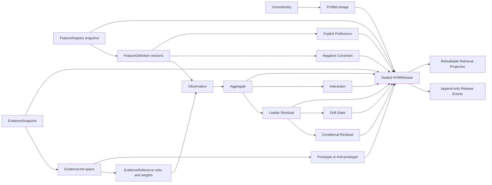

# HVM Knowledge Representation Kernel

## Purpose and boundary

The `ceo_voice.voice` package is the authoritative domain kernel for the Hierarchical Voice Model
(HVM). It represents a declared writing identity as versioned, context-scoped, evidence-backed
behavior rather than as examples, embeddings, or a prose summary. Its job is to make future
measurement and retrieval systems interoperable, auditable, and replaceable.

This increment deliberately contains no NLP, feature extraction, statistical fitting, baseline
construction, LLM use, vector search, persistence adapter, API, or generation behavior. Those
capabilities will implement injected ports or consume sealed releases later. Keeping algorithms out
of the kernel prevents one research approach or infrastructure vendor from becoming the domain
model.

The compatibility `ceo_voice.models.VoiceProfile` transport model remains available to existing
callers. New voice-intelligence work must use the HVM domain because it preserves feature
definitions, evidence roles, producer lineage, confidence dimensions, residual hierarchy, and
release lineage that the flat transport model cannot express.

## Logical graph



The graph has three important separation rules:

1. Evidence is not a feature value. It is immutable source support connected by typed roles.
2. Observations are not profile conclusions. Aggregates, residuals, and conditional residuals are
   different artifacts with different lineage.
3. Release status is not release content. Lifecycle events change operational state without
   rewriting the sealed HVM payload.

## Module responsibilities and design decisions

### `enums.py` — closed semantic vocabularies

This module owns the independent voice dimensions and the controlled states used across the HVM.
It includes measurement classes, value types, downstream permissions, evidence roles, identity
types, decision states, interaction types, drift states, lifecycle events, and retrieval intents.

Closed vocabularies prevent magic strings and make serialized contracts stable. Adding a member is
an explicit schema evolution; adding a concrete feature does not require changing an enum because
features live in the registry. This distinction avoids hardcoding an English-centric feature list
in application code.

### `primitives.py` — shared immutable value objects

Primitives define semantic versions, exact feature and registry references, language and platform
applicability, UTC time ranges, voice context, producer lineage, and baseline references.
`SemanticVersion` implements SemVer precedence so definitions and registries can evolve without
lexicographic version bugs. Applicability objects use explicit `all_*` flags rather than overloaded
nulls or wildcard strings. `VoiceContext` makes language, platform, form, audience, mode, and time
regime queryable dimensions instead of prompt prose.

Future extractors will attach a `ProducerReference`; future estimators will attach a
`BaselineReference`. The domain therefore records what produced a value without importing the
producer implementation.

### `values.py` — typed feature-value algebra

Voice behavior cannot be represented reliably by `dict[str, Any]` or a scalar-only schema. The
kernel provides discriminated immutable values for:

- scalar measurements;
- continuous, categorical, and count distributions;
- sequence models;
- sparse vectors;
- typed graphs;
- bounded intervals;
- mixtures;
- governed prototype sets.

Each representation validates its own mathematical shape: normalized probabilities, unique
categories, ordered quantiles, declared sequence endpoints, unique sparse dimensions, valid graph
references, coherent bounds, and unique prototype identities. This is structural validation only;
the kernel does not estimate any value or judge whether a distribution is scientifically good.

The discriminated union lets storage and transport adapters serialize values without losing type
information. It also allows a feature definition to declare one required value type and prevents a
consumer from silently interpreting incompatible payloads.

### `identity.py` — governed identity and lineage

`VoiceIdentity` identifies the declared target: personal authorship, an approved executive brand,
or an editorial-team voice. This prevents evidence from silently moving between identity claims.
`ProfileLineage` owns the monotonic sequence of releases for that identity and pins the policy
version that governs lineage behavior.

Both objects carry tenant ownership. At scale, that gives authorization and persistence layers a
stable partition key and keeps two leaders with similar names from sharing artifacts.

### `features.py` and `registry.py` — declarative feature governance

`FeatureDefinition` describes one observable behavior: its dimension, scope, opportunity unit,
allowed measurement pipeline, language/platform/modality support, typed value representation,
confidence contract, aggregation strategy, evidence gates, nuisance controls, downstream
permissions, and minimum text size.

Definitions do not contain extractor functions or model clients. Implementations are selected
later by dependency injection against their versioned contract references. A new feature is added
by registering a definition and providing compatible adapters; registry code remains unchanged.

`FeatureRegistry` is an immutable, content-addressed snapshot. It canonicalizes definition order,
rejects duplicate or equal-precedence ambiguous versions, supports exact and latest-version
resolution, filters by HVM dimension, and evolves only to a higher registry version. Consumers
receive a registry instance explicitly—there is no process-global registry or mutable singleton.

This is stronger than a conventional RAG metadata table. It specifies what a feature means, what
evidence can support it, how it may be aggregated, and which downstream uses are permitted.

### `evidence.py` — addressable provenance and evidence roles

`EvidenceUnit` points to an exact Unicode span inside an immutable document version. Document,
segmentation, and span checksums make later audits reproducible without placing source text inside
the HVM. The manifest also pins a digest of the complete evidence-unit metadata, so offset,
modality, platform, or attribution-relevant changes cannot hide behind a stable unit ID.
`EvidenceSnapshot` is a canonical manifest pinned by every release, so a rebuild cannot silently
use a different corpus.

`EvidenceReference` connects an assertion to a unit with one of six distinct roles: support,
counterevidence, opportunity, prototype, anti-prototype, or exception. It stores decomposed
attribution, source, modality, quality, independence, context, temporal, and rights inputs instead
of an opaque weight. Opportunity evidence requires a non-zero denominator.

Future systems may compute an effective weight from these inputs, but the original components stay
inspectable. The structural validator rejects orphan references and corpus-manifest drift.

### `observations.py` — producer-neutral measurements

`Observation` records one feature measurement at a context and event time. It supports deterministic,
statistical, probabilistic, LLM-derived, and human-annotated producers without embedding their
implementation details. Observed states require a typed value and evidence; abstained or missing
states cannot masquerade as zero values. Producer type must agree with measurement class, and human
observations require an actor.

This boundary allows multiple extraction approaches to coexist. Downstream aggregation sees the
same observation contract regardless of whether a tokenizer, parser, calibrated classifier, LLM
annotator, or reviewer produced it. Releases pin both observation IDs and full content digests, so
an observation cannot be changed in place after validation.

### `components.py` — hierarchical profile representation

The component model separates distinct scientific claims:

- `Aggregate` summarizes observations using a registry-selected strategy.
- `Residual` represents leader-specific deviation from an explicit versioned baseline.
- `ConditionalResidual` stores a context delta that inherits from a core residual.
- `Interaction` represents supported dependence among features rather than independent marginals.
- `DriftState` records a reviewable time-regime assertion.
- `Prototype` links approved representative or boundary evidence without copying source text.
- `NegativeConstraint` separates corpus-supported avoidance from explicit policy prohibition.
- `ExplicitPreference` stores human-authorized targets without claiming they are observed frequency.
- `ConfidenceVector` preserves measurement, attribution, coverage, support, stability, robustness,
  distinctiveness, freshness, calibration, conflict, and variance separately.

All components are immutable, tenant-owned, identity-owned, evidence-addressable, and assigned a
decision state that bounds downstream authority. This hierarchy is what distinguishes the HVM
from retrieving semantically similar posts and asking an LLM to imitate them.

### `ports.py` — replaceable capability contracts

Protocols define aggregation, partial pooling, residual computation, conditional-residual
estimation, interaction estimation, drift estimation, confidence estimation, registry reading,
structural validation, and release persistence. Requests carry complete typed inputs and immutable
build identifiers.

No protocol chooses a statistical library, database, queue, model provider, or execution mode.
Implementations may run locally, in batch workers, or in distributed workflows as long as they
honor the same contract. This keeps research iteration independent from orchestration and storage.

### `compiler.py` — orchestration, not estimation

`ProfileCompiler` executes injected capabilities in an explicit order:

```text
observations → aggregates → partial pooling → residuals → conditional residuals
             → interactions → drift → confidence → sealed release → structural validation
```

The compiler validates mandatory stage output, prevents the confidence stage from changing
non-confidence content, pins registry and evidence snapshots, seals the release, and rejects an
invalid structural report. IDs and timestamps are caller-supplied so compilation is deterministic
and replayable. The compiler contains no extraction or statistical formula.

Later workflow infrastructure can wrap this compiler with retries and durable execution without
changing domain sequencing. A stage can be replaced independently through its port.

### `validation.py` — exhaustive structural audit

`StructuralReleaseValidator` checks the complete release bundle and returns all findings in stable
path/code order. It verifies:

- tenant, identity, and lineage ownership;
- registry, evidence snapshot, release, and predecessor versions;
- evidence manifest membership and immutable span identity;
- observation and component references;
- measurement class, typed value, language, platform, modality, and minimum-span compatibility;
- feature-specific evidence counts, independent clusters, roles, attribution, and rights gates;
- aggregate/residual/conditional parentage;
- interaction, drift, prototype, constraint, and preference references;
- component confidence evidence counts.

It intentionally does not evaluate statistical significance, model calibration, stylistic quality,
or activation thresholds. Those require versioned evaluation policies and datasets in later
increments. Separating structural correctness from scientific quality makes both gates explainable.

### `releases.py` and `lifecycle.py` — immutable release governance

`HVMRelease` seals one reproducible payload with exact registry, evidence snapshot, observations,
components, validation report, compiler version, predecessor, and content hash. Content cannot be
edited after sealing.

Operational state is derived by replaying append-only `ReleaseEvent` facts. `ManagedRelease`
validates event identity, sequence, time ordering, transitions, and report consistency.
`ReleaseManager` operates over an injected atomic `ReleaseCatalog` and supports:

- creation and validation;
- approval only after a valid report;
- atomic activation and supersession;
- rollback by reactivating an unchanged superseded payload;
- withdrawal;
- point-in-time active-release lookup;
- optimistic concurrency through expected stream revisions.

Lifecycle commands supply actor, event ID, and time; the manager does not read a global clock or
generate random identifiers. This design supports audit, deterministic tests, and distributed
command deduplication. Activation/supersession and rollback/supersession event pairs must share one
effective timestamp, preserving exactly-one-active point-in-time semantics. A catalog
implementation must atomically commit multi-release activation or rollback changes.

### `retrieval.py` — public query boundary only

Retrieval contracts express intent, exact or point-in-time release selection, context, feature and
dimension filters, downstream use, minimum authority, response bounds, and evidence visibility.
Resolved components return typed values, confidence, decision state, and an ordered inheritance
trace. `RetrievalProjection` is explicitly rebuildable from a sealed release and is never the
source of truth.

No ranking, vector search, query planning, or database implementation exists yet. A future
retriever will implement `VoiceProfileRetriever`; a point-in-time resolver will implement its
narrow protocol. This prevents a vector database schema from defining the HVM and allows different
indexes for critique, generation, evaluation, or explanation.

## Invariants at subsystem boundaries

| Boundary | Enforced invariant | Failure prevented |
| --- | --- | --- |
| Definition registration | Canonical order, exact versions, no ambiguous SemVer precedence | Two meanings silently sharing one feature ID/version |
| Evidence admission | Immutable span identity and pinned snapshot membership | Rebuilds using changed or orphan source text |
| Observation creation | State/value/evidence and producer/measurement consistency | Missing data interpreted as observed behavior |
| Component construction | Unique references, typed contexts, explicit ownership | Duplicate support and cross-tenant contamination |
| Compilation | Mandatory hierarchy, stage isolation, sealed inputs | Partial or nondeterministic profiles being released |
| Structural validation | Exhaustive graph, schema, version, and confidence audit | Fail-fast validation hiding additional corruption |
| Lifecycle transition | Append-only legal state replay and atomic replacement | In-place release edits and two active profiles |
| Retrieval contract | Release pinning and explainable resolution trace | Serving an untraceable blend of profile versions |

## Scaling and extension rules

Tenant and identity IDs are present on durable graph objects, allowing database partitioning and
authorization when the platform reaches thousands of leaders. Registry and release content hashes
support cache keys, immutable object storage, and deterministic rebuild comparison. Evidence is
referenced rather than embedded in profile objects, so millions of spans need not be copied into
every release.

When implementing the next increment:

1. Add an algorithm behind an existing narrow port; do not place formulas in domain models or the
   compiler.
2. Add a new port only when the capability has a distinct responsibility and independent lifecycle.
3. Keep SDK, ORM, vector-store, queue, and workflow types inside adapters.
4. Resolve every feature through an injected registry snapshot; never branch on feature IDs in the
   compiler.
5. Preserve evidence roles and weight components; do not collapse them into one retrieval score.
6. Build retrieval projections from an active sealed release and retain the source content hash.
7. Treat schema or semantic changes as versioned migrations, not in-place edits.
8. Add deterministic unit, contract, integration, and scientific-evaluation tests at the boundary
   where the new behavior lives.

## Known limitations of this increment

The kernel proves representation and governance correctness, not voice fidelity. It does not yet
provide a concrete registry catalog, extraction coverage, comparison baselines, partial-pooling
model, confidence calibration, drift detector, durable release catalog, or retrieval index. It
also does not define authorization policy implementation or retention enforcement. Those are
intentional extension points, not hidden behavior.

The test suite exercises immutable contracts, registry evolution, evidence traceability, compiler
sequencing, exhaustive validation, release transitions, rollback, point-in-time resolution, and
retrieval message shape. Repository-wide branch coverage is gated at 95%; scientific validity will
require separate versioned evaluation datasets and cannot be inferred from unit-test coverage.
