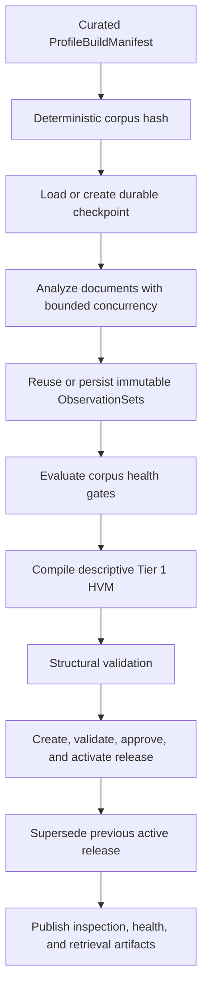

# Voice Profile Builder

## Purpose and completed requirement audit

The Voice Profile Builder is the application orchestration layer over the stable ingestion,
analysis, and HVM kernels. It turns one curated, point-in-time CEO corpus into a governed release
without requiring callers to invoke analyzers, compiler stages, validators, or lifecycle commands
manually.

| Required capability | Implementation |
| --- | --- |
| Corpus orchestration | `VoiceProfileBuilder` validates corpus ownership and executes the complete workflow |
| Batch observation processing | `CorpusAnalyzer` schedules documents with bounded concurrency and isolates document failures |
| Incremental updates | Content-addressed observation keys reuse unchanged analyses; changed corpora receive the next release version |
| Release publishing | The HVM lifecycle creates, validates, approves, activates, and supersedes immutable releases |
| Profile inspection | A deterministic report summarizes scalar features, authority, evidence counts, and limitations |
| Corpus health | Coverage, failures, temporal span, sources, platforms, languages, and build eligibility are reported |
| Build CLI | `ceo-voice build` accepts a strict JSON manifest and emits machine-readable progress and results |
| Progress reporting | A transport-neutral sink receives stage and per-document events; sink failure cannot fail the build |
| Failure recovery | Durable checkpoints, immutable observation caching, and idempotent lifecycle operations resume interrupted builds |
| Retrieval-ready output | A content-pinned `RetrievalProjection` lists indexable feature and component identities |

## Executable lifecycle



The build input fingerprint exposed as `corpus_hash` includes the identity, lineage, exact document
versions and fingerprints, source modalities, registry snapshot, analyzer signature, compiler
schema, and baseline snapshot. Repeating compatible inputs therefore returns the same published
artifact. Adding or changing a document—or changing an interpretation dependency—creates a new
hash and a new release in the same lineage. The publish flag is a lifecycle instruction: a reviewed
release can later be activated without recompiling it as a duplicate version.

## Corpus contract

`ProfileBuildManifest` is the only CLI input. It contains:

- one `VoiceIdentity` and its `ProfileLineage`;
- at least one canonical `CleanDocument` per logical document ID;
- an explicit `SourceModality` for each document;
- the authorized actor ID, request timestamp, and publication decision.

The contract rejects cross-tenant documents, documents belonging to another leader, duplicate
logical document IDs, identity/lineage mismatches, naive timestamps, and unknown fields. Tier 1
currently admits `authored_written` evidence only. Machine transcripts and other modalities are
retained as isolated document failures because speaker attribution and transcription artifacts
require dedicated analyzers.

The complete JSON schema can be inspected from the installed package:

```bash
.venv/bin/python -c \
  'import json; from ceo_voice.profiles import ProfileBuildManifest; print(json.dumps(ProfileBuildManifest.model_json_schema(), indent=2))'
```

## Compilation and scientific authority

This workflow is intentionally more conservative than a conventional RAG profile summary:

1. Each document produces versioned HVM observations with exact evidence spans, producer lineage,
   source context, and independence clusters.
2. Scalar language-core components are arithmetic corpus summaries over observed values; missing or
   abstained measurements never become numeric zeroes.
3. Residuals are computed only against an explicit, versioned baseline snapshot. The initial Tier 1
   composition uses declared zero baselines so raw measurements remain visible. It does **not** call
   those values population distinctiveness.
4. Platform conditionals are deltas from the same corpus-wide feature mean. They describe observed
   context differences but do not claim cross-platform transferability.
5. Evidence-derived confidence reports measurement reliability, attribution, coverage, evidence
   count, and independent support. Distinctiveness, stability, nuisance robustness, calibration,
   and transfer confidence remain zero until independently validated estimators exist.
6. Interactions and drift are empty instead of fabricated when no validated estimator is present.

Published Tier 1 profiles therefore have `descriptive` authority and `generation_ready=false`.
This is a production-governed artifact suitable for inspection, evidence retrieval, and later
evaluation—not yet authority to imitate a leader in generated content.

## Incremental builds and immutable lineage

An observation cache key pins the analysis run ID, document ID and version, canonical fingerprint,
feature-registry snapshot, and analyzer signature. Unchanged documents are reused; changed inputs
are analyzed again. A new corpus release points to the prior release, and activation atomically
marks the prior active release as superseded.

This approach avoids two common errors:

- cache reuse after an analyzer or registry change; and
- mutating a historical profile when a corpus grows.

Historical releases remain resolvable and their observation/evidence references remain unchanged.
The current local workspace is single-process. A distributed deployment should implement the same
`ProfileWorkspace` port with transactional compare-and-swap semantics in a durable database.

## Recovery and failure semantics

The checkpoint reserves deterministic build, release, validation, evidence-snapshot, and projection
IDs before analysis. It records the current stage and safe failure code. On retry:

- completed document observations are reused;
- an already-created lifecycle record is advanced idempotently rather than duplicated;
- an already-active release is reused if final artifact persistence was interrupted;
- the completed profile is returned directly for an identical corpus hash.

Document analysis errors are isolated and evaluated against explicit corpus-health policy. Structural
validation or publication errors fail the build. Progress adapters are observational and cannot
control correctness. The JSON workspace writes individual files with atomic replacement, but it is
not a substitute for multi-process database transactions.

## Published artifacts

`PublishedVoiceProfile` is one strict machine-readable envelope containing:

- the managed immutable `HVMRelease`;
- its exact structural `ValidationReport`;
- every referenced `Observation` and `EvidenceUnit`;
- `CorpusHealthReport` with operational eligibility and limitations;
- `ProfileInspectionReport` for a human review surface; and
- a release-content-pinned `RetrievalProjection`.

The retrieval projection is not a retriever or vector index. It is the stable, machine-readable
contract that a later retrieval adapter will materialize without reinterpreting the release.

## Running a build

```bash
ceo-voice build \
  --manifest data/curated/ali-ghodsi/corpus.json \
  --workspace data/profile-workspace \
  --output data/profile-workspace/ali-ghodsi-profile.json \
  --pretty
```

Progress events are newline-delimited JSON on standard error so an operator, job runner, or future
API can track the build without parsing prose. Standard output contains one compact completion
summary. Exit code `0` means success, `1` is an expected application failure, and `2` is an invalid
manifest.

## Current limitations and next extensions

The workflow is ready to process an Ali Ghodsi or Matei Zaharia corpus once curated canonical
documents and correct identity attribution are supplied. It intentionally does not scrape those
corpora or infer authorship.

The next profile-engine research increments should replace collaborators behind existing compiler
ports, not redesign the workflow:

- empirically estimated population/cohort baselines;
- higher-tier lexical, syntactic, rhetorical, discourse, and pragmatic analyzers;
- transcript-specific speaker and artifact models;
- partial pooling with uncertainty propagation;
- drift and interaction estimators;
- calibrated profile-level evaluation and generation-readiness policy; and
- transactional object/relational workspace adapters for distributed workers.

Virality, retrieval execution, voice compilation for prompts, generation, and re-voice remain
separate downstream systems. They must consume a pinned published release and cannot mutate it.
