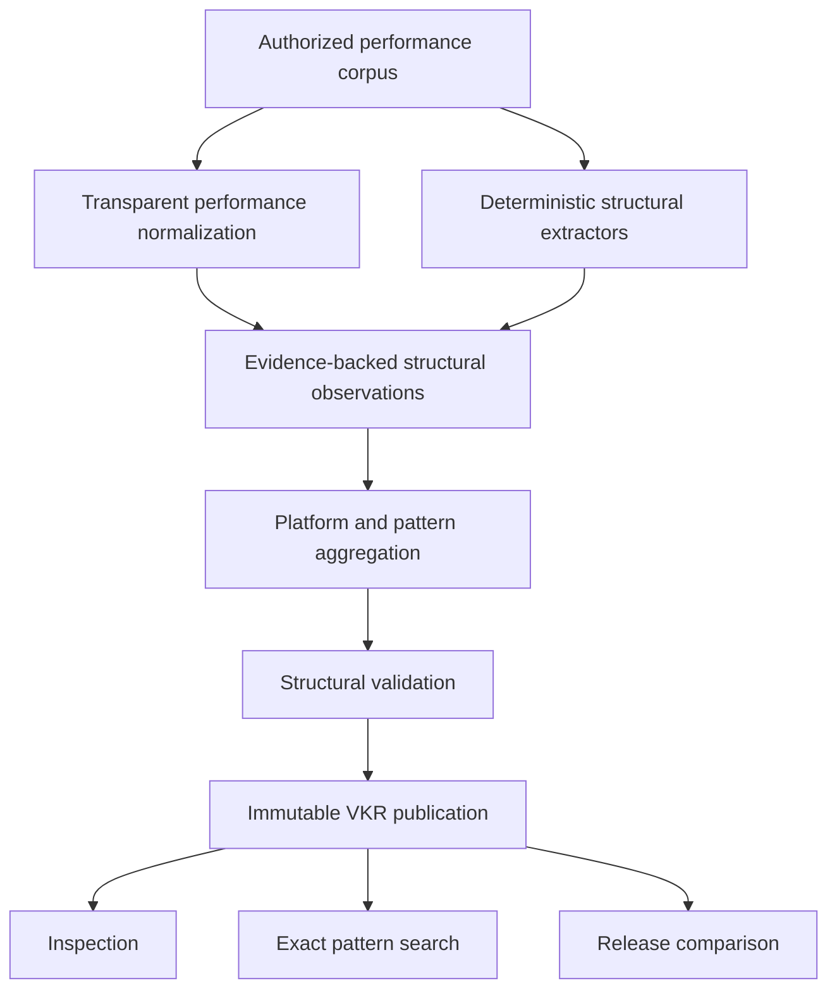

# Virality Structure Library

## Responsibility and boundary

The Virality Structure Library learns reusable **content organization**, not personal writing
identity. Its input is an authorized, versioned corpus of canonical social posts and time-pinned
performance observations. Its output is an immutable Virality Knowledge Release (VKR) containing
structural categories, support statistics, evidence addresses, validation, and inspection data.

The production package has no import from `ceo_voice.voice` or `ceo_voice.profiles`. It may consume
the same canonical `CleanDocument` contract because data provenance is shared platform
infrastructure. It defines its own feature references, registry, observations, evidence, authority,
validation, release, and publication contracts. This prevents engagement patterns from silently
becoming CEO voice instructions.



No stage calls an LLM, creates prompts, performs semantic retrieval, generates content, or reads an
HVM.

## Completed deliverables

| Required capability | Implementation |
| --- | --- |
| Virality corpus | Strict cross-leader `ViralityCorpus` with dataset version, platform posts, metric snapshots, collection method, and tenant ownership |
| Extraction interfaces | `StructuralExtractor` protocol plus versioned specifications and exclusive registry ownership |
| Observation pipeline | Central construction of deterministic IDs, content-free evidence spans, producer lineage, platform context, and normalized performance |
| Structural registry | Content-addressed vocabulary with exact feature versions and allowed categorical patterns |
| Pattern aggregation | Platform-specific prevalence, support, leader diversity, mean performance, standard error, comparability, and observational relative difference |
| Pattern validation | Release-wide ownership, registry, evidence, observation, aggregate, version, authority, and content-hash checks |
| Virality releases | Compact immutable VKR snapshots that pin a content-addressed analysis dataset, with previous-release lineage and atomic active/superseded publication state |
| Inspection | Human-readable scope, top patterns, evidence quality, and scientific limitations |
| Pattern search | Exact, explainable facets for platform, dimension, feature, support, and authority |
| Pattern comparison | Added, removed, changed, and unchanged pattern statistics across releases |

## Structural vocabulary

V1 publishes ten features across nine independent structural dimensions:

| Feature | Examples of governed categories | What is deliberately excluded |
| --- | --- | --- |
| Hook type | question, numeric, announcement, contrast, personal-story function, direct claim | Actual hook wording or signature phrases |
| Opening length | short, medium, extended | CEO-specific sentence construction |
| Sentence pacing | short, medium, long, varied | Personal cadence targets |
| Paragraph rhythm | compact, standard, longform, varied | Lexical or syntactic identity |
| Transition strategy | contrastive, causal, sequential, concluding, mixed, implicit | Preferred transition words |
| Narrative shape | listicle, announcement-details, problem-solution, story-lesson, question-answer, claim-evidence, linear exposition | Topics, entities, facts, or opinions |
| CTA pattern | audience question, direct action, resource direction, community invitation, none | The CTA's wording |
| Formatting strategy | list-led, heading-sectioned, whitespace-broken, dense, plain | Idiosyncratic punctuation or capitalization |
| Thread organization | single post, short thread, long thread | Platform account behavior |
| Announcement organization | outcome-first, context-first, details-first | Product/company identity |

These categories are intentionally coarse and deterministic. They provide an auditable V1 baseline
and a stable representation for future statistically validated extractors. A category describes
what a post does structurally; it does not prescribe how any CEO should phrase it.

## Performance normalization

The raw performance snapshot stores reactions, comments, shares, saves, clicks, impressions,
audience size, collection time, collection method, and source metadata. V1 uses a documented
heuristic weighted engagement count:

```text
reactions + 2×comments + 3×shares + 2×saves + clicks
```

The score is expressed per thousand impressions when impressions are positive. If impressions are
missing, audience size is used as an explicitly confounded exposure proxy. If neither denominator
is available, the raw weighted count is retained and marked confounded. Zero impressions are never
silently treated as a valid denominator.

Weights are versioned engineering heuristics, not learned utilities. They make the first system
transparent and testable; they do not assert that one share is universally worth three reactions.

## Statistical interpretation

Patterns are grouped by exact feature, category, and platform. Every aggregate reports:

- document and distinct-leader support;
- prevalence among posts on that platform;
- mean normalized performance and the platform-corpus mean;
- observed relative performance difference when the platform mean is nonzero;
- sample standard error;
- the fraction backed by impression-denominator data; and
- earliest/latest represented publication times.

The default authority gate requires at least three documents and two leaders. Below either
threshold, the pattern is `insufficient`. Above both, it is `descriptive`. V1 never publishes causal
lift, predicted reach, calibration, or an actionable recommendation. A statistically supported
association can still be explained by topic, audience, timing, paid distribution, follower mix, or
selection bias.

## Evidence and privacy posture

Each observation points to exact source offsets and a SHA-256 hash of the supporting span. VKR
evidence does not contain an excerpt field. This keeps the library usable for auditing without
turning successful posts into a phrase-copying store. The canonical source remains governed by the
data pipeline and its retention policy.

Full observations and evidence live in a content-addressed analysis snapshot behind the workspace
port. The release stores only the snapshot hash/counts, aggregates, and at most 25 deterministic
supporting observation/evidence IDs per pattern. Release activation and exact pattern search are
therefore bounded by the structural vocabulary rather than by corpus size, while audit tooling can
resolve the pinned full dataset when needed.

The observation retains leader ID only to calculate independent cross-leader support. Aggregates
publish the leader count, not a personal structural profile. A downstream generator must consume
the structural category separately from any contextual Voice Target.

## Publication and incremental behavior

The build fingerprint pins the order-independent corpus, full performance snapshots, registry
hash, extractor signature, normalizer version, aggregation policy, and builder schema. Reordered
input is idempotent. Any changed document, performance observation, or interpretation dependency
creates the next immutable release. Publication atomically activates the new release and supersedes
the prior active release while retaining its content and validation history.

The in-memory and JSON workspaces support local and embedded execution. The JSON catalog uses atomic
file replacement and is single-process. A distributed deployment should implement the same
`ViralityWorkspace` port using transactional version allocation and compare-and-swap publication.

## Search and comparison

`PatternSearcher` is exact faceted library inspection—not the future Retrieval Engine. It filters a
pinned release by platform, structural dimension, feature ID, minimum support, and authority. Each
hit explains sample size, leader diversity, and exposure comparability.

`compare_releases` matches structural pattern identity across two releases and reports support,
prevalence, and observed-performance-difference changes. This makes corpus growth and tactic drift
reviewable without mutating history.

## Known limitations and next product steps

- Deterministic rules are English-oriented and must not be presented as multilingual classifiers.
- Heuristic categories will miss nuanced rhetorical moves and can misclassify ambiguous posts.
- Outcome normalization does not control for topic, audience composition, time, paid reach, or
  platform algorithm changes.
- A corpus curated only from successful posts can estimate reusable prevalence but cannot establish
  counterfactual performance. Comparative cohorts are required for ranking.
- Cross-platform values are not pooled because metric semantics differ.
- The local workspace is not a distributed transaction coordinator.

The next Virality increments should add authorized comparison cohorts, platform-specific metric
semantics, temporal holdouts, confound controls, calibration, and ethical tactic policy. Those
changes should replace or extend extractors and estimators behind the current contracts. Retrieval,
Context Compilation, generation, and voice realization remain separate downstream phases.
