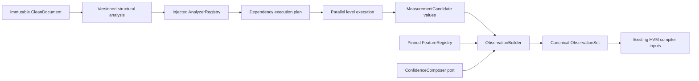

# Voice Analysis Framework

## Boundary and responsibility

`ceo_voice.analysis` is a compiler boundary between the clean ingestion projection and the HVM
kernel. It accepts one immutable `CleanDocument`, a governed `VoiceIdentity`, an explicit source
modality, deterministic timestamps, and an injected feature-registry snapshot. It returns one
canonical `ObservationSet` containing HVM `Observation` and `EvidenceUnit` objects.

The subsystem does not build or mutate an HVM release. It does not infer a voice profile, retrieve
examples, create embeddings, call an LLM, or fit a statistical model. That narrow ownership keeps
measurement independently testable and allows the HVM compiler to consume analysis output without
an adapter or schema change.

## Why this is not a collection of extractors

An analyzer is a plugin with a complete declarative specification: stable ID and semantic version,
exact supported feature references, required compiler artifacts, platform/language scope,
measurement class, priority, dependencies, and a configuration digest. Analyzer code has no right
to create an HVM observation. It returns only typed `MeasurementCandidate` claims against addressed
source spans.

This separation prevents four classes of drift:

- a feature implementation cannot silently use a feature definition other than the pinned registry;
- a new analyzer cannot duplicate ownership of an existing feature without registration failing;
- evidence and confidence policy cannot diverge across hundreds of analyzer implementations;
- operational scheduling, caching, and telemetry do not leak into linguistic measurement logic.

The registry is instance-scoped and immutable. `register()` returns a new registry, making analyzer
sets safe to share across concurrent runs and straightforward to pin for a deployment or backfill.
There is no process-global plugin list and no import-time discovery side effect. A future composition
root may discover entry points or configuration manifests, but it must convert them into explicit
analyzer instances before constructing the registry.

## Execution and recovery semantics

The registry resolves the transitive dependency closure, verifies minimum and maximum-major
constraints, rejects cycles, and emits deterministic execution levels. Analyzers inside one level
run concurrently with `asyncio`; levels run in dependency order. Priority and analyzer ID define a
stable order within each level, independent of task completion order.

One analyzer exception does not discard unrelated results. Dependents of a failed analyzer are
marked `skipped`; independent analyzers continue. Invalid analyzer output is rejected at the
builder boundary and treated as that analyzer's failure. The final status is:

- `succeeded` when at least one observation exists and no analyzer failed or was skipped;
- `partial` when valid observations coexist with failed or skipped analyzers;
- `failed` when no valid observation can be produced.

The canonical execution trace contains logical level, status, error code, and candidate count.
Wall-clock durations go to an injected metrics sink and are excluded from `ObservationSet`; this is
necessary because runtime timing would make identical inputs serialize differently. Cache access is
also an injected asynchronous port. Its key pins document fingerprint/version, analyzer/configuration,
segmentation version, complete dependency outputs, and registry snapshot.

## Evidence and identity

Structural analysis produces deterministic UUIDv5 addresses for document, paragraph, sentence,
and non-empty line spans. Addresses pin document ID and version, segmentation version, unit type,
and Unicode offsets. Reprocessing the same immutable document with the same segmentation policy
therefore yields identical evidence identifiers.

`ObservationBuilder` is the only component that creates HVM observations. Before construction it
checks:

- the analyzer declared the emitted feature;
- the exact feature exists in the pinned registry;
- value type and measurement class match the definition;
- language, platform, source modality, and evidence scope are admissible;
- every evidence address resolves to the analyzed document;
- confidence composition returns the complete HVM weight contract.

The resulting graph traces each observation through feature and registry references, producer and
configuration versions, CEO voice identity, tenant, platform, event/creation time, canonical
document/version, paragraph and sentence structural IDs, offsets, checksums, and source modality.
`ObservationSet.to_evidence_snapshot()` creates the manifest required by the existing HVM compiler.

## Confidence composition

Confidence is a strategy port, not an analyzer convention. `ConfidenceMethod` reserves dispatch for
deterministic, statistical, classifier, future LLM, and evidence-weighted composition. This phase
implements only `DeclaredConfidenceComposer`, which returns a fully specified governed contract and
performs no estimation. It is appropriate for exact rules whose operators have explicitly selected
the weights. Later calibrated strategies can implement the same port without changing analyzers or
the observation builder.

## Tier 1 deterministic scope

Four small analyzers currently emit 23 scalar observations:

| Analyzer | Measurements |
| --- | --- |
| Document statistics | Unicode character count, word count, configured reading time, document length, declared thread length |
| Structural | Sentence and paragraph counts/mean word lengths, line breaks, list items, Markdown headings |
| Symbol usage | Emoji code points, Unicode punctuation, question/exclamation marks per sentence, links, hashtags, mentions |
| Formatting | Uppercase character/word ratios, blank lines, repeated horizontal-whitespace runs |

Feature references are constructor-injected bindings. The analyzer implementations contain no HVM
feature IDs, so registry evolution and alternative feature namespaces do not require editing the
measurement rules. Thread length is read only from a configured metadata field; it becomes an
explicit `missing` observation when absent or invalid rather than being guessed from prose.

The versioned sentence splitter is deliberately dependency-free and conservative. It handles
punctuation boundaries, line boundaries, URLs, list markers, and trailing symbols deterministically,
but it is not a language-aware parser. A future language-specific segmenter should implement the
same `AnalyzedDocument` contract under a new segmentation version. Existing observations remain
reproducible because every evidence unit pins that version.

## Scaling and extension points

- Add an analyzer by implementing the `Analyzer` protocol, binding exact registered features, and
  registering it in the composition root. Existing analyzers and the engine remain unchanged.
- Add statistical, classifier, or LLM-derived measurements by adding the appropriate analyzer and
  confidence composer. Their calibration artifacts and model lineage must be explicit; none are
  included in this phase.
- Add durable cache and telemetry adapters behind `AnalyzerResultCache` and `ExecutionMetricsSink`.
  Domain outputs must remain independent of adapter state and wall-clock timing.
- Partition large backfills outside this package by immutable document identity. The engine has no
  shared mutable state and can run safely in many workers.
- If one analyzer becomes expensive, introduce process or workflow isolation at the executor port;
  do not make other analyzers import its NLP dependency.

The primary future bottleneck is evidence fan-out: document-level aggregate observations currently
retain document, paragraph, and sentence traceability. At millions of documents, durable storage
should deduplicate shared `EvidenceUnit` records and store observation links separately. Compacting
away those links would save storage but would violate the HVM audit contract, so it is not an
acceptable optimization.

## Verification contract

Every Tier 1 analyzer has isolated behavior tests. Integration tests cover registration conflicts,
feature resolution, semantic-version dependencies, cycle rejection, deterministic ordering,
same-level concurrency, failure isolation, dependency skips, cache hits, metrics, builder rejection,
HVM evidence snapshots, identical-run repeatability, and immutable-output integrity. The repository
quality gate runs Ruff, Black, strict mypy, and pytest with branch coverage greater than 95 percent.
