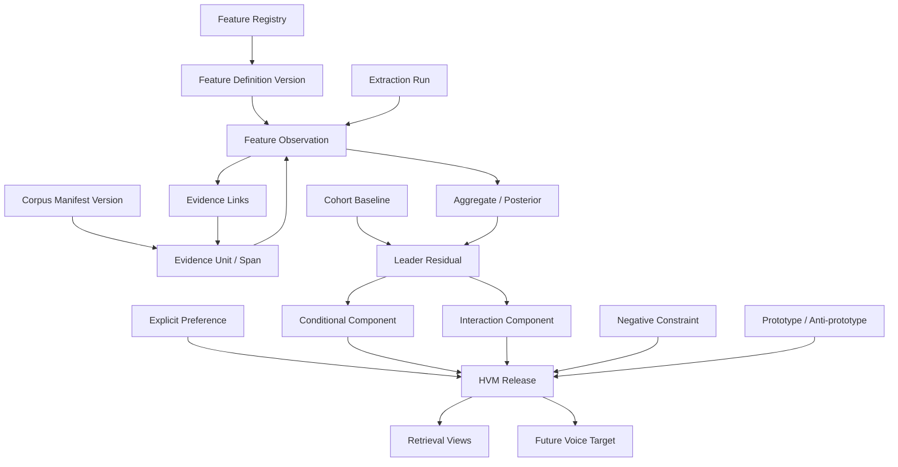
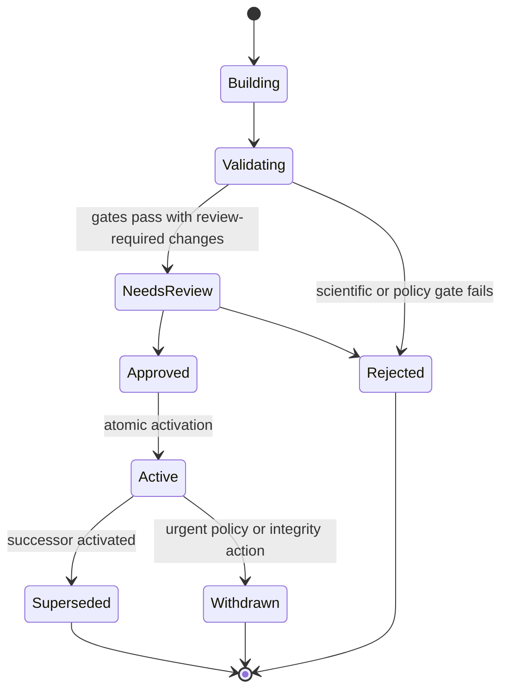

# Computational Voice Profile Representation

- **Status:** Research design, pre-implementation
- **Decision class:** Foundational representation contract
- **Applies to:** Voice analysis, retrieval, generation, re-voice, evaluation, review, and audit
- **Does not authorize:** Feature extraction, model training, prompts, APIs, storage migrations, or
  production Voice Profile Engine code

## 1. Executive decision

The authoritative representation of a leader's writing voice will be a **Hierarchical Voice Model
(HVM)**: an immutable, evidence-backed release composed of reusable feature definitions,
span-level observations, population and platform baselines, leader-specific residual
distributions, conditional mode residuals, feature interactions, explicit preferences, negative
constraints, prototypes, uncertainty, drift state, and complete derivation lineage.

It will not be a prose persona, one embedding, an exemplar bundle, a flat feature vector, or an
independent profile per platform. Those artifacts may exist as projections or baselines, but none
is authoritative.

The core representation is:

```text
observed expression
  = language/register prior
  + platform/content-form baseline
  + source-modality/editorial effects
  + topic/entity/campaign effects
  + leader core residual
  + leader × platform/mode/audience residuals
  + feature interactions
  + time regime
  + observation noise
```

Only the supported leader residuals, legitimate conditional residuals, interactions, approved
preferences, and negative constraints form the usable voice target. Raw averages are never assumed
to be voice.

This design makes five commitments:

1. **Distributions, not adjectives.** “Direct” is not a stored truth. The model stores measurable
   behaviors that jointly realize directness, their contexts, ranges, evidence, variance, and
   uncertainty.
2. **Observations are not identity.** A post is an event produced under topic, audience, platform,
   editorial, and temporal conditions. The HVM estimates what remains characteristic after those
   conditions are represented.
3. **Evidence is addressable.** Every supported or conflicting feature can resolve to immutable
   document versions and exact spans through versioned segmentation.
4. **Inheritance is partial and feature-specific.** A global leader residual is inherited on a
   platform only when transfer is supported. Platform residuals override deltas, not entire
   profiles.
5. **Uncertainty controls behavior.** Confidence is a structured vector and a calibrated decision,
   not a decorative scalar. Weak evidence causes shrinkage, omission, or review—not stronger
   prompting.

Removing any of these commitments reintroduces conventional prompt-based cloning: topic leakage,
untraceable intuition, platform flattening, false certainty, and uncontrolled imitation.

## 2. Scope and scientific boundary

The object of representation is **observable written expression**, not personality, cognition,
sincerity, intelligence, ideology, or private intent. A leader may repeatedly use first-person
plural pronouns or concessions; that supports a linguistic behavior claim. It does not prove
collectivism, humility, honesty, or a psychological trait.

The representation may include prepared or spoken material only through explicit source-modality
and admissibility policy. A transcript can support cadence or rhetorical-move evidence when speaker
attribution is reliable, but transcription punctuation cannot support the leader's orthographic
signature. A ghostwritten post can model an approved brand voice if that is the product's declared
target; it cannot silently be labeled the CEO's personal authorship.

The HVM is therefore a model of a declared **target writing identity**:

```text
target_identity = named leader or approved editorial identity
target_context  = language × platform × content form × audience × mode × time regime
target_voice    = supported conditional distribution of expressive choices
                  given fixed meaning and planned discourse function
```

The Semantic Plan owns intended meaning and claims. The Discourse Plan owns the selected ordering
of rhetorical functions. The HVM represents preferences over expression and conditional discourse
habits, but it cannot silently change the plan. This boundary is essential for attribution: a
leader's tendency to use contrast may be voice evidence; whether a specific post should contain a
contrast is a planning decision.

## 3. Research synthesis by discipline

The design draws from twelve disciplines, but rejects the temptation to import each discipline's
entire objective. The table records the exact transfer.

| Discipline | Problem it solves | Relevant ideas | Ideas not useful as the authoritative representation | Design influence |
| --- | --- | --- | --- | --- |
| Stylometry | Measures stable and discriminative textual regularities | Function words, character and POS patterns, punctuation, vocabulary distributions, distance measures, text-length sensitivity | Treating the most discriminative feature as inherently causal, authentic, or safe to generate; closed-set author ranking as a voice model | Establishes reproducible microfeatures and distributional comparisons, but every feature carries nuisance sensitivity and generative admissibility |
| Authorship attribution and verification | Tests whether texts are distinguishable by author, including open-set and cross-domain conditions | Cross-topic/time evaluation, content masking, impostor/cohort comparisons, calibration, attribution under short text | Classification accuracy as proof of style; memorized entities, company terms, or campaigns; one winner-take-all identity score | HVM releases require content-matched and cross-topic leakage tests; latent author encoders are auxiliary evidence, never the sole profile |
| Computational linguistics | Converts linguistic theory into token-, sentence-, and document-level structures | Morphology, POS, dependencies, semantic roles, discourse connectives, multilingual analyzers, parser confidence | Treating parser output as ground truth or assuming English categories transfer unchanged | Feature definitions specify language, parser/model version, expected error, missingness, and admissible fallbacks |
| Discourse analysis | Represents how clauses and larger units perform communicative functions and form coherent texts | Rhetorical relations, move sequences, nucleus/support relations, transition behavior, opening/closing functions | Copying whole historical structures as identity; assuming one discourse framework is universally correct | Adds typed rhetorical-move and relation observations while leaving the actual Discourse Plan under a separate owner |
| Pragmatics | Models language as action under context, audience, stance, and social relationship | Epistemic stance, hedging, politeness, implicature cues, directness, evidentiality, disagreement, credit allocation | Universal scalar “tone”; inferring sincere belief or intention from surface markers | Pragmatic features are contextual, probabilistic, culturally scoped, and often human-calibrated; no psychological claims are stored |
| Corpus linguistics | Establishes representative sampling and variation across registers, contexts, and time | Stratification, register, concordances, collocation, dispersion, opportunity denominators, balanced comparison corpora | Unstratified corpus averages and raw frequency tables that hide modes or duplicate sources | Every aggregate is computed over a versioned corpus manifest with strata, coverage, effective sample size, and dispersion |
| Psycholinguistics | Studies production preferences, priming, fluency, and individual variation | Recurrent low-level choices, syntactic persistence, accessibility, revision behavior, alignment | Personality diagnosis, cognitive-state inference, or assuming observed repetition is a fixed trait | Motivates interactions, sequential dependencies, editorial traces, and short-lived accommodation state distinct from long-term identity |
| Sociolinguistics | Explains register, audience design, accommodation, code-switching, identity performance, and style shifting | Addressee effects, social distance, platform communities, context collapse, multilingual repertoire, style as contextual practice | A single decontextualized idiolect or demographic stereotype | Audience, platform, language, and mode become explicit conditioning dimensions; variation is modeled rather than treated as noise |
| Text statistics | Quantifies distributions, dependence, uncertainty, change, and sample adequacy | Robust estimators, hierarchical partial pooling, Bayesian/posterior intervals, effective sample size, covariance, change points | Means without variance; independence assumptions over duplicated posts; arbitrary composite confidence | HVM components store distributions or posteriors, support, covariance, opportunity counts, and shrinkage to relevant priors |
| Information retrieval | Serves the right representation under filters, ranking, diversity, and latency constraints | Faceted indexes, materialized views, hybrid ranking, query intent, prototype diversity, provenance-aware results | Semantic nearest-neighbor search as the definition of voice; retrieving many old posts into a prompt | The profile exposes typed feature and interaction indexes; evidence retrieval is a separate second hop with diversity and copying controls |
| Modern LLM memory representations | Separates raw episodes from generalized knowledge and reusable procedures | Episodic evidence, semantic abstractions, procedural preferences, consolidation, retrieval by relevance/recency/importance | Free-form reflections as truth, mutable summaries, or ungoverned self-updating memory | Documents/spans are episodic evidence; HVM components are governed semantic abstractions; approved editorial rules are procedural constraints |
| Knowledge representation and feature stores | Makes entities, relations, provenance, definitions, versions, and point-in-time values queryable | Registries, typed relations, PROV-style derivation, immutable definitions, point-in-time correctness, offline/online consistency | Selecting a graph database because the domain is a graph; opaque feature blobs without schema and migration | Defines a logical evidence graph and feature registry over relational/columnar stores; every value resolves to definition, entity, event time, and derivation |

### 3.1 Research implications

The literature creates several constraints rather than a menu of optional techniques:

- Cross-topic authorship work shows that topic leakage can survive ordinary train/test splits.
  Therefore every feature definition declares its topic/entity susceptibility, and HVM validation
  uses content-matched and topic-confusion tests.
- Syntactic and low-level controls can remain informative when lexical content is masked, but no
  family is universally content-free. Function words, character n-grams, and syntax are retained
  as complementary observations, not privileged truth.
- Discourse and pragmatic labels are useful because surface resemblance often depends on rhetorical
  and social action. Their ambiguity requires probability distributions and human calibration,
  not categorical labels generated once by an LLM.
- Audience design and register variation imply that within-person variation is systematic. A
  platform profile cannot be a duplicate or a prompt suffix; it must be a conditional residual.
- Feature-store point-in-time correctness maps directly to voice history: a generation from March
  must resolve the feature definitions, corpus evidence, and active profile that were valid in
  March, not today's retrospective state.
- Provenance models distinguish entities, activities, and responsible agents. The HVM mirrors this:
  evidence and profile releases are entities; extraction/aggregation/review are activities; source
  publishers, reviewers, and systems are agents.

## 4. Computational definition of writing voice

**Computational writing voice is the context-conditioned, leader-specific probability structure
over observable expressive choices, estimated relative to appropriate language, register,
platform, and content-form baselines after nuisance influences are represented, with every
assertion bounded by evidence and uncertainty.**

This definition has five consequences:

1. A feature must describe an observable choice or a relationship among choices.
2. A profile value is normally a distribution, residual, conditional probability, constraint, or
   interaction—not an unqualified point value.
3. Context is part of the feature key, not prose surrounding the value.
4. “Characteristic” means different from an applicable baseline and stable enough under relevant
   perturbations, not merely frequent.
5. A generated text can be compared with the profile, but matching every feature is neither
   possible nor desirable; authentic variation is part of the target distribution.

### 4.1 Independent representational dimensions

| Dimension | Independent question answered | Why it must remain separate | What breaks if removed |
| --- | --- | --- | --- |
| Orthographic | How are characters, punctuation, casing, and visible marks selected? | These choices can survive topic changes and are often erased by generic cleaning | Highly salient micro-patterns disappear; critic cannot diagnose punctuation caricature |
| Layout and formatting | How is text arranged spatially and by platform-native units? | Layout has structure beyond punctuation and is frequently platform-conditioned | Line-break grammar, list habits, and scan rhythm collapse into plain text |
| Lexical | Which words and multiword choices are preferred among alternatives? | Lexical selection includes function words and semantic-equivalent choices, but has high topic risk | Wording fidelity becomes generic or over-relies on catchphrases |
| Morphological | Which inflectional and derivational forms are preferred? | Morphology carries tense, aspect, modality, compactness, and language-specific style | Multilingual profiles become English-centric and syntactic aggregates hide form choice |
| Syntactic | Which constructions and clause topologies recur? | Construction choice is different from vocabulary and sentence length | Drafts may use the right words with alien grammar |
| Rhythmic | How do lengths, pauses, repetitions, and alternations unfold? | Rhythm is distributional and sequential; means cannot represent it | Output becomes mechanically “short” or “long” without the leader's cadence |
| Semantic-expression | At what abstraction, specificity, figurative, and causal level is meaning expressed? | This concerns how meaning is framed, not which topic is discussed | Topic is mistaken for style, or all semantic behavior is excluded as unsafe |
| Discourse and rhetorical | Which communicative moves and relations are preferred in which positions? | Multi-sentence organization cannot be reduced to syntax | Openings, argument progression, evidence placement, and closes feel generic |
| Pragmatic and stance | How are certainty, social action, face, obligation, and evaluation expressed? | The same proposition can perform different interpersonal actions | “Tone” remains subjective and cannot be measured or explained |
| Narrative and perspective | How are experiences, actors, time, and lessons framed? | Narrative habits span semantics, discourse, and viewpoint but form a coherent behavior family | Personal storytelling and lesson extraction are copied as templates or ignored |
| Audience and interpersonal | How does expression adapt to addressee knowledge and relationship? | Audience accommodation is neither platform alone nor stable global identity | Contextual shifts are mislabeled drift or flattened into one voice |
| Reasoning and argument | How are claims justified, qualified, contrasted, and converted into recommendations? | Reasoning presentation differs from factual content and rhetorical labels alone | CEO-specific explanatory logic is replaced by generic persuasion patterns |
| Editorial and revision | Which changes are repeatedly made or rejected during review? | Revealed preference can be stronger evidence than published frequency | The model learns what survived editing but not what the target identity actually prefers |
| Negative space | What is rejected or avoided when there was a real opportunity to use it? | Absence has different evidence semantics from presence | Generic LLM defaults leak in, or weak corpus absence becomes a false prohibition |
| Platform adaptation | Which leader-specific changes occur relative to platform baselines? | Platform convention and leader adaptation must not contaminate core identity | Independent profiles duplicate data; global profiles ignore real adaptation |
| Temporal regime and drift | Which behaviors are stable, trending, seasonal, or regime-specific? | A version snapshot alone cannot explain gradual or abrupt change | Old and new voices are averaged into a profile that never existed |
| Interactions and covariance | Which choices co-occur, alternate, or depend on position and mode? | Independent marginal targets destroy joint style | Generated text satisfies metrics individually but feels synthetic |
| Nuisance/control variables | Which observed differences are attributable to topic, entities, modality, editor, campaign, or data quality? | These are not voice but are necessary to identify voice | The system faithfully clones products, ghostwriters, transcription artifacts, or campaigns |

Statistical summaries such as mean, variance, entropy, correlation, or posterior interval are not a
separate voice dimension. They are value representations applied to every dimension. Likewise,
“behavioral” is not a catch-all layer: platform adaptation, audience design, editorial behavior,
and temporal drift have distinct causal and operational meanings.

## 5. Measurement classification

Every registered feature has one or more measurement stages. A single “AI-derived” flag is too
coarse because a deterministic count can feed a statistical residual, while a probabilistic label
can later receive human adjudication.

| Code | Class | Meaning | Trust policy |
| --- | --- | --- | --- |
| **D** | Deterministic | Same immutable input and extractor version must produce the same value | Eligible for direct recomputation and exact tests; correctness still depends on tokenization/segmentation definitions |
| **S** | Statistical | Aggregate or relationship estimated from multiple observations | Must include estimator, sample/opportunity counts, dispersion, interval, and comparison population |
| **P** | Probabilistic | Parser or classifier produces a calibrated distribution or score | Store model/version, calibration cohort, entropy/margin, and abstention; never coerce low confidence to a hard label |
| **L** | LLM-derived | Structured candidate label or relation produced by an LLM | Treated as fallible annotation with prompt/model/schema lineage; requires calibration, deterministic validation where possible, and review for high-impact use |
| **H** | Human annotated | Reviewer asserts, corrects, approves, rejects, or scopes a preference | Store actor role, rubric, timestamp, rationale category, and supersession; explicit preference has high authority but is not evidence of natural frequency |

“Classification” therefore means an ordered method signature such as `D→S`, `P→S`, `L→H`, or
`D+P→S`. The first stage creates observations; the final stage creates a profile component.
Features with different method signatures are not interchangeable even if they share a display
label.

### 5.1 Feature eligibility rules

A feature may enter an active HVM only if its definition specifies:

- stable feature ID and semantic version;
- dimension, phenomenon, value type, unit, and valid range;
- observation scope: character, token, sentence, paragraph, rhetorical unit, document, revision,
  or corpus;
- position and opportunity denominator;
- measurement signature and exact extractor/model/prompt/rubric lineage;
- supported languages, scripts, platforms, content forms, source modalities, and minimum text size;
- admissible ingestion transformations and known normalization losses;
- missingness and abstention semantics;
- aggregation estimator, weighting, shrinkage, and conflict policy;
- nuisance susceptibility and required controls;
- minimum evidence, diversity, and calibration requirements;
- allowed downstream uses: explore, retrieve, generate, critique, evaluate, or explain;
- privacy, sensitivity, and retention class;
- migration and backward-compatibility policy.

Without this registry contract, two teams can compute “sentence length” with different tokenizers or
“directness” with different prompts and silently merge incompatible values.

## 6. Feature taxonomy and classification

The following tables define the candidate **feature templates** for schema version 1. A template
may expand into a controlled vocabulary of concrete IDs—for example,
`orthographic.punctuation.token_rate.question_mark` and
`orthographic.punctuation.token_rate.em_dash`. Every concrete ID inherits the method class shown
in its row and must meet the registry contract above. Enumerating templates avoids a brittle list
of English-only literals while keeping the feature space finite and governed.

These are representation candidates, not a mandate to extract or activate all features. A feature
enters a release only after reliability, nuisance, utility, and ablation gates.

### 6.1 Orthographic and graphemic features

| Feature template | Measured value | Class | Later use and fidelity contribution | Primary failure/confound |
| --- | --- | --- | --- | --- |
| Character inventory | Rate and dispersion of letters, digits, symbols, script blocks, diacritics | D→S | Detects stable surface repertoire and script behavior | Language, keyboard, OCR, and platform normalization |
| Character n-grams | Smoothed distribution and cohort residual for bounded n-gram orders | D→S | Captures subword, punctuation, and spacing habits jointly | Strong topic, entity, language, and copy leakage; diagnostic by default |
| Capitalization regime | Lower/title/sentence/all-caps rates; capitalized-token position and run length | D→S | Preserves emphasis and naming habits | Named entities, headings, auto-capitalization |
| Case-transition motifs | Conditional probabilities of case patterns around boundaries and emphasis | D→S | Represents micro-sequences missed by all-caps rate | Short samples and proper names |
| Punctuation inventory | Per-opportunity rate for each punctuation mark and normalized category | D→S | Supports precise surface realization and critic diagnostics | Transcription/editorial punctuation |
| Punctuation combinations | Distribution of repeated/combined marks, spacing, and terminal sequences | D→S | Captures “?!”, ellipsis, dash, colon, and semicolon grammar | Platform character substitution |
| Punctuation transition grammar | Mark-to-mark and mark-to-boundary conditional probabilities | D→S | Preserves cadence rather than maximizing mark counts | Sparse combinations; requires shrinkage |
| Dash and hyphen behavior | Em/en/hyphen choice, spacing, parenthetical versus connective function | D+P→S | Highly visible construction habit | Editor normalization and Unicode conversion |
| Quote/apostrophe behavior | Straight/curly style, quote nesting, apostrophe conventions, scare-quote rate | D→S | Captures typography and rhetorical quoting habits | CMS conversion; locale rules |
| Ellipsis behavior | Glyph versus periods, length, spacing, position, discourse function | D+P→S | Distinguishes pause, omission, and trailing-close habits | Transcription and truncation |
| Numeric representation | Digits versus words, separators, percentages, currency, ranges, date formats | D→S | Preserves precision and executive communication conventions | Locale, domain, legal templates |
| Emoji/emoticon repertoire | Inventory, frequency, co-occurrence, repetition, skin tone, and position | D→S | Captures affective surface behavior | Platform and campaign effects; sensitive demographic inference prohibited |
| Emoji pragmatic function | Calibrated role such as emphasis, warmth, irony, list marker, or close | P/L→S; H calibration | Enables context-correct use instead of random emoji insertion | Cultural ambiguity and sparse evidence |
| Hashtag/mention orthography | Count, casing, composition, inline/final placement, separator behavior | D→S | Captures platform-native marking style | Campaign and social-team conventions |
| Typographic emphasis | Repetition, capitalization, surrounding marks, Unicode emphasis, markdown markers | D→S | Models emphasis realization independently of stance | Platform renderer and copied formatting |
| Nonstandard spelling signature | Stable abbreviations, elisions, phonetic spellings, deliberate variants | D+P→S | Preserves distinctive informality | Typos, OCR, dialect bias; never “correct” automatically |
| Error/repair signature | Recurrent misspelling classes, self-correction marks, edits in published text | D→S; H admissibility | Potentially distinctive diagnostic evidence | Unsafe to reproduce accidental errors without explicit approval |

Removing orthographic features would force the system to approximate visible style with broad tone
labels. Activating them without transformation lineage would instead learn CMS or transcript
behavior. The schema therefore carries an admissibility mask per source modality.

### 6.2 Layout and formatting features

| Feature template | Measured value | Class | Later use and fidelity contribution | Primary failure/confound |
| --- | --- | --- | --- | --- |
| Line-break density | Breaks per token/sentence and distribution by rhetorical position | D→S | Reproduces scan rhythm without copying whole templates | Responsive rendering and export format |
| Blank-line grammar | Runs, paragraph separators, and conditional use around moves/lists | D→S | Represents visual pacing | Cleaner normalization; platform editor |
| Paragraph-count distribution | Full distribution conditioned on platform/form/length band | D→S | Sets authentic range, not fixed paragraph count | Topic complexity and platform limits |
| Paragraph-length profile | Token/sentence distributions by opening, body, and close | D→S | Preserves macro rhythm and position-specific compression | Content amount and copied templates |
| Single-line paragraph tendency | Rate and function of isolated lines/fragments | D+P→S | Captures executive emphasis and reveal patterns | Generic social-media convention |
| List propensity and type | Bulleted, numbered, inline, checklist, pseudo-list rates | D+P→S | Models list behavior as conditional preference | Content form and advice-post genre |
| List grammar | Marker choice, punctuation, capitalization, item parallelism, lead-in/close | D+P→S | Prevents generic list rendering | Platform markdown conversion |
| Heading behavior | Frequency, depth, casing, punctuation, and relation to body | D→S | Supports newsletters/blogs without contaminating short posts | Content-form baseline |
| Indentation and alignment | Tabs/spaces, nested depth, block quote, code or callout layout | D→S | Preserves long-form visual organization | Renderer and pasted source artifacts |
| Link/media placement | Inline/final/comment-reference position and surrounding text | D→S | Represents platform-native realization constraints | Publishing workflow rather than author choice |
| Mention/hashtag block placement | Opening/body/closing clusters and separator patterns | D→S | Captures social layout | Campaign policy |
| Opening visual footprint | Characters, lines, whitespace, and first-break location | D→S | Directly serves opening-habit retrieval | Headline/content-form effects |
| Closing visual footprint | Final paragraph/line length, terminal marker, CTA/link/hashtag block | D+P→S | Directly serves closing-pattern retrieval | Platform CTA convention |
| Thread/carousel segmentation | Segment count, boundary function, numbering, cliffhanger behavior | D+P→S | Models multi-unit platform expression | Product feature changes and engagement tactics |
| Whitespace signature | Leading/trailing/internal spacing where source fidelity is reliable | D→S | Retains subtle typography | Usually transport noise; strict admissibility required |

Layout is stored independently from rhetorical structure because the same “contrast” move can be
one paragraph, two isolated lines, or a thread boundary. Merging them would make structure
retrieval and surface realization inseparable.

### 6.3 Lexical features

| Feature template | Measured value | Class | Later use and fidelity contribution | Primary failure/confound |
| --- | --- | --- | --- | --- |
| Function-word distribution | Smoothed rates and leader residual for language-specific functors | D→S | Strong low-content microstyle signal | Register, sentence structure, translation |
| Pronoun system | Person/number/case rates and contextual transitions | D+P→S | Represents self, company, and audience reference mechanics | Topic, quoted speech, language pro-drop |
| Determiner/preposition/auxiliary profile | Per-token and construction-conditioned rates | D+P→S | Captures almost-invisible grammatical preferences | Parser/tokenizer differences |
| Vocabulary diversity | MATTR, MTLD, HD-D, entropy, hapax/dislegomena under length controls | D→S | Models lexical range without unstable raw type-token ratio | Sample length, language morphology, named entities |
| Word-length distribution | Character, syllable, and morpheme distributions by role/position | D+P→S | Supports lexical density and cadence | Language/script and technical terminology |
| Frequency-band preference | Residual use across corpus frequency/rarity bands | D→S | Distinguishes plain versus uncommon wording | Reference corpus choice and domain jargon |
| Lexical density | Content/function ratio and POS-specific density | P→S | Represents informational packing | Parser and genre effects |
| Contraction preference | Type-specific rate with grammatical opportunity denominator | D+P→S | Captures informality precisely | Language/dialect and editor normalization |
| Intensifier and downtoner repertoire | Type, rate, strength, position, and governed target | D+P→S | Realizes emphasis without one-dimensional “energy” | Sentiment/topic and classifier subjectivity |
| Hedges and boosters | Lexical/syntactic cue distribution and claim-relative position | D+P→S | Supports calibrated certainty and nuance | Pragmatic context; lexical cue alone is insufficient |
| Discourse-marker repertoire | Marker type, relation, position, and transition probabilities | D+P→S | Captures connective habits | Discourse parser error and content form |
| Preferred semantic alternatives | Conditional choice among near-equivalent words/phrases given sense/context | P→S | High-fidelity wording without memorized topics | Sense ambiguity, topic leakage, sparse alternatives |
| Formulaic sequences and collocations | Association, dispersion, context diversity, and residual frequency | D→S | Captures habitual phrasing with anti-copy controls | Catchphrase overuse, campaign copy, duplicates |
| Lexical bundles by position | Multiword patterns specialized to opening, evidence, transition, or close | D+P→S | Direct retrieval and constrained realization | Near-copy risk; prototypes need diversity |
| Technical vocabulary behavior | Density, explanation rate, acronym introduction, repetition, substitution | D+P→S | Models how expertise is communicated | Company/product vocabulary is knowledge, not voice |
| Action/state/mental verb preference | Semantic verb-class distribution and syntactic context | P→S | Represents agency and explanation style | Topic and semantic-role model bias |
| Nominalization tendency | Nominalized predicates versus verbal alternatives per opportunity | P→S | Captures compact/formal construction choice | Language morphology and domain |
| Cliché and generic-phrase behavior | Use, explicit rejection, replacement, and opportunity-adjusted absence | D+L/H→S | Prevents generic LLM phrasing | Cliché lexicon drift and cultural scope |
| Borrowing and code-switching | Language spans, switch points, function, direction, and audience context | P→S; H calibration | Represents multilingual repertoire | Language-ID errors and identity sensitivity |
| Neologism/coinage behavior | Novel compounds, affixation, quoted coinages, explanation patterns | D+P→S | Captures inventive lexical style | Product names and one-off campaigns |
| Lexical repetition | Lemma/phrase recurrence distance, deliberate versus accidental function | D+P→S | Preserves rhetorical recurrence | Topic terms and short text |

Raw word lists are never directly promoted as “voice vocabulary.” Named entities, product names,
quoted phrases, and brief-required terminology remain factual or topical inputs unless a
cross-topic conditional-choice test supports a stylistic preference.

### 6.4 Morphological features

| Feature template | Measured value | Class | Later use and fidelity contribution | Primary failure/confound |
| --- | --- | --- | --- | --- |
| Tense distribution | Form- and clause-conditioned tense rates | P→S | Represents temporal framing mechanics | Narrative topic and parser quality |
| Aspect distribution | Progressive, perfective, habitual, completive, and language-specific aspect | P→S | Distinguishes event framing beyond tense | Language-specific ontology |
| Mood and modality morphology | Indicative, subjunctive, imperative, conditional, evidential forms | P→S | Supports stance and recommendation realization | Sparse forms and analyzer bias |
| Person/number marking | Morphological realization rates, including pro-drop inference | P→S | Complements pronoun features cross-lingually | Coreference uncertainty |
| Voice morphology | Active, passive, middle, causative and impersonal constructions | P→S | Captures agency realization | Syntax/semantic overlap and topic |
| Derivational preference | Affix, conversion, nominalization, adjectivalization, and productive pattern rates | P→S | Represents compactness and lexical creativity | Morphological analyzer coverage |
| Inflectional complexity | Feature bundles and paradigm choices normalized by opportunity | P→S | Essential for morphologically rich languages | Corpus/register and analyzer error |
| Compounding behavior | Compound type, length, novelty, separator, and explanation | D+P→S | Captures technical and creative compression | Domain vocabulary |
| Clitic and contraction behavior | Clitic inventory, host, placement, and optionality | P→S | Language-specific fluency signature | Tokenization instability |
| Honorific/politeness morphology | Form choice conditioned on addressee/context | P→S; H calibration | Encodes social register in relevant languages | Cultural sensitivity and sparse labels |
| Morphological alternation choice | Probability among equivalent inflectional/derivational realizations | P→S | High-value within-language preference | Requires reliable opportunity modeling |

Morphology is not forced into a universal English schema. Feature definitions attach to a
language-family or language-specific ontology, while higher-level functions such as modality may
map to a cross-language concept only through explicit mappings and confidence.

### 6.5 Syntactic features

| Feature template | Measured value | Class | Later use and fidelity contribution | Primary failure/confound |
| --- | --- | --- | --- | --- |
| POS n-grams | Smoothed sequence distributions and residuals | P→S | Captures local construction patterns without exact words | Tagger, language, topic leakage through POS-rich names |
| Dependency relation profile | Relation, direction, distance, and head/dependent POS distributions | P→S | Represents grammar beyond linear sequences | Parser domain shift |
| Dependency motifs | Frequent bounded subtrees with dispersion and context diversity | P→S | Captures repeated construction shapes | Sparse/high-dimensional; false parser motifs |
| Constituency production profile | Phrase-rule and phrase-depth distributions where supported | P→S | Alternative view of phrase organization | Parser availability and framework dependence |
| Sentence complexity | Clause count, depth, dependency length, branching, embedding distributions | P→S | Supports authentic complexity range | Length and topic must be controlled |
| Coordination/subordination balance | Opportunity-normalized construction types and sequence position | P→S | Differentiates additive from hierarchical explanation | Parser and genre effects |
| Clause-type distribution | Main, relative, complement, adverbial, conditional, comparative, nonfinite | P→S | Fine-grained construction preference | Language-specific mapping |
| Sentence fragments | Rate, syntactic type, position, and rhetorical function | P→S | Crucial social-writing micro-pattern | Headings, bullets, parser failure |
| Interrogative repertoire | Yes/no, wh-, tag, rhetorical/real question; position and follow-up | P/L→S; H calibration | Models questions without generic engagement bait | Rhetorical intent ambiguity |
| Imperative and recommendation forms | Direct imperative, modal, infinitival, suggestion, inclusive imperative | P→S | Captures action orientation and directness | Content/task effects |
| Active/passive/impersonal choice | Conditional choice given agent/patient availability | P→S | Represents agency, accountability, and formality mechanics | Semantic-role uncertainty |
| Sentence-initial construction | POS/dependency/phrase type, discourse marker, adverbial, pronoun, fragment | D+P→S | Directly serves opening and rhythm retrieval | Topic words and quoted material |
| Parenthetical construction | Dash/parentheses/comma/apposition type, depth, position, function | P→S | Captures aside and qualification habits | Orthographic/editorial effects |
| Apposition and elaboration | Appositive structure, definition, example, and expansion rate | P→S | Models explanatory density | Technical-topic effects |
| Relative-clause preference | Restrictive/nonrestrictive, marker choice, attachment, reduction | P→S | Fine-grained sentence signature | Language and parser limitations |
| Complement selection | That-clause, infinitive, gerund, zero complement conditioned on governor | P→S | Represents semantic-equivalent construction choice | Lexical governor/topic sparsity |
| Parallel syntactic constructions | Repeated parse skeletons, length symmetry, and position | P→S | Captures triads and rhetorical balance | Requires robust alignment |
| Inversion/fronting/clefting | Construction-specific rates and discourse function | P→S | Represents emphasis grammar | Rare; strong shrinkage required |
| Attachment and modifier ordering | Adjective/adverb/prepositional ordering patterns | P→S | Captures subtle grammar in sufficient data | Language-specific and sparse |

Syntactic features retain parser posterior or confidence at observation level. Aggregation weights
or abstains rather than treating a low-confidence parse as a precise fact.

### 6.6 Rhythm and cadence features

| Feature template | Measured value | Class | Later use and fidelity contribution | Primary failure/confound |
| --- | --- | --- | --- | --- |
| Sentence-length distribution | Quantiles, robust location, dispersion, tails, and multimodality in tokens/characters | D→S | Defines authentic range instead of an average | Content form and segmentation |
| Sentence-length transitions | Conditional distribution of next length band and transition entropy | D→S | Captures short–long alternation | Short documents and templated forms |
| Paragraph-length distribution | Quantiles and shape in sentences/tokens/lines by position | D→S | Models macro cadence | Layout transformations |
| Clause rhythm | Clauses per sentence, clause-length sequences, subordinate placement | P→S | Links syntax to perceived cadence | Parser error |
| Punctuation pause profile | Boundary type, estimated pause class, sequence, and position | D+P→S | Represents visible pacing | Speech pauses cannot be inferred exactly from punctuation |
| Burstiness | Local variance and clustering of token/sentence lengths relative to shuffled baseline | D→S | Distinguishes dynamic from uniform rhythm | Small-sample instability |
| Repetition spacing | Distance distribution between lexical, syntactic, or rhetorical recurrences | D+P→S | Captures deliberate echo and callback timing | Topic recurrence |
| Parallelism cadence | Number, length symmetry, boundary pattern, and terminal variation | D+P→S | Supports triads and balanced sequences | Generic rhetoric and list genre |
| Line cadence | Characters/tokens per rendered line and break transition patterns | D→S | Platform-visible rhythm | Device rendering; use authored breaks only |
| Opening-to-body contrast | Residual difference in length/complexity between opening and body units | D+P→S | Captures hook-release rhythm | Content form and headline presence |
| Body-to-close contrast | Residual change in length, syntax, and punctuation near close | D+P→S | Captures compression or expansion at endings | CTA templates |
| Prosodic proxy | Syllable count, stress/rhyme/alliteration proxies where language tools support them | P→S | Useful for speech-like or highly rhythmic writing | Weak mapping from written form; diagnostic only by default |
| Readability trajectory | Position-conditioned readability/complexity rather than one document score | D+P→S | Represents escalation or simplification | Formula bias and domain terminology |
| Tempo regimes | Mixture components for terse, normal, and expansive modes | S/P | Avoids averaging distinct cadence modes | Requires enough context-labeled samples |

The generator should target intervals and transitions, not maximize burstiness or alternate lengths
mechanically. Rhythm is evaluated jointly with naturalness and discourse function.

### 6.7 Semantic-expression features

| Feature template | Measured value | Class | Later use and fidelity contribution | Primary failure/confound |
| --- | --- | --- | --- | --- |
| Abstractness/concreteness | Distribution and trajectory of calibrated lexical/concept scores | P→S | Models whether ideas begin abstractly or through concrete detail | Language/resource coverage and topic |
| Specificity | Granularity, named detail, quantities, temporal/location qualifiers per claim opportunity | P/L→S; H calibration | Captures preferred level of detail | Facts available in brief; entity leakage |
| Semantic density | Propositions/concepts per clause and redundancy-adjusted information packing | P/L→S | Supports compact versus elaborative realization | Model dependence and factual complexity |
| Example behavior | Example count, marker, specificity, position, and relation to claim | D+P→S | Represents teaching/explanation style | Topic and content-form effects |
| Analogy behavior | Source-domain type, explicitness, length, mapping depth, and position | P/L→S; H calibration | Captures explanatory metaphor mechanics | Hallucination risk; analogy content is not reusable voice |
| Metaphoricity | Calibrated rate, conventional/novel class, and rhetorical function | P/L→S | Represents figurative tendency | Cultural bias and weak automatic reliability |
| Causal framing | Cause/effect relation density, direction, connective realization, chain depth | P→S | Captures explanatory orientation | Topic and discourse-plan requirements |
| Temporal orientation | Past/present/future event distribution and transitions around claims | P→S | Models retrospective versus forward framing | Announcement/story topic |
| Counterfactual/hypothetical framing | Rate, construction type, and function | P→S | Supports characteristic scenario reasoning | Mode-specific sparsity |
| Quantification style | Exact numbers, ranges, qualitative quantifiers, ratios, uncertainty bounds | D+P→S | Represents precision behavior | Source facts and legal requirements |
| Evaluation polarity and intensity | Target-specific appraisal distribution and position | P→S | Supports controlled positive/critical expression | Sentiment is not stance; campaign effects |
| Agency framing | Semantic-role allocation to self, company, team, customer, market, or impersonal forces | P→S | Captures credit and responsibility mechanics | Entity/coreference errors and topic |
| Action versus state framing | Eventive/stative proposition ratio and transition | P→S | Differentiates action-oriented from descriptive expression | Topic and parser model |
| Information novelty progression | Semantic similarity/novelty from unit to prior context | P→S | Models incremental reveal versus restatement | Embedding model and long-text segmentation |
| Lexical-semantic entropy | Diversity within semantic classes under topic control | P→S | Represents repetitive versus varied conceptual wording | Reference ontology and sample size |

Topic labels, named entities, products, factual claims, and ideological positions are **not voice
features**. They are nuisance or semantic-plan variables used to condition and test the expressive
features above.

### 6.8 Discourse and rhetorical features

| Feature template | Measured value | Class | Later use and fidelity contribution | Primary failure/confound |
| --- | --- | --- | --- | --- |
| Rhetorical-unit segmentation | Boundaries and posterior over unit functions | P/L→S; H calibration | Provides addressable units for higher-order features | Framework/model disagreement |
| Move inventory | Distribution of claim, context, anecdote, evidence, contrast, concession, lesson, recommendation, CTA, etc. | P/L→S | Models preferred communicative actions | Content form and prompt taxonomy |
| Move transition graph | Conditional probabilities, skip edges, start/end probabilities, and entropy | P/L→S | Enables retrieval of characteristic progressions | Sparse graphs and genre templates |
| Opening move | Function distribution, lexical/syntactic realization linkage, and length range | P/L→S | Directly answers opening-habit queries | Engagement convention and topic |
| Closing move | Summary, principle, question, CTA, gratitude, prediction, fragment, link, or no-close distribution | P/L→S | Directly answers closing-pattern queries | Campaign CTA and platform baseline |
| Claim–evidence relation | Ratio, distance, evidence type, ordering, and explicit connective | P/L→S | Captures credibility-building behavior | Evidence availability and content form |
| Elaboration depth | Number and nesting of explanation/example/detail units per core claim | P/L→S | Models explanatory thoroughness | Topic complexity |
| Contrast/concession behavior | Relation type, ordering, marker, position, and resolution | D+P/L→S | Captures nuance and dialectical habits | Generic persuasive forms |
| Problem–solution behavior | Presence, order, gap, solution specificity, and actor | P/L→S | Models executive problem framing | Advice/launch genre |
| Narrative-to-principle transition | Position, marker, abstraction shift, and explicit lesson | P/L→S | Captures characteristic story-to-insight motion | Narrative content availability |
| Thesis timing | Relative position of main claim and recurrence | P/L→S | Distinguishes front-loaded versus reveal structures | Parser/annotation ambiguity |
| Transition explicitness | Overt connective versus implicit relation by move pair | P→S | Controls smoothness without generic transition stuffing | Language/discourse parser |
| Rhetorical question sequence | Question function, answer delay, self-answer, and move transition | P/L→S | Prevents arbitrary question insertion | Intent ambiguity |
| Repetition/anaphora/epiphora | Form, span, count, spacing, and discourse function | D+P→S | Supports recognizable rhetorical emphasis | Near-copy and generic slogan risk |
| Enumeration/triad | Item count, syntactic symmetry, marker, climax ordering, and position | D+P/L→S | Captures patterned emphasis | Content availability and cliché |
| Callback and closure | Reference to opening concept/form, distance, transformation, and closure strength | P/L→S | Models cohesive endings | Semantic model and copy risk |
| Self-repair/reframing | “Rather”, correction, qualification, and restatement patterns | D+P/L→S | Captures thinking-on-page behavior | Transcription artifacts |
| Discourse relation distribution | RST/PDTB-style relation posterior, nuclearity/centrality, depth | P→S | Adds framework-grounded organization signals | Framework dependence and parser domain shift |
| Coherence profile | Entity continuity, connective adequacy, local relation confidence, topic-shift shape | P→S | Evaluates preferred cohesion range | Quality metric can punish intentional fragments |

Move preferences are stored in the HVM, but the Discourse Plan selects moves for a specific brief.
This prevents historical structure from overriding factual and strategic needs.

### 6.9 Pragmatic and stance features

| Feature template | Measured value | Class | Later use and fidelity contribution | Primary failure/confound |
| --- | --- | --- | --- | --- |
| Epistemic commitment | Calibrated distribution over asserted, probable, possible, uncertain, denied, attributed | P/L→S; H calibration | Replaces subjective “confident tone” with claim-level behavior | Truth and sincere belief cannot be inferred |
| Hedge strategy | Lexical, modal, syntactic, attributional, numeric, and discourse hedges per claim opportunity | D+P→S | Supports characteristic caution | Domain/legal requirements |
| Booster strategy | Certainty, emphasis, exclusivity, superlative, repetition, and punctuation mechanisms | D+P→S | Controls conviction without exaggeration | Promotion/campaign and factual risk |
| Evidentiality | Personal experience, data, source attribution, consensus, inference, hearsay markers | P/L→S | Models how support is signaled | Evidence availability and factual authority |
| Deontic stance | Obligation, permission, recommendation, invitation, prohibition strength | P→S | Captures leadership/directive behavior | Brief intent and policy |
| Directness | Speech-act realization and mitigation given request/recommendation/disagreement opportunity | P/L→S; H calibration | Contextual operationalization of directness | Culture, power relation, classifier bias |
| Politeness strategy | Greeting, gratitude, deference, apology, indirectness, positive/negative face cues | D+P→S; H calibration | Models interpersonal form rather than generic warmth | Culture, platform, social hierarchy |
| Audience address | Direct second-person, inclusive first-person, questions, vocatives, imperatives | D+P→S | Supports relationship mechanics | Marketing templates |
| Social distance/formality | Register markers and constructions conditioned on audience/mode | P/L→S; H calibration | Enables audience-specific target resolution | Demographic stereotype risk |
| Disagreement style | Concede-first, direct rebuttal, depersonalization, evidence-first, question, alternative framing | P/L→S; H calibration | High-fidelity leadership voice in conflict | Sparse crisis examples and reputational sensitivity |
| Credit allocation | Self/team/partner/customer attribution, naming, collective pronouns, passive suppression | P/L→S | Captures leadership acknowledgement | Entity/coreference and event facts |
| Blame/accountability allocation | Agent visibility, apology, ownership, externalization, repair commitment | P/L→S; H required for activation | Important crisis-mode behavior | Ethical/reputational risk; no inference from sparse data |
| Humility/status display | Limitation admission, learning claim, authority credential, title/status reference | P/L→S; H calibration | Replaces broad humility labels with behaviors | Personality inference prohibited |
| Promotional pressure | Superlative, urgency, scarcity, CTA, benefit claims, hype markers | D+P/L→S | Prevents generic marketing voice | Campaign and engagement strategy |
| Vulnerability/disclosure | Personal uncertainty, failure, emotion, limitation, boundary and depth | P/L→S; H approval | Captures permitted personal mode | Privacy and authenticity; never auto-escalate |
| Humor/irony | Type, target, explicitness, position, and audience context | P/L→S; H approval | Models rare but salient behavior | Low reliability, cultural harm, copying |
| Gratitude/recognition | Target, specificity, position, and formulaicity | D+P→S | Captures relationship-building habits | Event/campaign effects |
| CTA force | Ask type, beneficiary, effort, urgency, optionality, and placement | P/L→S | Supports authentic closes | Engagement tactic owned elsewhere |
| Disclosure/transparency style | Caveat, conflict, sponsorship, uncertainty, and limitation placement/form | D+P/L→S; H policy | Aligns required disclosure with voice safely | Regulatory policy overrides voice |

Pragmatic labels are stored as behavior distributions tied to observable cues and contexts. Human-
readable words such as “warm” or “bold” may be derived projections, never primitive feature values.

### 6.10 Narrative and perspective features

| Feature template | Measured value | Class | Later use and fidelity contribution | Primary failure/confound |
| --- | --- | --- | --- | --- |
| Point of view | First/second/third person and collective perspective by narrative unit | D+P→S | Captures characteristic viewpoint | Quotation, ghostwriting, company conventions |
| Personal-anecdote propensity | Opportunity-adjusted presence, length, position, specificity, and topic distance | P/L→S | Models when personal evidence is used | Sparse private material; do not fabricate anecdotes |
| Narrative temporal structure | Chronological, retrospective, in-medias-res, flashback, future projection transitions | P/L→S | Preserves story movement | Event structure and annotation subjectivity |
| Orientation–complication–resolution | Presence, order, duration, and missing stages | P/L→S | Represents narrative skeleton preferences | Framework does not fit all cultures/forms |
| Scene versus summary | Dialogue/action/detail density versus compressed report | P/L→S | Controls storytelling granularity | Source modality and topic |
| Actor introduction | Naming, role-first, relationship-first, delayed identity, collective actor | P→S | Captures how people enter stories | Privacy/redaction and entity types |
| Agency distribution | Who acts, decides, learns, succeeds, or fails across narrative roles | P/L→S | Models leadership framing | Factual event constraints |
| Self/company/team perspective switching | Transition probabilities and rhetorical triggers | P→S | Captures executive identity boundaries | Coreference and corporate editor effects |
| Dialogue/quotation use | Direct/indirect/free-indirect quote rate, length, attribution, and function | D+P→S | Supports characteristic vividness | Rights, quote accuracy, interviewer contamination |
| Sensory/detail profile | Concrete sensory, spatial, temporal, and operational detail by scene | P/L→S | Distinguishes lived vignette from generic anecdote | Topic and LLM hallucination risk |
| Emotional arc | Calibrated appraisal trajectory, not inferred private emotion | P/L→S; H calibration | Models how narratives build and resolve affect | Sentiment bias and authenticity claims |
| Lesson extraction | Explicit/implicit lesson, abstraction jump, pronoun shift, and position | P/L→S | Captures story-to-principle signature | Generic leadership-content template |
| Failure/learning narrative | Ownership, turning point, corrective action, and generalization pattern | P/L→S; H approval | Important approved vulnerability mode | PR scripting and reputational sensitivity |
| Success narrative | Credit distribution, process/outcome focus, scale, and humility markers | P/L→S | Models celebration without generic boasting | Campaign and event type |
| Open-loop and reveal behavior | Information withholding, foreshadowing, reveal position, closure | P/L→S | Captures narrative tension | Engagement tactic and clickbait risk |

Narrative features express **how available facts are framed**. They never authorize inventing a
personal event, quote, emotional state, or causal claim.

### 6.11 Audience and interpersonal adaptation features

| Feature template | Measured value | Class | Later use and fidelity contribution | Primary failure/confound |
| --- | --- | --- | --- | --- |
| Self/audience/collective reference balance | Conditional pronoun and named-group distributions | D+P→S | Models relational stance | Topic and language pronoun systems |
| Vocative behavior | Role/name/community address, position, punctuation, and frequency | D+P→S | Captures audience recognition | Campaign/community convention |
| Assumed-expertise level | Definition density, acronym expansion, background omission, technical depth | P/L→S; H calibration | Resolves expert versus broad-audience mode | Topic complexity and available space |
| Explanation scaffolding | Definition, analogy, example, step, summary, and recap behavior | P/L→S | Models teaching relationship | Discourse-plan requirement |
| Accessibility adaptation | Sentence/term simplification, glossing, chunking, and multimodal reference | D+P/L→S | Preserves leader-specific simplification behavior | Readability formula bias |
| Social-distance markers | Honorifics, contractions, colloquial markers, politeness, disclosure depth | P/L→S; H calibration | Encodes audience design | Cultural and demographic sensitivity |
| In-group/out-group marking | Community labels, shared-knowledge presupposition, inclusive/exclusive pronouns | P/L→S; H review | Models belonging cues safely | Polarization, stereotype, and topic leakage |
| Accommodation strength | Deviation toward audience/register baseline relative to leader core | S/P | Separates adaptation from drift | Audience labels and causality uncertainty |
| Audience-question behavior | Genuine solicitation, rhetorical prompt, poll, challenge, feedback request | P/L→S | Captures interaction expectations | Engagement strategy |
| Response orientation | Anticipated objection, FAQ framing, comment reference, continuation markers | P/L→S | Models dialogic writing | Platform/community effects |
| Inclusivity and accessibility preferences | Approved person-first terms, neutral forms, explanation and formatting rules | D+H; H authority | Enforces explicit communication values | Policy/version changes; do not infer demographics |
| Multi-audience branching | Explicit segmentation, “for X / for Y”, layered explanations | D+P/L→S | Handles context collapse deliberately | Long-form/content-form dependence |

Audience features are keyed by declared audience class or interaction context. The system must not
infer sensitive audience demographics from text and then apply stereotyped language.

### 6.12 Reasoning and argumentation features

| Feature template | Measured value | Class | Later use and fidelity contribution | Primary failure/confound |
| --- | --- | --- | --- | --- |
| Claim-type distribution | Descriptive, evaluative, causal, predictive, normative, recommendation | P/L→S | Represents preferred reasoning actions | Brief intent and topic |
| Premise structure | Premises per claim, explicit/implicit premises, dependency depth | P/L→S | Captures explanation density | Annotation framework and content complexity |
| Evidence-type preference | Data, example, authority, experience, mechanism, comparison, counterexample | P/L→S | Models support style | Evidence availability; factual authority stays separate |
| Evidence-to-claim ordering | Evidence-first, claim-first, sandwich, cumulative, delayed thesis | P/L→S | Produces recognizable reasoning flow | Discourse-plan ownership |
| Causal-chain behavior | Number of links, explicit mechanisms, alternative causes, feedback loops | P/L→S | Captures systems-thinking presentation | Topic and hallucination risk |
| Counterargument handling | Omission, acknowledgement, concession, rebuttal, synthesis, boundary | P/L→S; H calibration | Models disagreement rigor | Sparse controversial content |
| Qualification behavior | Scope, exception, boundary condition, uncertainty, and placement | P/L→S | Preserves nuance without generic hedging | Legal/editorial policy |
| Trade-off framing | Named dimensions, symmetry, explicit cost, decision rule, residual risk | P/L→S | Captures executive decision communication | Business topic bias |
| Comparative reasoning | Baseline choice, dimensions, contrast markers, quantitative/qualitative balance | P/L→S | Models how alternatives are explained | Available facts |
| Analogy-based reasoning | Mapping completeness, caveat, source-domain distance, lesson | P/L→S; H calibration | Distinguishes explanatory analogy from decoration | False analogy and copied content |
| Inductive/deductive progression | Example-to-rule, rule-to-instance, abductive hypothesis, iterative update | P/L→S | Represents reasoning trajectory | Hard to label reliably; diagnostic until calibrated |
| Framework/checklist use | Named/unnamed framework, dimensions, sequencing, reuse, adaptation | D+P/L→S | Captures structured thinking presentation | Consultant/ghostwriter template and near-copy |
| Decision closure | Recommendation, conditional choice, experiment, deferral, question, no resolution | P/L→S | Models how arguments end | Brief objective |
| Uncertainty propagation | Whether uncertainty in evidence remains visible in conclusion strength | P/L→S; H calibration | Prevents overconfident voice imitation | Requires claim/evidence graph |
| Correction/update behavior | Prior position acknowledgement, changed evidence, revised conclusion, explanation | P/L→S; H review | Captures intellectual update style | Rare and reputationally sensitive |

Argument features describe presentation, not reasoning ability or factual correctness. Factual
validity remains an evaluation gate outside the HVM.

### 6.13 Editorial and revision-behavior features

| Feature template | Measured value | Class | Later use and fidelity contribution | Primary failure/confound |
| --- | --- | --- | --- | --- |
| Edit-operation distribution | Insert/delete/replace/move/split/merge counts by layer | D→S | Reveals recurrent preference beyond final text | Requires aligned, consented version history |
| Compression behavior | Tokens/sentences removed, semantic preservation, target positions | D+P→S | Models preferred concision | Deadline/editor role |
| Expansion behavior | Added explanation, evidence, qualification, example, or warmth | D+P/L→S | Shows what the target identity finds missing | New facts versus style edits |
| Lexical substitution | Source/target semantic class, register, intensity, cliché, specificity | D+P→S | High-value re-voice preference | Editor or legal mandated changes |
| Syntactic rewrite | Construction-to-construction transitions | P→S | Learns preferred grammar directly | Alignment/parser error |
| Punctuation/layout rewrite | Mark, break, paragraph, list, and emphasis transitions | D→S | Strong deterministic preference evidence | CMS reformatting |
| Stance adjustment | Soften/intensify/qualify/attribute/own changes with claim target | P/L→S; H calibration | Direct evidence for pragmatic target | Legal/PR review role |
| Move reordering | Rhetorical-node moves and transition changes | P/L→S | Reveals preferred discourse flow | Strategic content edit |
| Opening/closing rewrite | Function and realization transition, not just string difference | D+P/L→S | Directly improves hooks and closes | Engagement optimization |
| Deletion preference | Feature present in draft and removed under comparable opportunity | D+P→S | Supports negative constraints with real opportunity | One reviewer action is weak evidence |
| Acceptance preference | Candidate differences associated with selection under controlled comparison | S/P; H event | Learns approved trade-offs | Non-selection reasons and presentation-order bias |
| Reviewer/actor effect | Residual by CEO, delegate, legal, communications, or external editor | S/P; H identity | Separates target preference from workflow roles | Privacy and sparse actor data |
| Semantic/structure/surface edit class | Posterior and adjudicated layer changed | P/L→S; H override | Prevents semantic edits from training voice | Ambiguous multi-layer edits |
| Revision latency/regime | Time, number of rounds, and feature convergence by context | D→S | Operational evidence and mode indicator | Workflow constraints, not voice by itself |

Editorial events are never direct online-learning updates. They are evidence candidates grouped by
actor, reason, and layer, then admitted through the same release and evaluation process as corpus
features.

### 6.14 Negative-space and constraint features

| Feature template | Measured value | Class | Later use and fidelity contribution | Primary failure/confound |
| --- | --- | --- | --- | --- |
| Explicit prohibited phrase/form | Approved rule, scope, severity, exceptions, effective dates | H | Highest-authority prevention of unwanted defaults | Stale or overbroad rules |
| Explicit preferred phrase/form | Approved rule, scope, frequency cap, examples | H | Encodes intentional preference | Catchphrase overuse; preference is not mandatory occurrence |
| Opportunity-adjusted absence | Posterior absence rate given contexts where peers use the feature | D+S/P | Distinguishes meaningful avoidance from missing data | Poor opportunity model |
| Repeated deletion | Feature removal probability conditioned on reviewer/actor/context | D+S/P; H confirmation | Strong revealed negative preference | Draft generator may overproduce a feature |
| Repeated rejection rationale | Structured reject reason and targeted feature/move | H→S | Directly links preference to failure | Reviewer inconsistency |
| Anti-prototype | Approved span/candidate exemplifying off-voice behavior with targeted reason | H | Gives bounded counterexample for critic/retrieval | Never use as broad negative prompt without scope |
| Boundary/exception | Context in which a normally preferred feature becomes prohibited or vice versa | H or S/P→H | Prevents rigid caricature | Sparse edge cases |
| Co-occurrence prohibition | Unsupported or explicitly rejected feature combination | S/P or H | Avoids unnatural joint behavior | Multiple testing and sparse interactions |
| Frequency ceiling/floor | Approved or statistically supported range with tolerance | S/P or H | Converts preference into bounded control | Hard thresholds create mechanical output |

Absence requires an opportunity denominator. “Never uses rhetorical questions” cannot be inferred
from ten posts that never created a natural question opportunity. Low-data absence remains
`unknown`, not `prohibited`.

### 6.15 Platform-adaptation features

Platform features represent **leader × platform residuals** for already-defined phenomena. They
do not copy every global feature into a platform object.

| Feature template | Measured value | Class | Later use and fidelity contribution | Primary failure/confound |
| --- | --- | --- | --- | --- |
| Length compression residual | Leader's platform deviation after platform/form baseline | S/P | Shares core rhythm while modeling real compression | Platform limit and content mix |
| Layout residual | Conditional deviation in breaks, paragraphs, lists, threads | S/P | Captures personal adaptation beyond convention | Platform renderer/version |
| Opening/closing residual | Move and realization delta from leader core and platform baseline | P/L→S/P | Platform-specific hooks without duplicated profiles | Engagement tactic and form mix |
| Lexical-register residual | Function words, contractions, jargon explanation, colloquiality delta | D/P→S/P | Models register adaptation | Audience and topic mix |
| Syntactic/rhythmic residual | Construction and cadence deltas | P→S/P | Preserves identity under platform constraints | Short-text measurement variance |
| Pragmatic residual | Directness, address, CTA, warmth, promotion delta | P/L→S/P | Captures social-platform stance | Audience/community effects |
| Platform-native marker residual | Hashtag, mention, link, emoji, thread/carousel behavior relative to baseline | D/P→S/P | Separates leader behavior from generic platform rules | Campaign/social-team policy |
| Transferability | Posterior that a global feature remains stable on the platform | S/P | Gates inheritance feature-by-feature | Sparse platform evidence |
| Residual support | Effective sample size, topic/form/audience diversity, interval, stability | S/P | Prevents fabricated overrides | Correlated posts and reposts |
| Contract compatibility | Feature-definition and platform-contract validity interval | D | Prevents interpreting historical features under new platform semantics | Platform evolution |

### 6.16 Temporal regime and drift features

| Feature template | Measured value | Class | Later use and fidelity contribution | Primary failure/confound |
| --- | --- | --- | --- | --- |
| Rolling feature distribution | Point-in-time sufficient statistics over governed windows | D→S | Reconstructs voice at any valid time | Window choice and sparse periods |
| Trend slope | Robust temporal effect with interval after context controls | S/P | Identifies gradual evolution | Topic/platform composition drift |
| Change point | Posterior over abrupt regime boundary and affected features | P/S | Avoids averaging distinct voice eras | Campaign/editor/platform change |
| Regime persistence | Duration, recurrence, and posterior stability | S/P | Distinguishes temporary state from durable change | Sparse observation windows |
| Seasonal/context recurrence | Conditional periodic or event-linked variation | S/P | Preserves recurring modes without redefining core | Confounded business calendar |
| Feature volatility | Within-context variance and temporal autocorrelation | S | Tells retrieval/compiler how tightly to target | Measurement noise |
| Recency-weighted support | Time-decayed effective support with half-life policy | S | Balances current relevance and historical evidence | Arbitrary decay and long gaps |
| Old/new conflict matrix | Direction, magnitude, context overlap, and adjudication state | S/P; H review | Makes drift reviewable | Treating all conflict as change |
| Editorial/source regime | Change associated with named editor, team, modality, or source mix | S/P | Prevents team transition from becoming personal drift | Attribution uncertainty |

An HVM release is a point-in-time snapshot, while drift observations explain transitions among
snapshots. Automatic change detection proposes a candidate regime; a governed release determines
whether it becomes the active target.

### 6.17 Interaction and covariance features

| Feature template | Measured value | Class | Later use and fidelity contribution | Primary failure/confound |
| --- | --- | --- | --- | --- |
| Pairwise covariance/correlation | Robust/shrunk dependence with interval and context | S/P | Prevents impossible independent targets | Multiple testing and shared denominators |
| Conditional feature probability | `P(feature B | feature A, context)` with support | S/P | Encodes “question followed by terse answer” motifs | Sparse conjunctions |
| Sequential motif | Ordered lexical/syntactic/rhetorical/layout state sequence and transition probability | P→S/P | Captures temporal grammar of style | Exponential pattern space |
| Cross-layer interaction | Relation among move, syntax, rhythm, lexical, pragmatic, or layout feature | S/P | Represents how abstract preferences are realized | Confounded feature definitions |
| Position interaction | Feature residual conditioned on opening/body/close or move role | S/P | Supports opening and closing retrieval precisely | Segmentation uncertainty |
| Mode/platform interaction | Difference in feature effect under approved condition | S/P | Avoids global flattening | Sparse strata |
| Threshold/nonlinear effect | Piecewise or monotonic relationship rather than linear covariance | S/P | Captures behaviors that emerge only in long posts or strong stance | Overfitting |
| Mixture component | Latent but interpretable cluster of co-varying features with posterior membership | P/S; H naming | Represents terse/explanatory/celebratory modes without averaging | Unstable cluster labels |
| Feature cluster/factor | Regularized covariance factor with loadings and stability | S/P | Compression and retrieval ranking | Factors are not human traits |
| Explicit interaction rule | Reviewer-approved combination, priority, or incompatibility | H | High-authority style control | Can become rigid if context-free |

Only interactions with preregistered selection controls, stability under resampling, sufficient
support, and downstream utility are retained. The system must not materialize the combinatorial
cross-product of all features.

### 6.18 Nuisance and control variables

These variables are represented alongside observations but can never be compiled as voice targets
unless a separate approved conditional mode explicitly references them.

| Control variable | Representation | Class | Why required |
| --- | --- | --- | --- |
| Topic/semantic cluster | Multi-label topic posterior, semantic vector reference, taxonomy version | P | Prevents topic vocabulary and structures from masquerading as identity |
| Named entities and products | Span types, normalized IDs where permitted, masking/substitution variants | D+P | Enables leakage tests and content-matched comparisons |
| Campaign/template | Cluster ID, similarity, source, effective dates | D+P/H | Prevents repeated campaigns or boilerplate from overweighting evidence |
| Content form/genre | Controlled label/posterior and form version | P/L→H where ambiguous | Separates blog, letter, speech, short post, thread, announcement, etc. |
| Source modality | Authored-written, prepared-spoken, spontaneous-spoken, interview-mediated, transcript | H/provider+D/P | Determines feature-family admissibility |
| Speaker/quote attribution | Span-level speaker posterior, quote role, diarization/alignment version | P/H | Excludes interviewer and quoted text from CEO evidence |
| Editorial/co-author regime | Declared actor/team, attestation, inferred anomaly indicator | H plus P diagnostic | Separates target identity from collaborators |
| Transcription/ASR/editor effects | Provider/version, confidence, normalization, punctuation source | D/P | Prevents tool artifacts entering voice |
| Platform/content constraints | Contract version, length/rendering/policy constraints | D | Separates forced behavior from leader adaptation |
| Audience/mode | Declared controlled classes with uncertainty and effective dates | H/P | Conditions legitimate style shifting |
| Language/locale/script | BCP 47 plus script, locale, code-switch spans, detector posterior | D/P | Selects compatible feature definitions and priors |
| Time and event regime | Publication/effective time, event/campaign labels, window | D/H/P | Supports drift and point-in-time validity |
| Document/span length | Counts and opportunity measures | D | Controls unstable ratios and parser reliability |
| Duplicate/near-duplicate cluster | Canonical/source/style similarity cluster and representative | D/P | Computes independence and effective sample size |
| Rights/retention/admissibility | Policy version, allowed uses, deletion state | H/D policy | Prevents prohibited evidence from contributing downstream |
| Data-quality state | Encoding, truncation, OCR/ASR, parser coverage, corruption, missingness | D/P | Converts quality into weighting or abstention |

## 7. Logical Voice DNA data model

The representation is a normalized hierarchy plus a logical graph. It deliberately separates
**definition**, **observation**, **aggregation**, **assertion**, **release**, and **projection**.
Collapsing these into one feature object would make definitions mutable, evidence duplicated,
confidence uninterpretable, and point-in-time reconstruction impossible.



### 7.1 Aggregate hierarchy

```text
VoiceIdentity
└── ProfileLineage
    ├── FeatureSchemaVersion
    ├── EvidenceSnapshot / CorpusManifestVersion
    └── HVMRelease
        ├── LanguageRegisterModel(s)
        │   ├── CohortBaselineReference
        │   ├── LeaderCoreResidualSignature
        │   │   └── DimensionComponents
        │   ├── ConditionalResiduals
        │   │   ├── Platform × ContentForm
        │   │   ├── Audience × Mode
        │   │   └── approved composite conditions
        │   ├── InteractionGraph
        │   ├── Drift/RegimeState
        │   └── PrototypeSetReferences
        ├── ExplicitPreferences
        ├── NegativeConstraints
        ├── ConfidenceAndCoverageReport
        ├── ValidationAndAblationReport
        └── ReleaseLineageAndApprovals
```

One leader may have multiple language-register models under one identity lineage. Cross-language
links express supported functional correspondences; they do not force lexical or syntactic values
into one universal vector.

### 7.2 Core entities and invariants

| Entity | Required fields | Invariants and rationale |
| --- | --- | --- |
| `VoiceIdentity` | tenant, target identity ID, display metadata, target-authorship semantics, policy version | Declares whether the target is personal CEO voice, approved executive brand voice, or another governed identity; never inferred from style |
| `ProfileLineage` | stable lineage ID, identity ID, creation policy, lifecycle | Stable container; releases are immutable versions, not mutable rows |
| `FeatureDefinitionVersion` | feature ID, semantic version, dimension, phenomenon, value shape/unit/range, scope/opportunity, method signature, applicability, admissibility, aggregation, nuisance policy, downstream permissions | Definition changes that alter meaning create a new version; extractor changes alone also remain addressable |
| `CorpusManifestVersion` | immutable member document/span versions, inclusion/exclusion, weights, strata, rights, dedupe clusters, snapshot hash | Same manifest hash must resolve to the same eligible evidence set; deletion creates a superseding manifest |
| `EvidenceUnit` | document version, segmentation version, unit type, character/token offsets, span checksum, structural position, language, source/modality/platform/time | Offsets are meaningful only with the exact immutable text and segmentation version |
| `ExtractionRun` | producer type/version, configuration hash, feature schema, input snapshot, calibration version, start/end/status | Failed or partial runs cannot silently mix with successful observations |
| `FeatureObservation` | entity/evidence unit, feature definition version, raw value/distribution, event time, quality, missingness/abstention, extraction run | Observation is immutable and does not claim leader identity by itself |
| `ObservationEvidenceLink` | observation, evidence unit, role, opportunity, weight components, independence cluster | Links support, counterevidence, exception, or opportunity; weights remain decomposable |
| `AggregateComponent` | entity scope, condition key, feature definition, estimator/posterior, sufficient statistics, interval, support, baseline reference, source observation snapshot | Every aggregate can be rebuilt and can explain which evidence contributed |
| `CohortBaselineVersion` | cohort definition, language/platform/form, feature schema, distributions, sample/leader counts, validity interval | Cohort membership is versioned; one leader cannot dominate its own baseline |
| `LeaderResidualComponent` | aggregate, baseline, residual/posterior, practical-effect threshold, robustness tests | Raw frequency never substitutes for residual when a baseline exists |
| `ConditionalResidualComponent` | parent core residual, typed condition expression, delta/posterior, transfer confidence, support/coverage | Stores a delta and inheritance policy, not a duplicated profile |
| `InteractionComponent` | feature definition tuple, relationship type, parameters/posterior, context, support, stability, selection correction | No interaction without marginal definitions and reproducible selection lineage |
| `ExplicitPreference` | typed target/constraint, scope, authority, priority, tolerance/frequency cap, actor, rationale category, effective dates | Does not pretend to be corpus-derived; policy can override statistical preference |
| `NegativeConstraint` | prohibited/avoided target, evidence type, opportunity model, severity, scope, exceptions, authority | Statistical absence and explicit ban remain distinguishable |
| `PrototypeReference` | evidence span/candidate, represented feature IDs/interactions, representativeness, diversity cluster, copy-risk class, approval | Prototype is evidence for named behavior, never a bulk voice representation |
| `DriftState` | feature set, windows/regimes, change posterior, confound checks, review state | Detection cannot directly mutate active voice |
| `HVMRelease` | lineage/version, all pinned component versions, evidence snapshot, schema/producer versions, confidence report, validation report, status, created/approved/activated times | Immutable, reproducible, tenant-scoped; exactly one active release per identity policy scope |
| `RetrievalProjectionVersion` | HVM release, projection type, indexed keys, materialization time/hash | Derived and rebuildable; never becomes authoritative profile state |

### 7.3 Value representations

A feature definition selects one typed value representation. “JSON value” is not a sufficient
type.

| Value type | Examples | Required parameters |
| --- | --- | --- |
| Scalar rate/residual | question marks per sentence, platform compression delta | unit, denominator, estimator, interval, valid range |
| Robust continuous distribution | sentence length, dependency depth | quantiles or distribution family, dispersion, tails, sample and effective sample size |
| Categorical distribution | opening move, tense, CTA type | controlled vocabulary version, probabilities, unknown/other, calibration |
| Count distribution | paragraph count, list items | exposure/opportunity, zero inflation/overdispersion policy |
| Sequence/transition model | move graph, length-band transitions | state vocabulary, start/end, transition posterior, support |
| Sparse vector | function-word residuals, selected POS motifs | dimension registry/version, sparsity, normalization, distance semantics |
| Graph component | feature interaction, discourse motif | node definitions, edge semantics, parameters, support, selection lineage |
| Interval/constraint | preferred range, ceiling, banned form | bound inclusivity, tolerance, hard/soft priority, exception scope |
| Mixture distribution | terse versus explanatory cadence modes | components, posterior weights, identifiability/stability, human-readable mode mapping |
| Prototype set | representative/counterexample spans | feature coverage, diversity, representativeness, copy-risk, evidence pointers |

Point estimates may be materialized for ranking, but the authoritative value retains uncertainty
and sufficient statistics. This is necessary for low-data shrinkage, deletion, and drift updates.

## 8. Evidence and provenance model

Evidence is not a list of example posts attached to a summary. It is a typed, weighted graph from
an assertion back to immutable text, with counterevidence and opportunities represented alongside
positive observations. This follows the entity/activity/agent separation in
[W3C PROV-O](https://www.w3.org/TR/prov-o/) without requiring the physical store to be an RDF
database.

### 8.1 Addressable evidence

The smallest citable object is an `EvidenceUnit`, normally a sentence, paragraph, rhetorical unit,
revision hunk, or document-level window. It is identified by:

```text
tenant / document_id / document_version / segmentation_version /
unit_type / start_offset / end_offset / span_checksum
```

Offsets alone are insufficient: cleaning, transcript correction, and re-segmentation can move the
same text. The checksum detects a stale pointer, while the exact document and segmentation versions
allow deterministic reconstruction. Raw-source and normalized-text pointers may coexist, but the
observation records which representation it used.

An evidence link has one of six roles:

| Role | Meaning | Example |
| --- | --- | --- |
| `support` | Observed instance raises support for the assertion | A CEO-authored paragraph realizes claim → evidence → implication |
| `counterevidence` | Valid observation conflicts with or broadens the asserted range | A platform-conditioned post uses the otherwise rare question opening |
| `opportunity` | The behavior could have occurred and is needed to interpret absence | A direct ask was appropriate but no imperative or CTA was used |
| `exception` | Deliberate scoped deviation that should not lower global support | Legally mandated wording in an earnings release |
| `prototype` | Approved, representative realization for retrieval or review | A diverse span exemplifying terse contrast without copy-sensitive wording |
| `anti_prototype` | Approved boundary example of what the target is not | An over-caricatured fragment with excessive one-line paragraphs |

Negative-space claims require opportunities and counterevidence. “No exclamation marks in the
sample” can be a descriptive zero; it becomes a supported avoidance preference only when sample
coverage, genuine opportunities, and editorial or human evidence justify that interpretation.

### 8.2 Weight decomposition

No opaque evidence weight is stored. Each link retains separately queryable components:

| Component | Question answered | Typical effect |
| --- | --- | --- |
| Target attribution | Is this the declared writing identity rather than a staff member, interviewer, or quote? | Exclude or down-weight uncertain authorship |
| Speaker attribution | For transcripts, is the span spoken by the target? | Exclude interviewer, ads, and quoted speakers |
| Source reliability | Is the source canonical, syndicated, user-supplied, or reconstructed? | Prefer canonical versions; preserve source conflicts |
| Modality admissibility | Is this feature meaningful for authored text, prepared speech, or ASR transcript? | Blocks orthography from machine-punctuated transcripts |
| Observation quality | Did the parser/classifier/annotator produce usable evidence? | Uses calibrated uncertainty or abstention |
| Independence | Is this a duplicate, repost, campaign template, or derived excerpt? | Limits repeated text to one effective contribution |
| Context relevance | Does language, platform, form, audience, and mode match the asserted scope? | Determines direct support versus transfer evidence |
| Temporal relevance | Is the evidence inside the target regime and freshness policy? | Supports current profile without deleting history |
| Rights/admissibility | May the text be used for this downstream purpose? | Hard exclusion, never merely a low weight |

The aggregation policy may transform these components into an estimator-specific weight, but it
must pin the policy version and expose the components. Hard gates—rights, tenant boundary, corrupt
evidence, and incompatible modality—are evaluated before statistical weighting. This prevents a
high aggregate score from laundering prohibited or invalid evidence.

Duplicate and campaign clusters are treated as dependence groups. Effective support is computed
over independent clusters rather than raw document count; repeated syndication can improve source
confidence but cannot masquerade as repeated stylistic choice.

### 8.3 Derivation and deletion

The minimum derivation chain is:

```text
source snapshot
  → immutable raw document version
  → normalized document version
  → evidence unit
  → extraction/annotation activity
  → observation
  → aggregate and cohort comparison
  → leader or conditional residual
  → reviewed HVM release
  → retrieval projection or generated-text evaluation
```

Each arrow records activity version, configuration hash, time, responsible system or reviewer, and
input/output hashes. Aggregates keep reversible sufficient statistics or contribution manifests.
When evidence is deleted, corrected, or becomes inadmissible, the active release is not mutated;
the system determines affected components, rebuilds a superseding corpus manifest and release, and
retains only lineage metadata permitted by deletion policy.

## 9. Confidence and uncertainty

Confidence is a structured report attached to a feature component and then summarized at dimension
and release level. It is not the fraction of documents containing a behavior, model softmax, or an
LLM's self-rating.

### 9.1 Confidence vector

| Component | Meaning | Required evidence |
| --- | --- | --- |
| Measurement reliability | Repeatability and expected error of the extractor or rubric | Gold/calibration set, parser coverage, inter-annotator or rerun agreement |
| Attribution reliability | Confidence that evidence belongs to the declared target identity | Source and authorship/speaker/editorial provenance |
| Coverage | Share of eligible corpus opportunities represented | Opportunity counts by relevant stratum, including missingness |
| Effective support | Independent information after duplicates and campaigns | Effective sample size and cluster counts, not raw posts |
| Context diversity | Breadth across topics, forms, audiences, platforms, and time | Stratified support and concentration/entropy report |
| Stability | Sensitivity to bootstrap samples, time windows, and source removal | Interval, resampling, leave-source-out results |
| Cross-context robustness | Whether the core residual survives topic/time/platform perturbation | Content-matched, cross-topic, and held-context tests |
| Nuisance robustness | Whether the signal survives editor, modality, campaign, and entity controls | Matched/controlled model comparisons and leakage probes |
| Distinctiveness | Practical difference from applicable cohort/platform baseline | Residual posterior, effect size, cohort uncertainty |
| Freshness | Relevance to the active temporal regime | Event-time decay/report and drift state |
| Calibration | Whether reported probability or interval has empirical meaning | Versioned calibration cohort and reliability metrics |
| Conflict | Amount and location of valid counterevidence | Counterevidence mass, multimodality, unresolved reviewer conflict |

These components remain visible because they fail differently. Ten near-duplicate posts can have
high measurement reliability and low effective support. A stable pattern can have high support but
low distinctiveness. A novel platform can have a strong core estimate but weak transfer confidence.

### 9.2 Estimation semantics

For a feature value \(\theta\), the profile stores a posterior or robust sampling interval derived
from opportunity-aware observations and an applicable prior/baseline. Conceptually:

```text
component estimate = partial_pool(weighted independent observations,
                                  language/register/platform baseline,
                                  nuisance controls)

usable support = P(practical effect exceeds feature-specific threshold)
```

There is no universal numeric threshold. A common punctuation count can be stable with modest data;
a rare narrative move or feature interaction needs substantially more independent opportunities.
Thresholds belong to the feature definition and must be calibrated against the intended use.

A release may expose an ordinal decision state:

| State | Permitted behavior |
| --- | --- |
| `unsupported` | Do not represent the value; report missingness |
| `exploratory` | Analyst inspection and evidence retrieval only |
| `descriptive` | Profile display and evaluation with uncertainty; no generation control |
| `actionable_soft` | May weakly rank/re-rank targets or critiques |
| `actionable_strong` | May constrain generation within context and variation bounds |
| `explicit_policy` | Human-authorized rule applies within its effective scope, independent of corpus frequency |

An aggregate release score may help operations prioritize review, but it cannot override a weak
component. Downstream consumers receive both the state and confidence vector; unsupported values
must not be converted into neutral-looking defaults.

### 9.3 Conflict handling

Conflicting observations trigger one of four outcomes: wider uncertainty, a mixture/mode model, a
new conditional residual, or unresolved review. The system must not average two real modes into a
behavior that appears in neither. Human preferences can override generation policy, but the
descriptive corpus component remains intact and visibly in conflict so audit and future revision
remain possible.

## 10. Core voice and platform inheritance

Platform behavior is represented as a residual over the leader core and the platform/content-form
baseline. This is more faithful than independent per-platform profiles: it shares supported
identity signals, separates ordinary platform convention, and allows sparse platforms to shrink
toward evidence rather than toward arbitrary prompts.

For feature \(f\) in context \(c\):

```text
target(f, c) = applicable population/register baseline
             + supported leader-core residual(f)
             + supported leader × language/register residual(f, c)
             + supported leader × platform/form residual(f, c)
             + supported audience/mode/time residuals(f, c)
             + applicable interactions(f, c)
```

Not every term is additive numerically; categorical distributions, graphs, and constraints have
typed composition operators defined in the feature registry. The equation specifies inheritance
semantics, not a required estimator.

### 10.1 Resolution order

The future target compiler resolves each feature independently in this order:

1. Apply rights, safety, product, and explicit preference constraints for the requested context.
2. Resolve the exact language/register model; never transfer across unsupported languages by
   default.
3. Select leader-specific platform × content-form residual when adequately supported.
4. Otherwise partially inherit the leader core according to that feature's transfer confidence.
5. Apply supported audience, mode, and temporal residuals and valid interactions.
6. Fill platform-forced structure from the platform contract, not the voice profile.
7. For unsupported optional features, omit the target. For required rendering behavior, use the
   neutral platform baseline and label it as fallback rather than leader voice.

The output includes a resolution trace for every target: selected component, inherited parent,
baseline, confidence gate, conflict, and fallback. An override changes only the named feature or
interaction; it does not fork the entire profile.

### 10.2 New and sparse platforms

A new platform begins with its versioned platform/content-form contract and baseline. Transferable
core residuals are inherited feature-by-feature, while platform-sensitive features remain
unsupported until evidence exists. As observations accumulate, hierarchical partial pooling learns
leader-specific deltas. The system can therefore launch conservatively without pretending that a
shareholder-letter paragraph distribution should control a short-form post.

Platform evolution is modeled by baseline and contract versions with effective intervals. A change
in maximum length or common formatting behavior should change the platform baseline, not be
misdiagnosed as leader drift.

## 11. Versioning and lifecycle

Voice is time-varying, while reproducibility requires immutability. The system resolves this by
versioning definitions, evidence, estimates, and approvals independently and pinning them together
in an immutable release.

### 11.1 Version axes

| Axis | Version rule | Example trigger |
| --- | --- | --- |
| Feature semantics | Semantic version per definition | Denominator changes from token to sentence; label vocabulary changes |
| Producer | Immutable extractor/model/prompt/rubric version | Parser upgrade or annotation prompt change |
| Source document | Immutable content-addressed version | Transcript correction or source edit |
| Segmentation | Versioned against exact document version | New sentence/rhetorical-unit segmenter |
| Corpus manifest | Immutable evidence membership and weighting snapshot | New documents, exclusion, deletion, rights change |
| Baseline/cohort | Versioned population definition and estimate | Platform convention or comparison cohort changes |
| Aggregate/model | Versioned configuration and input manifest | Estimator, prior, nuisance control, or calibration changes |
| HVM release | Immutable bundle of pinned components | Approved evidence update, preference change, or drift adoption |
| Retrieval projection | Rebuildable version derived from one HVM release | Index/schema/materialization change |

All temporal records distinguish:

- **event/effective time:** when the source behavior or policy applied;
- **knowledge/transaction time:** when the platform learned or recorded it;
- **release time:** when an approved HVM made it usable downstream.

This bitemporal distinction prevents a late transcript correction from rewriting what the system
actually knew when an earlier draft was generated.

### 11.2 Release state machine



Activation is atomic at identity and policy scope. Building and validation never mutate the active
release. Rollback means reactivating an eligible prior release with a new activation event, not
changing history.

### 11.3 Update policy

New documents create observations and candidate aggregates; they do not immediately modify voice.
An update is proposed when one or more of these triggers fire:

- minimum independent evidence has accumulated for unsupported or stale components;
- a calibrated change-point or stability test indicates possible drift;
- a platform baseline, feature definition, or producer version changes materially;
- a reviewer creates, changes, or expires an explicit preference;
- evidence is corrected, deleted, reattributed, or made inadmissible;
- scheduled freshness or policy review is due.

The candidate is compared with the active release using component diffs, evidence additions and
removals, confidence changes, cross-topic/platform validation, and generation/evaluation impact.
Minor data growth can be auto-approved only under an explicit policy when no material target or
confidence boundary changes. Schema, preference, identity, major drift, and policy changes require
review.

## 12. Retrieval readiness

The HVM must answer feature questions directly without scanning raw documents or embedding the
whole profile into a prompt. Retrieval is therefore **profile-first and evidence-second**:

1. Query typed, release-pinned profile components that match the requested context and use.
2. Resolve inheritance and confidence gates.
3. Optionally retrieve a small, diverse evidence set for the selected components.
4. Apply copy-risk, rights, recency, topic leakage, and source-diversity policies.

Semantic similarity to old posts may assist the second hop, but it cannot decide which stylistic
features define the target.

### 12.1 Query contract

A logical profile query contains:

```text
identity + as_of/release + language + platform + content_form + audience + mode
+ requested dimensions/features + downstream_use + minimum decision state
+ evidence policy + response budget
```

The response returns resolved values, valid ranges/distributions, interaction neighbors, confidence
vectors, resolution traces, applicable constraints, drift state, and optional evidence references.
It never returns an unversioned prose summary as authoritative state.

| Future question | Primary index/view | Secondary evidence filter |
| --- | --- | --- |
| How does this leader open short posts? | position × discourse-opening move × platform/form residual | Representative opening units, diverse by topic and time |
| Which rhetorical moves usually follow a claim? | discourse transition graph conditioned on form/mode | Claim→support/contrast examples with strong speaker/authorship evidence |
| How does the leader close without a CTA? | closing move distribution + negative constraints | Non-CTA closes with genuine closing opportunity |
| What cadence fits an explanatory post? | rhythm mixture + sentence/paragraph transition model | Length-matched examples, no copied phrases |
| What “tone” is supported here? | Composite ontology view over stance, certainty, evaluation, politeness, directness, and audience residuals | Feature-specific support/counterevidence; no scalar tone label |
| Which wording is safe for this topic? | topic-controlled lexical residual + prohibited/overused lexicon | Same semantic function, entity-masked, campaign-diverse evidence |
| Which features should the critic inspect? | actionable components by salience, confidence, and evaluability | Support and counterevidence for diagnostic explanation |

### 12.2 Materialized projections and indexes

The authoritative normalized model supports rebuildable projections:

- active-release lookup by tenant, identity, language, and event/knowledge time;
- feature lookup by dimension, scope, context key, decision state, and downstream permission;
- interaction adjacency by feature IDs and context;
- sequence/transition indexes for opening, body, and close positions;
- constraint index by target, scope, authority, and priority;
- prototype index by represented features, platform/form, diversity cluster, rights, and copy risk;
- evidence inverted index from feature component to spans and from span to observations;
- drift/freshness index for review scheduling;
- optional semantic vectors for evidence discovery, never as the source of profile truth.

Materializations carry the source HVM release and projection hash. Stale or mismatched projections
fail closed rather than mixing components across releases.

### 12.3 Retrieval ranking and diversity

Feature-component ranking considers context match, decision state, practical salience, confidence,
interaction coverage, and response budget. Evidence ranking additionally considers
representativeness, source independence, topic distance from the requested content, temporal
coverage, and copy risk. Maximum-per-cluster and maximum-per-document limits prevent one campaign
or memorable post from dominating the result.

## 13. Explainability contract

Every active assertion must support three forms of explanation:

1. **Definition:** what was measured, in what unit and scope, with which version and limitations.
2. **Derivation:** which observations, baselines, controls, estimators, reviewers, and release gates
   produced the value.
3. **Application:** why a target, critique, or score applied in this exact context and which
   inheritance/fallback path was used.

For a generated passage, an explanation may say:

```text
Feature: pragmatic.epistemic.commitment_strength@2.1
Requested context: en-US × LinkedIn × explanatory_post × peer_leaders
Resolved from: core residual + supported LinkedIn/form delta
Target: calibrated distribution/range, not one required phrase
Observed draft behavior: measurement with interval
Decision: outside preferred upper range; soft critique
Evidence: 5 independent support clusters, 2 counterexamples, 3 source types
Limitations: prepared-speech evidence excluded; current regime coverage moderate
```

The interface may render this in plain language, but it must retain stable feature and evidence
identifiers. Explanations use calibrated language such as “observed in,” “supported for,” and
“uncertain under.” They must not claim psychological causes or expose private chain-of-thought.

### 13.1 Explainable differences and ablations

Release diffs report changed definitions, evidence membership, baselines, residual values,
confidence states, constraints, and context inheritance. An ablation report answers which feature
families or interactions materially improved held-out style discrimination or human fidelity, and
which introduced content leakage or generation caricature. Features that cannot be explained to a
reviewer or ablated from downstream outcomes remain exploratory.

## 14. Physical architecture and scale

The logical graph does not imply a graph database. At the stated target of 1,000 CEOs, 50 million
documents, many languages, and multiple platforms—and with room to grow beyond it—a polyglot but
minimal storage design is more efficient:

| Concern | Preferred physical form | Why |
| --- | --- | --- |
| Raw and normalized immutable artifacts | Object storage, content-addressed with manifest metadata | Cheap, durable, versionable, suitable for large transcripts and source snapshots |
| Identity, definitions, lineage, releases, policies, approvals | Transactional relational database | Strong integrity, tenancy, constraints, bitemporal queries, atomic activation |
| Sparse observations and sufficient statistics | Partitioned columnar files/table format | Efficient analytical scans, compression, schema evolution, incremental aggregation |
| Evidence search | Search/inverted index plus relational provenance | Span/term/filter retrieval without forcing authority into the search engine |
| Online profile serving | Release-pinned materialized relational/JSON projections and cache | Low-latency typed queries; rebuildable from authoritative state |
| Optional evidence semantics | Vector index keyed to immutable evidence units | Useful second-hop discovery; explicitly non-authoritative |

The architecture starts with relational storage plus object/columnar artifacts; separate search,
cache, and vector infrastructure are added only when measured load requires them. This avoids a
premature distributed feature-store platform while preserving the interfaces needed to adopt one.

### 14.1 Partitioning and computation

- Partition observations by tenant, feature-schema major version, language, event-time window, and
  hashed identity/document buckets; avoid one physical partition per CEO.
- Keep feature values sparse. Unsupported or inapplicable features are explicit missing states,
  not millions of null-filled wide columns.
- Reuse immutable document-level observations across candidate HVM builds. CEO releases reference
  manifests and aggregates rather than copying observations.
- Maintain mergeable sufficient statistics and contribution manifests for incremental addition,
  source removal, and targeted recomputation.
- Recompute only components affected by changed evidence, feature definitions, baselines, or
  context keys; use a dependency graph to determine the blast radius.
- Separate offline analytical consistency from online serving. The online view is a pinned,
  validated projection, never a partially updated mix.
- Batch high-volume deterministic/statistical features; reserve costly parsers, LLM annotation, and
  human review for gated candidates where expected fidelity gain justifies cost.

### 14.2 Reusable versus identity-specific assets

| Reusable across identities | Identity-specific and tenant-scoped |
| --- | --- |
| Feature definitions and extractor contracts | Source/evidence manifests and authorship policy |
| Language analyzers and calibration sets | Leader residuals and conditional residuals |
| Platform/content-form contracts and baselines | Explicit preferences and negative constraints |
| Cohort definition machinery and aggregate priors | Interaction graphs and approved prototype sets |
| Nuisance controls and validation suites | Drift decisions, review outcomes, active releases |
| Retrieval projection schemas | Identity-specific projections and access policy |

Cohort statistics may be reusable only after privacy, minimum-group-size, tenant-isolation, and
self-influence controls. Raw evidence, reviewer decisions, and identity residuals do not leak across
tenants.

### 14.3 Capacity bottlenecks

The likely bottlenecks are span-level probabilistic annotation, interaction discovery, cohort
recomputation, evidence indexing, and human calibration—not storage of final profile values.
Mitigations include candidate screening, shared versioned baselines, bounded interaction degree,
incremental aggregates, asynchronous projection builds, backpressure, and cost/latency budgets per
feature family. Observability must report queue age, cost per eligible evidence unit, abstention,
coverage, profile build duration, projection staleness, and affected-identity fan-out.

## 15. Failure modes and mitigations

| Failure mode | Detection signal | Mitigation in this representation | Residual limitation |
| --- | --- | --- | --- |
| Ghostwritten or PR-authored posts | Authorship attestation, source/editor clustering, abrupt multi-feature modes, revision provenance | Declare personal versus approved-brand target; model editor/co-author as nuisance or explicit conditional identity; exclude ambiguous evidence from personal core | Text alone cannot reliably prove authorship; governance evidence is required |
| Shared social account | Multiple author signatures, scheduling/source metadata, inconsistent modes | Span/document attribution posterior; separate identity lineages or approved team-voice target; abstain when unresolved | Attribution may remain unknowable from public data |
| Corporate announcements and mandated language | Form classifier, boilerplate/campaign clusters, legal template similarity | Separate content form and template cluster; estimate leader residual only against matched form baseline; mark exceptions | Leader may deliberately adopt corporate register, so exclusion must not be automatic |
| Prepared versus spontaneous speech | Modality and transcript provenance, disfluency/ASR patterns | Separate modality conditions; feature-family admissibility blocks unsupported transfer | Some preparation level is not observable |
| Interviewer, quoted speaker, or embedded post contamination | Diarization, quotation/speaker spans, turn structure | Evidence-unit speaker role and calibrated exclusion; retain uncertain spans as unusable rather than CEO evidence | Poor transcripts can make reliable segmentation impossible |
| Transcription, OCR, or platform normalization artifacts | Provider/version, character anomalies, alignment and confidence | Preserve raw and normalized forms; restrict orthography/layout evidence by modality; record transformation loss | Lost original formatting cannot be reconstructed confidently |
| Translation | Source/translation provenance, language mismatch, parallel-text detection | Translation is a separate mediated modality; never use translated syntax/lexicon as target-language personal voice without explicit policy | Translator style and source style are difficult to disentangle |
| Sparse identity or sparse context | Low effective support, narrow strata, wide interval | Hierarchical shrinkage, feature-specific abstention, conservative core transfer, explicit missing states | High-fidelity cloning is scientifically unsupported below some evidence levels |
| Short texts | Unstable ratios, low opportunity counts, parser uncertainty | Aggregate opportunity-aware observations across independent units; prefer reliable microfeatures; withhold document-level claims | Individual short posts may remain uninformative |
| Duplicate, syndicated, or cross-posted content | Exact/near/style similarity clusters and canonical source graph | One dependence cluster contributes bounded effective support; preserve source lineage | Heavily modified reposts create fuzzy dependence boundaries |
| Campaign and catchphrase dominance | Temporal/topic concentration, phrase burst, template clusters | Dispersion requirements, leave-campaign-out validation, frequency caps, copy-risk filters | A real temporary campaign can also be part of public voice |
| Topic/entity leakage | Author performance collapses under topic-confusion/content masking; high entity mutual information | Topic/entity nuisance features, matched cohorts, cross-topic validation, downstream lexical permissions | Perfect content–style separation is not identifiable from observational text |
| Contradictory evidence | Multimodality, counterevidence, reviewer conflict, unstable residual | Preserve conflict; widen interval, model conditional mixture, create scoped residual, or send to review | Some modes lack observable conditioning variables |
| Temporal drift | Change-point posterior, rolling residual changes, source-matched comparisons | Candidate drift state and regime-specific components; reviewed release supersession | Sudden world events can mimic durable drift |
| Platform evolution | Baseline/contract change across platform cohorts | Version platform baseline and constraints; compare leader residuals to contemporaneous baselines | External platform data may be delayed or biased |
| Unseen platform or content form | Missing conditional component and low transfer calibration | Feature-specific inheritance; forced rendering from platform contract; unsupported style targets omitted | Initial output is necessarily less personalized |
| Audience accommodation mistaken for identity | Behavior correlates with audience or relationship strata | Typed audience/mode residuals and context-matched evidence | Audience metadata is often inferred and uncertain |
| Platform convention mistaken for CEO voice | Pattern common in platform cohort | Residualize against versioned platform/form baseline | A weak or unrepresentative cohort distorts residuals |
| Style caricature and feature gaming | Generated text matches marginals but violates interactions/variation; repeated salient markers | Store ranges, mixtures, covariance, frequency caps, negative constraints, anti-prototypes; evaluate distributionally | A generator can still exploit incomplete metrics |
| Generic output despite metric compliance | Human fidelity poor while independent feature scores pass | Expand/ablate interaction and discourse/pragmatic families; blind human comparison; do not optimize one composite score | Human judgments vary by reader and context |
| Feature extractor bias or upgrade drift | Calibration differs by dialect/language; producer-version discontinuity | Language-specific registry, calibration, abstention, shadow rebuild, no silent merging across versions | Low-resource languages may lack adequate tools or gold data |
| LLM annotation instability | Rerun disagreement, prompt/model drift, low human agreement | Immutable prompt/model lineage, structured outputs, calibration, deterministic checks, human gate for high-impact labels | Proprietary model behavior may not be fully reproducible |
| Cohort leakage or self-influence | Target evidence appears in baseline; one organization dominates cohort | Leave-target-out baseline, contribution caps, cohort versioning, minimum identity diversity | Cohort choice remains a modeling judgment |
| Privacy, rights, or deletion change | Policy engine or source request invalidates evidence | Hard admissibility gate, dependency impact graph, superseding manifest/release, projection purge | Some aggregate retention rules require legal interpretation |
| Reviewer overreach | Explicit rules contradict evidence or exceed scope | Separate descriptive component from policy; record authority, scope, rationale, expiry, and conflict | Governance cannot guarantee a reviewer chooses a good brand direction |
| Mode explosion | Too many sparse context combinations and interactions | Controlled context vocabulary, hierarchy, minimum support, bounded interaction degree, partial pooling | Rare but legitimate modes may remain underrepresented |

The representation mitigates these failures by preserving uncertainty and causal alternatives; it
does not claim observational text can uniquely identify a person's intrinsic style. That
limitation is scientific, not an implementation defect.

## 16. Future subsystem integration contracts

This phase defines boundaries, not implementations. Future modules integrate through versioned,
typed projections and never mutate the HVM directly.

| Future subsystem | Consumes from the HVM | Produces back | Boundary and failure prevention |
| --- | --- | --- | --- |
| Voice feature engine | Feature definitions, admissibility, context and nuisance schema | Immutable observations with producer/calibration lineage | Extraction produces evidence, not profile truth; aggregation/review owns promotion |
| Retriever | Resolved feature targets, interactions, constraints, prototype/evidence indexes | Ranked references plus retrieval trace | Evidence is a second hop; semantic similarity cannot redefine voice |
| Prompt/target builder | Context-resolved actionable components and variation budget | Model-neutral `VoiceTarget` projection | Prose prompt is derived, disposable, and release-pinned; it is not the profile |
| Draft generator | Semantic/discourse plan plus `VoiceTarget` | Draft and generation trace | Voice may alter expression within plan boundaries, not facts or intended argument |
| Re-Voice engine | Existing text, protected meaning constraints, resolved targets | Minimal edits and before/after feature delta | Optimizes high-value deviations without maximizing all markers or rewriting content |
| Evaluation pipeline | Draft, plan, resolved HVM components, evidence policy | Per-feature measurements, calibrated deviations, interaction/constraint findings | Scores against distributions and applicability; preserves missingness and uncertainty |
| Critic/reviewer UI | Explainable deltas, release diff, support/counterevidence | Accepted/rejected suggestion and typed preference candidate | Human action is auditable and scoped; feedback does not silently become statistical evidence |
| Multilingual layer | Separate language-register models and supported cross-language correspondences | Language-specific observations/residuals and transfer calibration | Avoids translating English features or transferring syntax by default |
| Fine-tuning/distillation | Approved, rights-compatible targets and balanced examples | Candidate model artifact plus evaluation lineage | Model weights are a serving projection; HVM remains inspectable authority and drift anchor |
| Knowledge graph | Stable entity/feature/evidence/release relations | Optional derived graph views and organizational links | Graph improves traversal; it does not replace versioned observations or relational integrity |
| Analytics and experimentation | Release-pinned component/evaluation data | Experiment results, ablations, calibration artifacts | No experiment writes directly to active profile state |

### 16.1 Model-neutral `VoiceTarget`

A future generation-facing projection should contain only the context-resolved subset needed for
one task: typed feature targets, interactions, constraints, priority, confidence state, allowed
variation, resolution trace, and optional low-copy-risk prototypes. It should exclude the complete
corpus, irrelevant dimensions, unsupported values, and hidden profile internals. Different model
providers can compile that projection into prompts, control tokens, rerankers, or constrained
decoding without changing the authoritative representation.

### 16.2 Multilingual extension

Feature definitions attach to language, script, and register capabilities. Universal or comparable
phenomena—such as rhetorical position or sentence-length quantiles—can link through an explicit
`correspondence` relation with empirical transfer confidence. Language-specific morphology,
honorifics, discourse particles, punctuation, and code-switching retain native schemas. A CEO's
English and Hindi profiles may share identity and evidence governance while remaining separate
language-register models; translation never fills missing voice automatically.

### 16.3 Fine-tuning extension

Fine-tuning is considered only after the HVM can define and measure the desired behavior. Training
examples are sampled by feature/context coverage, evidence independence, rights, drift regime, and
copy risk. Evaluation compares the tuned model with the same release-pinned targets and held-out
evidence. If a fine-tuned model changes, the voice representation does not need to be relearned;
only the serving projection and model-specific calibration change.

## 17. Validation and evaluation program

The representation succeeds only if it improves faithful, context-appropriate expression while
reducing content leakage and remaining reproducible. Author-classification accuracy alone is
insufficient: a system can identify a CEO from company names and learn no transferable voice.

### 17.1 Scientific evaluation layers

| Layer | Evaluation | Success evidence | Failure interpretation |
| --- | --- | --- | --- |
| Definition validity | Expert review of observability, construct boundary, opportunity, and downstream use | Review agreement; no personality/intent leakage; reproducible specification | Feature is vague, redundant, or not computationally grounded |
| Measurement reliability | Unit/golden tests, reruns, parser calibration, inter-annotator agreement | Deterministic equality where promised; calibrated probabilistic labels; bounded annotator disagreement | Producer or rubric cannot support the feature |
| Corpus adequacy | Stratum coverage, effective sample size, dispersion, source influence | Support is diverse and no source/campaign dominates | Value is corpus-specific rather than identity-supported |
| Distinctiveness | Leave-target-out cohort comparisons and practical effect posteriors | Stable residual beyond applicable baseline | Frequent behavior is merely conventional |
| Robustness | Cross-topic, cross-time, cross-platform, content-masked, leave-source-out tests | Core components transfer where claimed; conditional ones remain scoped | Topic, campaign, editor, or platform leakage |
| Calibration | Reliability curves, interval coverage, Brier/log scores where applicable | Confidence states predict held-out support and error | Confidence cannot govern downstream use |
| Retrieval utility | Feature query precision, context correctness, evidence diversity, copy-risk violations, latency | Correct components and representative independent evidence within budget | Schema or index cannot serve real questions |
| Generation fidelity | Blind paired human judgments plus feature-distribution and interaction fit on novel topics | Higher identity similarity without factual/semantic degradation or caricature | Targets are incomplete, misweighted, or generator cannot follow them |
| Explainability | Reviewer can trace claims, reproduce evidence, and identify limits | High trace completion and reviewer comprehension; no stale pointers | Representation is opaque despite good scores |
| Operational correctness | Point-in-time replay, tenant isolation, deletion propagation, projection consistency | Exact release reconstruction and bounded update blast radius | Production model is scientifically irreproducible |

### 17.2 Experimental design

- Split evidence by time, topic, platform/form, and dependence cluster before fitting profiles.
  Random post-level splits are prohibited for primary claims.
- Include topic-confusion and entity-masked conditions so attribution cannot win through company or
  campaign vocabulary alone.
- Compare against at least four baselines: generic platform writing, exemplar-only RAG, prose voice
  summary, and a flat feature profile. The HVM must justify its added complexity through ablation.
- Evaluate identity fidelity and content preservation as separate outcomes. A draft that sounds
  similar but changes the claim fails.
- Use unseen content briefs and, when possible, future-held-out writing. Do not evaluate only by
  similarity to the source posts supplied to generation.
- Blind expert and audience-matched raters to system condition. Measure agreement, uncertainty, and
  subgroup differences rather than reporting only an average preference.
- Run family and interaction ablations to identify marginal benefit, topic leakage, latency, and
  cost. Remove or demote features that add complexity without reliable fidelity gain.
- Test low-data learning curves and platform-transfer matrices to calibrate support thresholds and
  inheritance policies.
- Red-team metric gaming: deliberately overuse salient punctuation, catchphrases, sentence
  fragments, and rhetorical moves to confirm that variation, covariance, and anti-caricature checks
  reject superficial matches.

### 17.3 Release acceptance gates

Before implementation can call a profile release production-ready, it must demonstrate:

1. immutable reconstruction from pinned definitions, evidence, producers, baselines, and policies;
2. no unresolved hard rights, tenant, authorship, modality, or document-integrity violations;
3. feature-level reliability and calibration appropriate to each allowed downstream use;
4. sufficient independent support and context coverage, with unsupported values omitted;
5. passing topic/entity/campaign leakage and source-influence checks;
6. explicit platform inheritance and drift decisions with no silent fallback;
7. traceable support, counterevidence, and limitations for every actionable component;
8. measurable improvement over simpler baselines in the intended downstream task;
9. no unacceptable loss of semantic/factual preservation or increase in copying risk;
10. successful point-in-time, rollback, deletion, and projection-consistency tests.

Thresholds are calibrated per feature family, language, and use. They should not be invented once
as a universal quality score.

## 18. Alternatives considered and rejected

| Alternative | Useful role | Why it is not authoritative | Trade-off accepted by the HVM |
| --- | --- | --- | --- |
| Prose persona or “voice summary” | Human-readable briefing or derived prompt | Loses distributions, context, counterevidence, versioning, provenance, and measurement semantics; encourages adjective interpretation | More schema and governance in exchange for testable claims |
| Historical-post RAG | Topic facts and carefully governed evidence examples | Retrieval relevance favors subject matter and memorable phrases; corpus changes silently change behavior; copying risk is high | Two-stage typed retrieval adds complexity but separates profile selection from evidence |
| One style embedding | Candidate author similarity, clustering, anomaly detection | Dimensions are entangled and hard to edit, scope, calibrate, inherit, or explain; content leakage is difficult to audit | Embeddings remain optional auxiliary observations/projections |
| Flat vector of feature means | Fast classical analysis and simple distance | Erases variance, opportunity, missingness, modes, interactions, context, and evidence lineage | Sparse typed distributions cost more to serve but preserve fidelity and uncertainty |
| Independent profile per platform | Simple initial implementation | Duplicates global evidence, confuses convention with identity, fragments sparse data, and creates inconsistent updates | Hierarchical residuals require a resolver but enable principled transfer |
| Universal global profile plus platform prompt suffix | Low operational overhead | Treats platform adaptation as instructions rather than measured behavior and transfers incompatible features | Feature-level transfer can abstain or fall back safely |
| LLM-only feature extraction and summaries | Rapid candidate annotation for difficult discourse/pragmatic phenomena | Model and prompt drift, uncalibrated certainty, inconsistent ontologies, and weak provenance | LLMs can nominate structured observations under calibration and review |
| Fine-tuned model as the profile | Potentially fluent imitation and low prompt overhead | Voice is buried in weights, hard to inspect/update/delete/version, and coupled to one generator | HVM can later supervise or evaluate fine-tuning while remaining authoritative |
| Knowledge graph as the primary database | Natural traversal of evidence relations | Graph technology does not solve statistical arrays, aggregation, point-in-time integrity, or object storage | Preserve a logical graph while choosing fit-for-purpose physical stores |
| Generic online feature store | Strong offline/online reuse and point-in-time serving | Most systems assume entity→scalar features, not evidence roles, probabilistic values, review policy, and immutable voice releases | Borrow registry and consistency principles behind a domain-specific contract |
| Personality or psychometric representation | Compelling narrative for users | Overclaims unobservable traits, creates ethical risk, and is not required to reproduce expression | Model only observable linguistic behavior and context |

The HVM is intentionally more expensive than a summary prompt. Its complexity is justified only if
the validation program shows gains over those simpler baselines. Components that fail ablation or
reliability gates should be removed, not preserved to make the ontology appear sophisticated.

## 19. Known limitations and open decisions

### 19.1 Scientific limitations

- Content and style are not perfectly separable. Residualization and cross-topic tests reduce
  leakage; they do not reveal a context-free essence of an author.
- Public writing may represent an editorial organization rather than an individual. Text cannot
  reliably resolve hidden authorship without provenance or governance evidence.
- Corpus absence rarely proves a preference. Negative-space modeling improves rigor but depends on
  a defensible opportunity model.
- Discourse, pragmatics, audience, and reasoning labels are theory- and culture-dependent. Multiple
  plausible analyses may coexist; calibration must be language and community specific.
- Human fidelity judgment is affected by familiarity, halo effects, and exposure to topics.
  Blinding and paired evaluation reduce but do not eliminate this subjectivity.
- A representation can measure known patterns and still omit a salient behavior. Open-world
  residual analysis and reviewer feedback remain necessary.
- Extremely sparse leaders or languages cannot support deep voice claims. The correct result is
  partial coverage or abstention, not synthetic certainty.

### 19.2 Governance decisions required before implementation

1. What exactly is the product target: personal authorship, approved executive brand voice, or a
   separately named mode for each? Who has authority to declare and change it?
2. Which source modalities and editorial provenance classes are allowed for each feature family?
3. What evidence rights, retention, deletion, and cross-tenant cohort policies apply?
4. Which languages, scripts, dialects, platforms, and content forms are launch requirements?
5. Who may create an explicit preference, negative constraint, identity correction, or release
   approval, and what are the precedence and expiry rules?
6. Which downstream uses—retrieval, generation, critique, evaluation, fine-tuning—need separate
   consent or evidence-admissibility policies?
7. What latency, cost, freshness, and human-review service levels must a production profile meet?

### 19.3 Empirical research decisions

These should be settled by registered experiments, not architectural intuition:

- the minimum independent evidence and stratum diversity for each feature family;
- practical-effect thresholds and cohort definitions for distinctiveness;
- which features transfer across platform, form, audience, time, and language;
- the best controlled vocabularies and annotation rubrics for discourse, stance, narrative, and
  argumentation;
- whether covariance graphs, mixtures, sequence models, or selected combinations add enough
  downstream fidelity to justify their complexity;
- how confidence components should rank profile targets without collapsing into an opaque score;
- which prototype selection and phrase-overlap policies minimize copying while helping fidelity;
- the optimal boundary between deterministic/probabilistic extraction, LLM-assisted annotation,
  and human review;
- which human evaluation panels best predict the intended audience's perception of identity;
- the materiality threshold for auto-approved data-only release updates.

The logical model can be prototyped before all empirical answers are known because definitions and
policies are versioned. The seven governance decisions above are implementation blockers where an
assumption could change identity, authorization, or data-handling semantics.

## 20. Research basis

The design uses primary papers and authoritative standards as constraints, not as proof that a
specific production estimator will work for this corpus.

- Stamatatos's [Survey of Modern Authorship Attribution
  Methods](https://asistdl.onlinelibrary.wiley.com/doi/abs/10.1002/asi.21001) establishes the breadth
  of character, lexical, syntactic, and semantic features and their corpus/text-length trade-offs.
- Sundararajan and Woodard's [What Represents “Style” in Authorship
  Attribution?](https://aclanthology.org/C18-1238/) motivates complementary lexical, syntactic, and
  character representations rather than one privileged family.
- Bischoff et al.'s [The Topic Confusion Task](https://aclanthology.org/2021.findings-emnlp.359/)
  and Sawatphol et al.'s [cross-topic authorship verification
  study](https://aclanthology.org/2024.tacl-1.75/) motivate explicit topic/entity controls and
  evaluation beyond random splits.
- Kestemont's [Function Words in Authorship Attribution: From Black Magic to
  Theory?](https://aclanthology.org/W14-0908/) and Evert et al.'s [Understanding and Explaining
  Delta Measures](https://aclanthology.org/W15-0709/) support distributional low-level evidence and
  comparison baselines, while not turning distance metrics into a complete voice model.
- Mann and Thompson's [Rhetorical Structure Theory](https://doi.org/10.1515/text.1.1988.8.3.243)
  and Liu et al.'s [discourse parsing work](https://aclanthology.org/2021.naacl-main.128/) motivate
  typed relations, hierarchy, and parser uncertainty at document scale.
- Danescu-Niculescu-Mizil et al.'s [Computational Approach to
  Politeness](https://aclanthology.org/P13-1025/) demonstrates that pragmatic strategies can be
  operationalized only with social and domain context.
- Pennebaker and King's [Linguistic Styles](https://pubmed.ncbi.nlm.nih.gov/10626371/) motivates
  investigating stable linguistic variation while the HVM explicitly rejects psychological
  inference from those markers.
- Nguyen et al.'s [Computational Sociolinguistics
  Survey](https://direct.mit.edu/coli/article/42/3/537/1536/Computational-Sociolinguistics-A-Survey)
  and Bell's [Language Style as Audience
  Design](https://eric.ed.gov/?id=EJ299832) motivate audience-, community-, and register-conditioned
  models instead of a decontextualized idiolect.
- Wang et al.'s [Can Authorship Representation Learning Capture Stylistic
  Features?](https://aclanthology.org/2023.tacl-1.80/) motivates probing author representations for
  content leakage rather than trusting embedding similarity.
- Gero et al.'s [Low Level Linguistic Controls for Style Transfer and Content
  Preservation](https://aclanthology.org/W19-8628/) supports low-level, inspectable controls while
  highlighting the need to preserve semantic content separately.
- Park et al.'s [Generative Agents](https://arxiv.org/abs/2304.03442) motivates separating episodes,
  abstractions, and behavior-guiding memory; the HVM adds governance, evidence lineage, and immutable
  release semantics absent from free-form reflection memory.
- The [W3C PROV-O Recommendation](https://www.w3.org/TR/prov-o/) informs entity/activity/agent
  derivation, while [Feast's architecture and point-in-time retrieval
  documentation](https://docs.feast.dev/getting-started/architecture/overview) informs definition
  reuse and offline/online consistency. Neither dictates the physical storage choice.

## 21. Final representation decision

The Voice Profile Engine should ultimately produce an immutable, release-governed **Hierarchical
Voice Model** with:

- versioned feature definitions across eighteen independent representational dimensions;
- typed observations and distributions rather than prose traits;
- leader residuals relative to applicable cohorts and platform/content-form baselines;
- feature-specific context inheritance, interactions, drift regimes, preferences, and constraints;
- addressable support, counterevidence, opportunities, prototypes, and complete derivation lineage;
- multidimensional confidence that governs allowed downstream uses;
- profile-first retrieval projections and evidence-second retrieval;
- point-in-time reconstruction, deletion propagation, release review, and tenant isolation;
- model-neutral integration contracts for generation, evaluation, re-voice, multilingual systems,
  fine-tuning, and graph views.

This specification deliberately stops before extraction algorithms, prompts, APIs, or physical
schema migrations. The next engineering phase should first resolve the governance blockers, define
the initial language/platform/content-form scope, and turn a small, ablation-driven subset of the
feature registry into implementation contracts. Implementing all candidate features at once would
violate the evidence-driven design established here.
